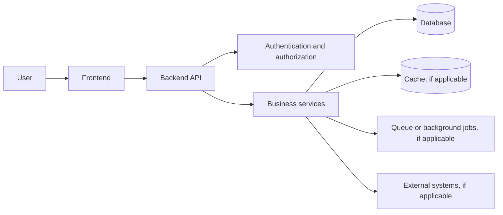
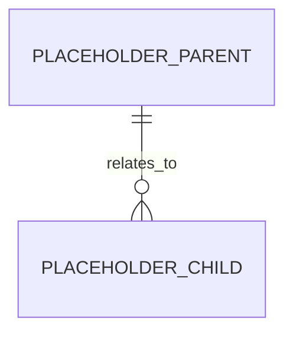
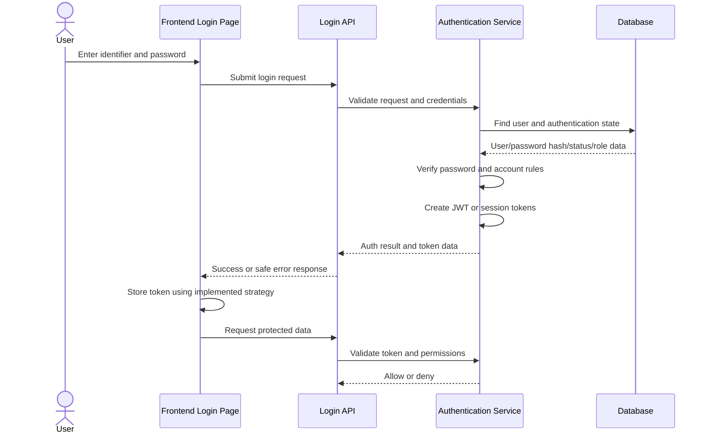
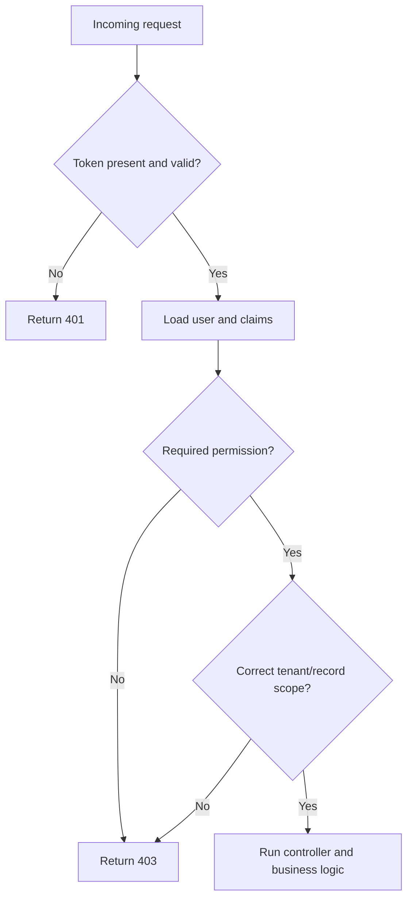
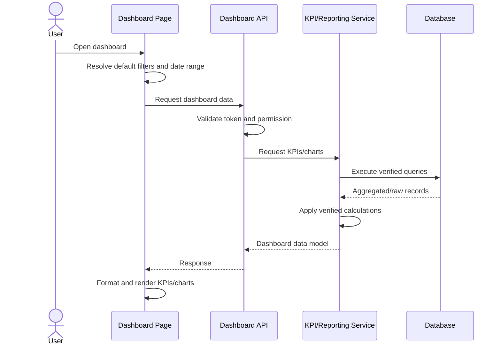

Here is a breakdown of what each library is and exactly what it does in your Python backend stack:
Would you like a basic starter code template showing how these libraries connect, or do you need help setting up your .env file?

A2P vendors (like Sinch, Route Mobile, Airtel IQ, etc.)
Option 1: GSM Gateway (Best for demo + learning)
This matches what you saw earlier.
📦 Setup:
	• GSM Gateway device (or SIM modem)
	• Insert SIM card
	• Connect to your backend (FastAPI)
Flow becomes:
Your CRM → GSM Gateway → Mobile Network → Phone

Instead of whatsapp api I will use slack api - for it to show the pip line 

https://join.slack.com/t/company1-xfa8138/shared_invite/zt-41ybj7p4x-YiZlAmnaZX~qrAHuLaYaxA


Great — now you’re moving into real CRM automation (email personalization) 🚀. This is exactly what companies like Tata Trent / Westside do.
Let’s break it simply and then I’ll tell you what to implement in your project.

🧠 1. Core Idea (What you described)
You want:
	✅ A template
	✅ Replace values like name, order, etc.
	✅ Send email automatically
👉 This is called Template-based Email Personalization

📧 2. How It Works (Architecture)
[CRM Event Trigger]
     ↓
[Email Template Engine]
     ↓ (Replace dynamic values like {{name}})
[Email Service]
     ↓
[User Inbox]


🧩 3. What You Should Build in OmniLink CRM
You need 3 main components:

✅ 1. Email Template Storage (Database)
Create a table:
email_templates
id	name	subject	body
1	Order Ready	"Hi {{name}}"	"Hello {{name}}, your order {{order_id}} is ready!"
👉 Notice:
	• {{name}}, {{order_id}} = placeholders

✅ 2. Template Engine (Variable Replacement)
When sending email:
Input:

{
  "name": "Harshit",
  "order_id": "ORD123"
}
Replace placeholders:

template = "Hello {{name}}, your order {{order_id}} is ready!"
for key, value in data.items():
    template = template.replace(f"{{{{{key}}}}}", str(value))
print(template)
✅ Output:
Hello Harshit, your order ORD123 is ready!

✅ 3. Email Sending Service
You have 2 choices:

🔹 Option A (BEST for Demo): Use SMTP (No big 3rd party)
Use:
	• Gmail SMTP
	• Outlook SMTP
Example:

import smtplib
from email.mime.text import MIMEText
def send_email(to_email, subject, body):
    msg = MIMEText(body)
    msg["Subject"] = subject
    msg["From"] = "your_email@gmail.com"
    msg["To"] = to_email
    with smtplib.SMTP("smtp.gmail.com", 587) as server:
        server.starttls()
        server.login("your_email@gmail.com", "app_password")
        server.send_message(msg)
✅ This is enough for your project.

🔹 Option B (Production-like)
	• SendGrid
	• Amazon SES
	• Mailgun
👉 But since you want no 3rd party → stick to SMTP

⚙️ 4. Final Flow in Your CRM
User places order
    ↓
CRM event triggers
    ↓
Check consent (email = true)
    ↓
Fetch template from DB
    ↓
Replace variables (name, order_id)
    ↓
Send email via SMTP
    ↓
Store log in DB


🗄️ 5. Add Email Logs Table (Important for Demo)
email_logs
id	user_id	email	subject	status	sent_at
1	123	test@mail.com	Order Ready	SENT	time
✅ Helps you show:
	• sent / failed
	• history

🎯 6. Show This in Your UI (VERY IMPORTANT)
Create a dashboard:
✅ Features:
	• Template editor
	• Email logs
	• Send test email button

🚀 7. Advanced (If you want to impress)
Add:
✅ Conditional content
Hello {{name}},

You get 20% off!

(use Jinja2 in Python)

✅ Scheduling
	• send email after 2 minutes
	• use background jobs

✅ Bulk sending
	• send emails to 100 users

🧪 8. Demo Idea (Super Useful for You)
Show this live:
	1. Enter user:
		○ Name: Harshit
		○ Email: your email
	2. Select template:
		○ "Order Ready"
	3. Click "Send"
👉 Output:
	• Email received ✅
	• Log stored ✅
	• UI updated ✅

✅ FINAL ANSWER (What to “put” in your project)
You should implement:
🧱 Components:
	• ✅ email_templates table
	• ✅ email_logs table
	• ✅ template replacement logic ({{name}})
	• ✅ SMTP email sender
	• ✅ API endpoint /send-email
	• ✅ UI to trigger + view logs

💡 Simple Summary
	“We store email templates with placeholders, dynamically replace user data at runtime, and send emails via SMTP while logging everything in the CRM.”

If you want, I can next: ✅ Design your exact DB schema (Supabase)
✅ Give you a ready FastAPI email module
✅ OR combine this with your SMS system for full omnichannel CRM

From <edge://commercial-copilot-chat/> 


From <https://www.google.com/search?q=google&safe=active&sca_esv=ec2bff8bd1e2ef21&fbs=ADc_l-aN0CWEZBOHjofHoaMMDiKpmAsnXCN5UBx17opt8eaTXyCfNeKGeJOJfUwi1MTUzwQIwJlelVIdgOjufMHPjJWrCH_lM-PPnh9_UTuFIoFx3rRv1gwaFvn2kIBPy8GWW80uVasALqwK4tSihFiJekRAADGf717ANyMXv7d8qrtNWwxGRrM-Dzuf3iqw27vLONrQEDmmKwt73kVhaYHFkxSKZyLFPA&aep=1&ntc=1&sa=X&ved=2ahUKEwj-v6ydjYuVAxWda2wGHRh6OQQQ2J8OegQIEhAD&biw=1272&bih=588&dpr=1.5&mstk=AUtExfBGoD5LDcdBJZm2hIc9rxdy15NgR43DV6KaKBojQIVOo0rNHvQB_vKXIINv0AroU3btSNyIpria6_5tAW_tHXvLF0Wv7zgxs9fulLWwSN_L2uBbitaIgBX9Ldz9TgX133RAK14b4K_EE4_QlnP1o3ri5oNY4M9CdSU&csuir=1&udm=50> 


TO HAVE PROGRESS REPORT OF THINGS 

Omnichannel Support: Merges communications across telephone auto-dialers, email, live chat, and social media platforms into one interface
Perfect Harshit — we’ll start backend setup first. I’ll guide you exactly like: which folder to make, which file to create, what code to put, and how to run it.
We’ll build Phase 1 backend foundation:

FastAPI backend
Supabase connection
Swagger UI
Login simulation
Role-based access structure
Customer APIs
Membership API
Consent API
Audit logging base
CORS for frontend
Supabase is good here because it gives PostgreSQL database + APIs + Auth/Storage options, and it supports Row Level Security for secure access control when needed. [forbes.com], [marketingw...thdave.com]

0. Backend Folder Name
Create one folder:
omnilink-backend
Open this folder in VS Code.

1. Final Folder Structure
Create this structure:

omnilink-backend/
│
├── app/
│   ├── main.py
│   │
│   ├── core/
│   │   ├── config.py
│   │   └── security.py
│   │
│   ├── db/
│   │   └── supabase_client.py
│   │
│   ├── schemas/
│   │   └── schemas.py
│   │
│   ├── api/
│   │   └── routes/
│   │       ├── health.py
│   │       ├── auth.py
│   │       ├── customers.py
│   │       ├── memberships.py
│   │       ├── consents.py
│   │       ├── campaigns.py
│   │       ├── audit.py
│   │       └── kpi.py
│   │
│   └── services/
│       ├── audit_service.py
│       ├── consent_service.py
│       └── segmentation_service.py
│
├── .env
├── requirements.txt
└── README.md

2. Create Virtual Environment
In terminal inside omnilink-backend:
python -m venv venv
Activate it:
Windows PowerShell
venv\Scripts\activate
Mac/Linux
source venv/bin/activate

3. Create requirements.txt
File:
requirements.txt
Code:

fastapi
uvicorn[standard]
python-dotenv
pydantic
pydantic-settings
supabase
PyJWT
Install:
pip install -r requirements.txt

4. Create Supabase Project
Go to Supabase and create a project.
You need these two values:

SUPABASE_URL
SUPABASE_SERVICE_ROLE_KEY
For backend only, we can use the service role key inside .env. Do not expose this key in frontend.

5. Create .env
File:
.env
Code:

APP_NAME=OmniLink CRM Backend
APP_ENV=development
SUPABASE_URL=PASTE_YOUR_SUPABASE_URL_HERE
SUPABASE_SERVICE_ROLE_KEY=PASTE_YOUR_SERVICE_ROLE_KEY_HERE
JWT_SECRET=change-this-secret-key
JWT_ALGORITHM=HS256
FRONTEND_ORIGINS=http://localhost:3000,http://127.0.0.1:3000
Later when Ankit connects from same Wi-Fi, add Ankit’s IP:
FRONTEND_ORIGINS=http://localhost:3000,http://127.0.0.1:3000,http://ANKIT_IP:3000

6. Supabase SQL Tables
In Supabase:
SQL Editor → New Query
Paste and run this:

create table if not exists customers (
  customer_id text primary key,
  name text not null,
  phone text,
  email text,
  city text,
  birthday_month text,
  status text,
  preferred_category text,
  total_spend numeric default 0,
  average_order_value numeric default 0,
  purchase_frequency integer default 0,
  last_purchase_date date,
  created_at timestamp default now()
);
create table if not exists memberships (
  membership_id text primary key,
  customer_id text references customers(customer_id),
  membership_status text,
  tier text,
  points_balance integer default 0,
  points_earned integer default 0,
  points_redeemed integer default 0,
  expiry_date date,
  upgrade_eligibility boolean default false,
  created_at timestamp default now()
);
create table if not exists consents (
  consent_id text primary key,
  customer_id text references customers(customer_id),
  whatsapp_consent boolean default false,
  sms_consent boolean default false,
  email_consent boolean default false,
  app_notification_consent boolean default false,
  personalization_consent boolean default false,
  do_not_contact boolean default false,
  consent_source text,
  consent_given_date timestamp default now(),
  consent_withdrawn_date timestamp
);
create table if not exists campaigns (
  campaign_id text primary key,
  campaign_name text not null,
  campaign_type text,
  channel text,
  target_segment text,
  status text default 'Draft',
  audience_count integer default 0,
  eligible_count integer default 0,
  created_by text,
  approved_by text,
  created_at timestamp default now()
);
create table if not exists audit_logs (
  audit_id bigserial primary key,
  user_email text,
  user_role text,
  action text,
  object_type text,
  object_id text,
  status text,
  details text,
  created_at timestamp default now()
);
create table if not exists campaign_responses (
  response_id bigserial primary key,
  campaign_id text references campaigns(campaign_id),
  customer_id text references customers(customer_id),
  sent_status text default 'simulated',
  opened boolean default false,
  clicked boolean default false,
  converted boolean default false,
  revenue numeric default 0,
  created_at timestamp default now()
);

7. Insert Sample Data
Run this in Supabase SQL Editor:

insert into customers
(customer_id, name, phone, email, city, birthday_month, status, preferred_category, total_spend, average_order_value, purchase_frequency, last_purchase_date)
values
('CUST-1001', 'Riya Sharma', '98xxxxxx45', 'r*****@mail.com', 'Mumbai', 'August', 'Member', 'Premium Dresses', 23800, 3400, 7, '2026-06-14'),
('CUST-1002', 'Aarav Mehta', '97xxxxxx22', 'a*****@mail.com', 'Pune', 'December', 'Non-member', 'Footwear', 14500, 2900, 5, '2026-06-02'),
('CUST-1003', 'Neha Iyer', '99xxxxxx78', 'n*****@mail.com', 'Mumbai', 'July', 'Member', 'Ethnic Wear', 52200, 4350, 12, '2026-06-18'),
('CUST-1004', 'Kabir Khan', '96xxxxxx54', 'k*****@mail.com', 'Navi Mumbai', 'March', 'Member', 'Casual Wear', 7200, 1800, 4, '2026-03-04')
on conflict (customer_id) do nothing;
insert into memberships
(membership_id, customer_id, membership_status, tier, points_balance, points_earned, points_redeemed, expiry_date, upgrade_eligibility)
values
('MEM-1001', 'CUST-1001', 'Active', 'Silver', 1320, 2000, 680, '2027-06-14', true),
('MEM-1002', 'CUST-1002', 'Non-member', 'Non-member', 0, 0, 0, null, true),
('MEM-1003', 'CUST-1003', 'Active', 'Gold', 4100, 6000, 1900, '2027-06-18', true),
('MEM-1004', 'CUST-1004', 'Active', 'Silver', 410, 600, 190, '2027-03-04', false)
on conflict (membership_id) do nothing;
insert into consents
(consent_id, customer_id, whatsapp_consent, sms_consent, email_consent, app_notification_consent, personalization_consent, do_not_contact, consent_source)
values
('CON-1001', 'CUST-1001', true, true, true, true, true, false, 'Membership Form'),
('CON-1002', 'CUST-1002', true, false, true, false, true, false, 'Website'),
('CON-1003', 'CUST-1003', false, false, true, true, true, false, 'App'),
('CON-1004', 'CUST-1004', false, false, false, false, false, true, 'Customer Service')
on conflict (consent_id) do nothing;

8. Create app/core/config.py
File:
app/core/config.py
Code:

from pydantic_settings import BaseSettings
from typing import List

class Settings(BaseSettings):
    APP_NAME: str = "OmniLink CRM Backend"
    APP_ENV: str = "development"
    SUPABASE_URL: str
    SUPABASE_SERVICE_ROLE_KEY: str
    JWT_SECRET: str
    JWT_ALGORITHM: str = "HS256"
    FRONTEND_ORIGINS: str = "http://localhost:3000"
    @property
    def allowed_origins(self) -> Listreturn [origin.strip() for origin in self.FRONTEND_ORIGINS.split(",")]
    class Config:
        env_file = ".env"

settings = Settings()

9. Create app/db/supabase_client.py
File:
app/db/supabase_client.py
Code:

from supabase import create_client, Client
from app.core.config import settings

supabase: Client = create_client(
    settings.SUPABASE_URL,
    settings.SUPABASE_SERVICE_ROLE_KEY
)

10. Create app/core/security.py
File:
app/core/security.py
Code:

import jwt
from datetime import datetime, timedelta
from fastapi import Header, HTTPException
from app.core.config import settings

ROLE_PERMISSIONS = {
    "Admin": ["dashboard", "customers", "loyalty", "consent", "campaigns", "kpi", "audit", "admin"],
    "CRM Team": ["dashboard", "customers", "loyalty", "consent", "campaigns", "kpi"],
    "Store Team": ["dashboard", "customers", "loyalty"],
    "Management": ["dashboard", "kpi"],
    "Customer Service": ["dashboard", "customers", "consent", "audit"],
    "Security / IT": ["dashboard", "audit", "admin"],
}

def create_access_token(user_email: str, role: str):
    payload = {
        "sub": user_email,
        "role": role,
        "exp": datetime.utcnow() + timedelta(hours=8)
    }
    token = jwt.encode(payload, settings.JWT_SECRET, algorithm=settings.JWT_ALGORITHM)
    return token

def decode_token(token: str):
    try:
        payload = jwt.decode(token, settings.JWT_SECRET, algorithms=[settings.JWT_ALGORITHM])
        return payload
    except jwt.ExpiredSignatureError:
        raise HTTPException(status_code=401, detail="Token expired")
    except Exception:
        raise HTTPException(status_code=401, detail="Invalid token")

def get_current_user(authorization: str = Header(None)):
    if not authorization:
        raise HTTPException(status_code=401, detail="Authorization header missing")
    if not authorization.startswith("Bearer "):
        raise HTTPException(status_code=401, detail="Invalid authorization format")
    token = authorization.replace("Bearer ", "")
    return decode_token(token)

def require_permission(user: dict, module: str):
    role = user.get("role")
    allowed_modules = ROLE_PERMISSIONS.get(role, [])
    if module not in allowed_modules:
        raise HTTPException(status_code=403, detail=f"Role '{role}' cannot access {module}")
    return True

11. Create app/schemas/schemas.py
File:
app/schemas/schemas.py
Code:

from pydantic import BaseModel
from typing import Optional

class LoginRequest(BaseModel):
    email: str
    role: str

class CampaignCreateRequest(BaseModel):
    campaign_name: str
    campaign_type: str
    channel: str
    target_segment: str
    created_by: Optional[str] = "CRM User"

class ConsentUpdateRequest(BaseModel):
    customer_id: str
    whatsapp_consent: Optional[bool] = None
    sms_consent: Optional[bool] = None
    email_consent: Optional[bool] = None
    app_notification_consent: Optional[bool] = None
    personalization_consent: Optional[bool] = None
    do_not_contact: Optional[bool] = None

12. Create app/services/audit_service.py
File:
app/services/audit_service.py
Code:

from app.db.supabase_client import supabase

def create_audit_log(
    user_email: str,
    user_role: str,
    action: str,
    object_type: str,
    object_id: str,
    status: str = "Allowed",
    details: str = ""
):
    data = {
        "user_email": user_email,
        "user_role": user_role,
        "action": action,
        "object_type": object_type,
        "object_id": object_id,
        "status": status,
        "details": details
    }
    supabase.table("audit_logs").insert(data).execute()

13. Create app/services/segmentation_service.py
File:
app/services/segmentation_service.py
Code:

def get_customer_segment(customer: dict, membership: dict, consent: dict):
    total_spend = float(customer.get("total_spend") or 0)
    purchase_frequency = int(customer.get("purchase_frequency") or 0)
    tier = membership.get("tier") if membership else "Non-member"
    do_not_contact = consent.get("do_not_contact") if consent else False
    if do_not_contact:
        return "Do Not Contact"
    if tier == "Non-member" and total_spend >= 10000 and purchase_frequency >= 3:
        return "Potential Member"
    if tier == "Silver" and total_spend >= 22000:
        return "Silver-to-Gold Eligible"
    if tier == "Gold" and total_spend >= 50000:
        return "Gold-to-Platinum Eligible"
    if purchase_frequency <= 2:
        return "Low Spender"
    if total_spend >= 50000:
        return "High Spender"
    if total_spend >= 20000:
        return "Medium Spender"
    return "General Customer"

14. Create app/services/consent_service.py
File:
app/services/consent_service.py
Code:

def is_customer_eligible_for_channel(consent: dict, channel: str):
    if not consent:
        return False
    if consent.get("do_not_contact"):
        return False
    channel = channel.lower()
    if channel == "whatsapp":
        return consent.get("whatsapp_consent", False)
    if channel == "sms":
        return consent.get("sms_consent", False)
    if channel == "email":
        return consent.get("email_consent", False)
    if channel == "app":
        return consent.get("app_notification_consent", False)
    return False

15. Create Route: app/api/routes/health.py

from fastapi import APIRouter
router = APIRouter(prefix="/health", tags=["Health"])

@router.get("")
def health_check():
    return {
        "status": "ok",
        "message": "OmniLink CRM backend is running"
    }

16. Create Route: app/api/routes/auth.py

from fastapi import APIRouter
from app.schemas.schemas import LoginRequest
from app.core.security import create_access_token, ROLE_PERMISSIONS
from app.services.audit_service import create_audit_log
router = APIRouter(prefix="/auth", tags=["Authentication"])

@router.post("/login")
def login(payload: LoginRequest):
    if payload.role not in ROLE_PERMISSIONS:
        return {
            "success": False,
            "message": "Invalid role"
        }
    token = create_access_token(payload.email, payload.role)
    create_audit_log(
        user_email=payload.email,
        user_role=payload.role,
        action="Login",
        object_type="User",
        object_id=payload.email,
        status="Allowed",
        details="User logged in successfully"
    )
    return {
        "success": True,
        "access_token": token,
        "token_type": "Bearer",
        "user": {
            "email": payload.email,
            "role": payload.role,
            "allowed_modules": ROLE_PERMISSIONS[payload.role]
        }
    }

17. Create Route: app/api/routes/customers.py

from fastapi import APIRouter, Depends
from app.db.supabase_client import supabase
from app.core.security import get_current_user, require_permission
from app.services.audit_service import create_audit_log
router = APIRouter(prefix="/customers", tags=["Customers"])

@router.get("")
def get_customers(user=Depends(get_current_user)):
    require_permission(user, "customers")
    response = supabase.table("customers").select("").execute()
    create_audit_log(
        user_email=user["sub"],
        user_role=user["role"],
        action="View customer list",
        object_type="Customer",
        object_id="ALL",
        status="Allowed"
    )
    return {
        "success": True,
        "data": response.data
    }

@router.get("/{customer_id}")
def get_customer_detail(customer_id: str, user=Depends(get_current_user)):
    require_permission(user, "customers")
    customer = supabase.table("customers").select("").eq("customer_id", customer_id).single().execute()
    membership = supabase.table("memberships").select("").eq("customer_id", customer_id).execute()
    consent = supabase.table("consents").select("").eq("customer_id", customer_id).execute()
    create_audit_log(
        user_email=user["sub"],
        user_role=user["role"],
        action="View customer profile",
        object_type="Customer",
        object_id=customer_id,
        status="Allowed"
    )
    customer_data = customer.data
    if user["role"] == "Store Team":
        customer_data["email"] = "Restricted"
    return {
        "success": True,
        "customer": customer_data,
        "membership": membership.data[0] if membership.data else None,
        "consent": consent.data[0] if consent.data else None
    }

18. Create Route: app/api/routes/memberships.py

from fastapi import APIRouter, Depends
from app.db.supabase_client import supabase
from app.core.security import get_current_user, require_permission
router = APIRouter(prefix="/memberships", tags=["Memberships"])

@router.get("/{customer_id}")
def get_membership(customer_id: str, user=Depends(get_current_user)):
    require_permission(user, "loyalty")
    response = supabase.table("memberships").select("").eq("customer_id", customer_id).execute()
    return {
        "success": True,
        "data": response.data[0] if response.data else None
    }

@router.get("")
def get_all_memberships(user=Depends(get_current_user)):
    require_permission(user, "loyalty")
    response = supabase.table("memberships").select("").execute()
    return {
        "success": True,
        "data": response.data
    }

19. Create Route: app/api/routes/consents.py

from fastapi import APIRouter, Depends
from app.db.supabase_client import supabase
from app.schemas.schemas import ConsentUpdateRequest
from app.core.security import get_current_user, require_permission
from app.services.audit_service import create_audit_log
router = APIRouter(prefix="/consents", tags=["Consents"])

@router.get("/{customer_id}")
def get_consent(customer_id: str, user=Depends(get_current_user)):
    require_permission(user, "consent")
    response = supabase.table("consents").select("*").eq("customer_id", customer_id).execute()
    return {
        "success": True,
        "data": response.data[0] if response.data else None
    }

@router.post("/update")
def update_consent(payload: ConsentUpdateRequest, user=Depends(get_current_user)):
    require_permission(user, "consent")
    update_data = payload.dict(exclude_unset=True)
    customer_id = update_data.pop("customer_id")
    response = supabase.table("consents").update(update_data).eq("customer_id", customer_id).execute()
    create_audit_log(
        user_email=user["sub"],
        user_role=user["role"],
        action="Update consent",
        object_type="Consent",
        object_id=customer_id,
        status="Allowed",
        details=str(update_data)
    )
    return {
        "success": True,
        "data": response.data
    }

20. Create Route: app/api/routes/campaigns.py

import uuid
from fastapi import APIRouter, Depends
from app.db.supabase_client import supabase
from app.schemas.schemas import CampaignCreateRequest
from app.core.security import get_current_user, require_permission
from app.services.consent_service import is_customer_eligible_for_channel
from app.services.audit_service import create_audit_log
router = APIRouter(prefix="/campaigns", tags=["Campaigns"])

@router.get("")
def get_campaigns(user=Depends(get_current_user)):
    require_permission(user, "campaigns")
    response = supabase.table("campaigns").select("").execute()
    return {
        "success": True,
        "data": response.data
    }

@router.post("")
def create_campaign(payload: CampaignCreateRequest, user=Depends(get_current_user)):
    require_permission(user, "campaigns")
    campaign_id = "CMP-" + str(uuid.uuid4())[:8]
    data = {
        "campaign_id": campaign_id,
        "campaign_name": payload.campaign_name,
        "campaign_type": payload.campaign_type,
        "channel": payload.channel,
        "target_segment": payload.target_segment,
        "status": "Draft",
        "created_by": user["sub"]
    }
    response = supabase.table("campaigns").insert(data).execute()
    create_audit_log(
        user_email=user["sub"],
        user_role=user["role"],
        action="Create campaign",
        object_type="Campaign",
        object_id=campaign_id,
        status="Allowed",
        details=payload.campaign_name
    )
    return {
        "success": True,
        "data": response.data
    }

@router.post("/{campaign_id}/audience-preview")
def audience_preview(campaign_id: str, user=Depends(get_current_user)):
    require_permission(user, "campaigns")
    campaign_response = supabase.table("campaigns").select("").eq("campaign_id", campaign_id).single().execute()
    campaign = campaign_response.data
    customers_response = supabase.table("customers").select("").execute()
    customers = customers_response.data
    eligible_customers = []
    for customer in customers:
        consent_response = supabase.table("consents").select("").eq("customer_id", customer["customer_id"]).execute()
        consent = consent_response.data[0] if consent_response.data else None
        if is_customer_eligible_for_channel(consent, campaign["channel"]):
            eligible_customers.append(customer)
    supabase.table("campaigns").update({
        "audience_count": len(customers),
        "eligible_count": len(eligible_customers)
    }).eq("campaign_id", campaign_id).execute()
    return {
        "success": True,
        "campaign_id": campaign_id,
        "total_audience": len(customers),
        "eligible_after_consent": len(eligible_customers),
        "removed_due_to_consent": len(customers) - len(eligible_customers),
        "eligible_customers": eligible_customers
    }

@router.post("/{campaign_id}/simulate-send")
def simulate_send(campaign_id: str, user=Depends(get_current_user)):
    require_permission(user, "campaigns")
    preview = audience_preview(campaign_id, user)
    for customer in preview["eligible_customers"]:
        supabase.table("campaign_responses").insert({
            "campaign_id": campaign_id,
            "customer_id": customer["customer_id"],
            "sent_status": "simulated"
        }).execute()
    supabase.table("campaigns").update({
        "status": "Simulated Sent"
    }).eq("campaign_id", campaign_id).execute()
    create_audit_log(
        user_email=user["sub"],
        user_role=user["role"],
        action="Simulate campaign send",
        object_type="Campaign",
        object_id=campaign_id,
        status="Allowed",
        details="Campaign simulated after consent filtering"
    )
    return {
        "success": True,
        "message": "Campaign simulated successfully",
        "campaign_id": campaign_id,
        "eligible_sent_count": preview["eligible_after_consent"]
    }

21. Create Route: app/api/routes/audit.py

from fastapi import APIRouter, Depends
from app.db.supabase_client import supabase
from app.core.security import get_current_user, require_permission
router = APIRouter(prefix="/audit", tags=["Audit Logs"])

@router.get("/logs")
def get_audit_logs(user=Depends(get_current_user)):
    require_permission(user, "audit")
    response = supabase.table("audit_logs").select("*").order("created_at", desc=True).execute()
    return {
        "success": True,
        "data": response.data
    }

22. Create Route: app/api/routes/kpi.py

from fastapi import APIRouter, Depends
from app.db.supabase_client import supabase
from app.core.security import get_current_user, require_permission
router = APIRouter(prefix="/kpi", tags=["KPIs"])

@router.get("/summary")
def get_kpi_summary(user=Depends(get_current_user)):
    require_permission(user, "kpi")
    customers = supabase.table("customers").select("").execute().data
    memberships = supabase.table("memberships").select("").execute().data
    campaigns = supabase.table("campaigns").select("*").execute().data
    total_customers = len(customers)
    total_members = len([m for m in memberships if m.get("tier") != "Non-member"])
    membership_conversion_rate = round((total_members / total_customers) * 100, 2) if total_customers else 0
    total_revenue = sum([float(c.get("total_spend") or 0) for c in customers])
    avg_order_value = round(sum([float(c.get("average_order_value") or 0) for c in customers]) / total_customers, 2) if total_customers else 0
    return {
        "success": True,
        "data": {
            "total_customers": total_customers,
            "total_members": total_members,
            "membership_conversion_rate": membership_conversion_rate,
            "total_revenue": total_revenue,
            "average_order_value": avg_order_value,
            "campaign_count": len(campaigns),
            "repeat_purchase_rate": 58,
            "campaign_roi": 336,
            "privacy_complaints": 3,
            "consent_withdrawals": 42
        }
    }

23. Create app/main.py
File:
app/main.py
Code:

from fastapi import FastAPI
from fastapi.middleware.cors import CORSMiddleware
from app.core.config import settings
from app.api.routes import health, auth, customers, memberships, consents, campaigns, audit, kpi
app = FastAPI(
    title="OmniLink CRM Backend",
    description="Backend API for secure loyalty CRM prototype",
    version="1.0.0"
)
app.add_middleware(
    CORSMiddleware,
    allow_origins=settings.allowed_origins,
    allow_credentials=True,
    allow_methods=[""],
    allow_headers=[""],
)
app.include_router(health.router)
app.include_router(auth.router)
app.include_router(customers.router)
app.include_router(memberships.router)
app.include_router(consents.router)
app.include_router(campaigns.router)
app.include_router(audit.router)
app.include_router(kpi.router)

@app.get("/")
def root():
    return {
        "message": "Welcome to OmniLink CRM Backend",
        "docs": "/docs"
    }

24. Create Empty __init__.py Files
Create empty files:

app/init.py
app/core/init.py
app/db/init.py
app/api/init.py
app/api/routes/init.py
app/schemas/init.py
app/services/init.py
Important, because Python packages need it.

25. Run Backend
From main project folder:
uvicorn app.main:app --reload
Open:
http://127.0.0.1:8000
Swagger:
http://127.0.0.1:8000/docs

26. Test Login in Swagger
Go to:
POST /auth/login
Request body:

{
  "email": "harshit@omnilink.local",
  "role": "Admin"
}
Copy token from response.

27. Test Protected API
In Swagger, click:
Authorize
Paste:
Bearer YOUR_TOKEN_HERE
Then test:

GET /customers
GET /customers/CUST-1001
GET /kpi/summary

28. What You Should Complete Today
Your backend setup target today:

1. Project folder created
2. Virtual environment created
3. FastAPI installed
4. Supabase project created
5. Tables created in Supabase
6. Sample data inserted
7. Backend runs locally
8. Swagger UI opens
9. Login API works
10. Customer list API works

29. What You Can Show Tomorrow / Thursday
You can show:

FastAPI backend running
Swagger UI
Login API
Customer API
Supabase tables
Sample customer data
Basic RBAC token flow
Architecture explanation
This is a very solid first backend milestone.

30. Your Next Step
Start with this exact order:

Step 1: Create folder
Step 2: Create venv
Step 3: Install requirements
Step 4: Create Supabase tables
Step 5: Add .env
Step 6: Add config.py
Step 7: Add supabase_client.py
Step 8: Add main.py
Step 9: Add health route
Step 10: Run backend
Once backend runs, tell me:
backend running
Then I’ll guide you to test login, customer API, and connect with Supabase step by step.

From <https://www.microsoft365.com/hwav2/chat/conversation/20af5c7a-eb91-4670-87f2-0293544b1af0?version=19.2606.38031.0&capabilities=interopPromise%2CsuspendOnClose%2CautoStart&client-request-id=f2ad3f48-bf53-b449-af9c-4bfaa56a8b6b&fromCode=cmm6j3rjue2&SSRDesktopTest=2> 


const BACKEND_AUTH_ENDPOINT =
    "http://YOUR_IPV4_ADDRESS:8000/auth/login";

From <https://www.microsoft365.com/hwav2/chat/conversation/20af5c7a-eb91-4670-87f2-0293544b1af0?version=19.2606.55071.0&capabilities=interopPromise%2CsuspendOnClose%2CautoStart&client-request-id=8eaad863-7e9d-5d4a-9768-179b33824baa&fromCode=cmm6j3rjue2&SSRDesktopTest=2> 


Perfect Harshit — progress solid hai. ✅
And yes, if we are switching from Supabase to SQLite, backend will become easier for local demo because:
	• no external database dependency
	• no API key needed
	• database file will stay inside project
	• same Wi‑Fi demo becomes simpler
Your uploaded backend documentation currently describes FastAPI + Supabase PostgreSQL, but now we will replace Supabase with SQLite local database for the prototype. [trentlimit...epoint.com]

1. Updated Backend Decision
We will use:

Backend: FastAPI
Database: SQLite
Auth: Test users with email + password
Password for all users: 1234567890
Frontend connects through same Wi-Fi using backend IP

2. Test Users We Will Create
Use these users in SQLite:

admin@omnilink.com       → Admin
crm@omnilink.com         → CRM Team
store@omnilink.com       → Store Team
management@omnilink.com  → Management
service@omnilink.com     → Customer Service
security@omnilink.com    → Security / IT
Password for all:
1234567890
Important: frontend should not decide the final role.
Frontend can show role dropdown if needed, but backend should return actual role from database.

3. Same Wi-Fi Connection Process
If frontend and backend are on different laptops
On your backend laptop
Run backend like this:
uvicorn app.main:app --host 0.0.0.0 --port 8000 --reload
Do not run only:
uvicorn app.main:app --reload
Because that only exposes backend to your own laptop.

Find your backend laptop IP
In PowerShell:
ipconfig
Find:
IPv4 Address
Example:
192.168.1.12
Then your friend should call backend using:
http://192.168.1.12:8000
Example frontend auth endpoint:

const BACKEND_AUTH_ENDPOINT =
    " http://192.168.1.12:8000/auth/login";
Customer API:

const SECURE_API_TARGET =
    " http://192.168.1.12:8000/customers/CUST-1001";

Important for your friend
If your friend opens frontend directly as file:///index.html, CORS can create issues.
Better: ask your friend to run frontend folder with:
python -m http.server 3000
Then open:
http://localhost:3000
Or if from your laptop:
http://ANKIT_IP:3000

4. Backend Changes Required Now
We will switch from Supabase to SQLite.
New files to create
Inside:
omnilink-backend/app/db/
Create:

sqlite_client.py
init_db.py
Your structure becomes:

app/
├── db/
│   ├── init.py
│   ├── sqlite_client.py
│   └── init_db.py
You can keep supabase_client.py for now, but we will not use it.

5. Update requirements.txt
Since SQLite is built into Python, no new database package is needed.
Keep:

fastapi
uvicorn[standard]
python-dotenv
pydantic
pydantic-settings
PyJWT
You can remove:
supabase
But if already installed, no problem.
Then run:
pip install -r requirements.txt

6. Update .env
Open .env and use this:

APP_NAME=OmniLink CRM Backend
APP_ENV=development
DB_PATH=omnilink_crm.db
JWT_SECRET=change-this-secret-key
JWT_ALGORITHM=HS256
FRONTEND_ORIGINS=http://localhost:3000,http://127.0.0.1:3000
Later, when Ankit connects from his laptop, add his frontend origin:

FRONTEND_ORIGINS=http://localhost:3000,http://127.0.0.1:3000,http://ANKIT_IP:3000
``

7. Update app/core/config.py
Replace full file with this:

from pydantic_settings import BaseSettings
from typing import List

class Settings(BaseSettings):
    APP_NAME: str = "OmniLink CRM Backend"
    APP_ENV: str = "development"
    DB_PATH: str = "omnilink_crm.db"
    JWT_SECRET: str = "change-this-secret-key"
    JWT_ALGORITHM: str = "HS256"
    FRONTEND_ORIGINS: str = "http://localhost:3000,http://127.0.0.1:3000"
    @property
    def allowed_origins(self) -> Listreturn [origin.strip() for origin in self.FRONTEND_ORIGINS.split(",")]
    class Config:
        env_file = ".env"

settings = Settings()

8. Create app/db/sqlite_client.py

import sqlite3
from app.core.config import settings

def get_connection():
    connection = sqlite3.connect(settings.DB_PATH)
    connection.row_factory = sqlite3.Row
    return connection

def fetch_all(query: str, params: tuple = ()):
    connection = get_connection()
    cursor = connection.cursor()
    cursor.execute(query, params)
    rows = cursor.fetchall()
    connection.close()
    return [dict(row) for row in rows]

def fetch_one(query: str, params: tuple = ()):
    connection = get_connection()
    cursor = connection.cursor()
    cursor.execute(query, params)
    row = cursor.fetchone()
    connection.close()
    return dict(row) if row else None

def execute_query(query: str, params: tuple = ()):
    connection = get_connection()
    cursor = connection.cursor()
    cursor.execute(query, params)
    connection.commit()
    last_id = cursor.lastrowid
    connection.close()
    return last_id

9. Create app/db/init_db.py
This file will create tables and insert test users + sample customers.

from app.db.sqlite_client import execute_query

def init_database():
    # Users table
    execute_query("""
    CREATE TABLE IF NOT EXISTS users (
        user_id INTEGER PRIMARY KEY AUTOINCREMENT,
        email TEXT UNIQUE NOT NULL,
        password TEXT NOT NULL,
        role TEXT NOT NULL,
        status TEXT DEFAULT 'Active'
    )
    """)
    # Customers table
    execute_query("""
    CREATE TABLE IF NOT EXISTS customers (
        customer_id TEXT PRIMARY KEY,
        name TEXT NOT NULL,
        phone TEXT,
        email TEXT,
        city TEXT,
        birthday_month TEXT,
        status TEXT,
        preferred_category TEXT,
        total_spend REAL DEFAULT 0,
        average_order_value REAL DEFAULT 0,
        purchase_frequency INTEGER DEFAULT 0,
        last_purchase_date TEXT
    )
    """)
    # Memberships table
    execute_query("""
    CREATE TABLE IF NOT EXISTS memberships (
        membership_id TEXT PRIMARY KEY,
        customer_id TEXT,
        membership_status TEXT,
        tier TEXT,
        points_balance INTEGER DEFAULT 0,
        points_earned INTEGER DEFAULT 0,
        points_redeemed INTEGER DEFAULT 0,
        expiry_date TEXT,
        upgrade_eligibility INTEGER DEFAULT 0
    )
    """)
    # Consents table
    execute_query("""
    CREATE TABLE IF NOT EXISTS consents (
        consent_id TEXT PRIMARY KEY,
        customer_id TEXT,
        whatsapp_consent INTEGER DEFAULT 0,
        sms_consent INTEGER DEFAULT 0,
        email_consent INTEGER DEFAULT 0,
        app_notification_consent INTEGER DEFAULT 0,
        personalization_consent INTEGER DEFAULT 0,
        do_not_contact INTEGER DEFAULT 0,
        consent_source TEXT,
        consent_given_date TEXT,
        consent_withdrawn_date TEXT
    )
    """)
    # Campaigns table
    execute_query("""
    CREATE TABLE IF NOT EXISTS campaigns (
        campaign_id TEXT PRIMARY KEY,
        campaign_name TEXT NOT NULL,
        campaign_type TEXT,
        channel TEXT,
        target_segment TEXT,
        status TEXT DEFAULT 'Draft',
        audience_count INTEGER DEFAULT 0,
        eligible_count INTEGER DEFAULT 0,
        created_by TEXT,
        approved_by TEXT
    )
    """)
    # Campaign responses table
    execute_query("""
    CREATE TABLE IF NOT EXISTS campaign_responses (
        response_id INTEGER PRIMARY KEY AUTOINCREMENT,
        campaign_id TEXT,
        customer_id TEXT,
        sent_status TEXT DEFAULT 'simulated',
        opened INTEGER DEFAULT 0,
        clicked INTEGER DEFAULT 0,
        converted INTEGER DEFAULT 0,
        revenue REAL DEFAULT 0
    )
    """)
    # Audit logs table
    execute_query("""
    CREATE TABLE IF NOT EXISTS audit_logs (
        audit_id INTEGER PRIMARY KEY AUTOINCREMENT,
        user_email TEXT,
        user_role TEXT,
        action TEXT,
        object_type TEXT,
        object_id TEXT,
        status TEXT,
        details TEXT,
        created_at TEXT DEFAULT CURRENT_TIMESTAMP
    )
    """)
    seed_users()
    seed_sample_data()

def seed_users():
    users = [
        ("admin@omnilink.com", "1234567890", "Admin"),
        ("crm@omnilink.com", "1234567890", "CRM Team"),
        ("store@omnilink.com", "1234567890", "Store Team"),
        ("management@omnilink.com", "1234567890", "Management"),
        ("service@omnilink.com", "1234567890", "Customer Service"),
        ("security@omnilink.com", "1234567890", "Security / IT"),
    ]
    for email, password, role in users:
        execute_query("""
        INSERT OR IGNORE INTO users (email, password, role)
        VALUES (?, ?, ?)
        """, (email, password, role))

def seed_sample_data():
    customers = [
        ("CUST-1001", "Riya Sharma", "9876543210", "riya@mail.com", "Mumbai", "August", "Member", "Premium Dresses", 23800, 3400, 7, "2026-06-14"),
        ("CUST-1002", "Aarav Mehta", "9765432122", "aarav@mail.com", "Pune", "December", "Non-member", "Footwear", 14500, 2900, 5, "2026-06-02"),
        ("CUST-1003", "Neha Iyer", "9988776678", "neha@mail.com", "Mumbai", "July", "Member", "Ethnic Wear", 52200, 4350, 12, "2026-06-18"),
        ("CUST-1004", "Kabir Khan", "9654321054", "kabir@mail.com", "Navi Mumbai", "March", "Member", "Casual Wear", 7200, 1800, 4, "2026-03-04"),
    ]
    for customer in customers:
        execute_query("""
        INSERT OR IGNORE INTO customers
        (customer_id, name, phone, email, city, birthday_month, status, preferred_category, total_spend, average_order_value, purchase_frequency, last_purchase_date)
        VALUES (?, ?, ?, ?, ?, ?, ?, ?, ?, ?, ?, ?)
        """, customer)
    memberships = [
        ("MEM-1001", "CUST-1001", "Active", "Silver", 1320, 2000, 680, "2027-06-14", 1),
        ("MEM-1002", "CUST-1002", "Non-member", "Non-member", 0, 0, 0, None, 1),
        ("MEM-1003", "CUST-1003", "Active", "Gold", 4100, 6000, 1900, "2027-06-18", 1),
        ("MEM-1004", "CUST-1004", "Active", "Silver", 410, 600, 190, "2027-03-04", 0),
    ]
    for membership in memberships:
        execute_query("""
        INSERT OR IGNORE INTO memberships
        (membership_id, customer_id, membership_status, tier, points_balance, points_earned, points_redeemed, expiry_date, upgrade_eligibility)
        VALUES (?, ?, ?, ?, ?, ?, ?, ?, ?)
        """, membership)
    consents = [
        ("CON-1001", "CUST-1001", 1, 1, 1, 1, 1, 0, "Membership Form", "2026-06-01", None),
        ("CON-1002", "CUST-1002", 1, 0, 1, 0, 1, 0, "Website", "2026-06-02", None),
        ("CON-1003", "CUST-1003", 0, 0, 1, 1, 1, 0, "App", "2026-06-03", None),
        ("CON-1004", "CUST-1004", 0, 0, 0, 0, 0, 1, "Customer Service", "2026-06-04", None),
    ]
    for consent in consents:
        execute_query("""
        INSERT OR IGNORE INTO consents
        (consent_id, customer_id, whatsapp_consent, sms_consent, email_consent, app_notification_consent, personalization_consent, do_not_contact, consent_source, consent_given_date, consent_withdrawn_date)
        VALUES (?, ?, ?, ?, ?, ?, ?, ?, ?, ?, ?)
        """, consent)

10. Update app/schemas/schemas.py
Your friend’s frontend sends:

{
  email: emailValue,
  password: passwordValue
}
So backend login schema must accept password.
Replace with:

from pydantic import BaseModel
from typing import Optional

class LoginRequest(BaseModel):
    email: str
    password: str

class ConsentUpdateRequest(BaseModel):
    customer_id: str
    whatsapp_consent: Optional[bool] = None
    sms_consent: Optional[bool] = None
    email_consent: Optional[bool] = None
    app_notification_consent: Optional[bool] = None
    personalization_consent: Optional[bool] = None
    do_not_contact: Optional[bool] = None

class CampaignCreateRequest(BaseModel):
    campaign_name: str
    campaign_type: str
    channel: str
    target_segment: str

11. Update app/core/security.py
Keep your current JWT logic, but make sure this exists:

import jwt
from datetime import datetime, timedelta
from fastapi import Header, HTTPException
from app.core.config import settings

ROLE_PERMISSIONS = {
    "Admin": [
        "dashboard",
        "customers",
        "loyalty",
        "consent",
        "campaigns",
        "kpi",
        "audit",
        "admin"
    ],
    "CRM Team": [
        "dashboard",
        "customers",
        "loyalty",
        "consent",
        "campaigns",
        "kpi"
    ],
    "Store Team": [
        "dashboard",
        "customers",
        "loyalty"
    ],
    "Management": [
        "dashboard",
        "kpi"
    ],
    "Customer Service": [
        "dashboard",
        "customers",
        "consent",
        "audit"
    ],
    "Security / IT": [
        "dashboard",
        "audit",
        "admin"
    ],
}

def create_access_token(user_email: str, role: str):
    payload = {
        "sub": user_email,
        "role": role,
        "exp": datetime.utcnow() + timedelta(hours=8)
    }
    return jwt.encode(
        payload,
        settings.JWT_SECRET,
        algorithm=settings.JWT_ALGORITHM
    )

def decode_token(token: str):
    try:
        return jwt.decode(
            token,
            settings.JWT_SECRET,
            algorithms=[settings.JWT_ALGORITHM]
        )
    except jwt.ExpiredSignatureError:
        raise HTTPException(status_code=401, detail="Token expired")
    except Exception:
        raise HTTPException(status_code=401, detail="Invalid token")

def get_current_user(authorization: str = Header(None)):
    if not authorization:
        raise HTTPException(status_code=401, detail="Authorization header missing")
    if not authorization.startswith("Bearer "):
        raise HTTPException(status_code=401, detail="Invalid authorization format")
    token = authorization.replace("Bearer ", "")
    return decode_token(token)

def require_permission(user: dict, module: str):
    role = user.get("role")
    allowed_modules = ROLE_PERMISSIONS.get(role, [])
    if module not in allowed_modules:
        raise HTTPException(
            status_code=403,
            detail=f"Role '{role}' cannot access {module}"
        )
    return True

12. Update app/services/audit_service.py
Replace Supabase version with SQLite version:

from app.db.sqlite_client import execute_query

def create_audit_log(
    user_email: str,
    user_role: str,
    action: str,
    object_type: str,
    object_id: str,
    status: str = "Allowed",
    details: str = ""
):
    execute_query("""
    INSERT INTO audit_logs
    (user_email, user_role, action, object_type, object_id, status, details)
    VALUES (?, ?, ?, ?, ?, ?, ?)
    """, (
        user_email,
        user_role,
        action,
        object_type,
        object_id,
        status,
        details
    ))

13. Update app/api/routes/auth.py
This is important.
Replace full file with:

from fastapi import APIRouter, HTTPException
from app.schemas.schemas import LoginRequest
from app.core.security import create_access_token, ROLE_PERMISSIONS
from app.db.sqlite_client import fetch_one
from app.services.audit_service import create_audit_log
router = APIRouter(prefix="/auth", tags=["Authentication"])

@router.post("/login")
def login(payload: LoginRequest):
    user = fetch_one("""
    SELECT email, password, role, status
    FROM users
    WHERE email = ?
    """, (payload.email,))
    if not user:
        raise HTTPException(status_code=401, detail="Invalid email or password")
    if user["password"] != payload.password:
        raise HTTPException(status_code=401, detail="Invalid email or password")
    if user["status"] != "Active":
        raise HTTPException(status_code=403, detail="User is inactive")
    role = user["role"]
    token = create_access_token(payload.email, role)
    create_audit_log(
        user_email=payload.email,
        user_role=role,
        action="Login",
        object_type="User",
        object_id=payload.email,
        status="Allowed",
        details="User logged in successfully"
    )
    return {
        "success": True,
        "access_token": token,
        "token_type": "Bearer",
        "user": {
            "email": payload.email,
            "role": role,
            "allowed_modules": ROLE_PERMISSIONS[role]
        }
    }

14. Update app/api/routes/customers.py
Replace with SQLite version:

from fastapi import APIRouter, Depends, HTTPException
from app.db.sqlite_client import fetch_all, fetch_one
from app.core.security import get_current_user, require_permission
from app.services.audit_service import create_audit_log
router = APIRouter(prefix="/customers", tags=["Customers"])

@router.get("")
def get_customers(user=Depends(get_current_user)):
    require_permission(user, "customers")
    customers = fetch_all("""
    SELECT *
    FROM customers
    ORDER BY customer_id
    """)
    create_audit_log(
        user_email=user["sub"],
        user_role=user["role"],
        action="View customer list",
        object_type="Customer",
        object_id="ALL",
        status="Allowed"
    )
    if user["role"] == "Store Team":
        for customer in customers:
            customer["email"] = "Restricted"
            customer["phone"] = mask_phone(customer.get("phone"))
    return {
        "success": True,
        "data": customers
    }

@router.get("/{customer_id}")
def get_customer_detail(customer_id: str, user=Depends(get_current_user)):
    require_permission(user, "customers")
    customer = fetch_one("""
    SELECT *
    FROM customers
    WHERE customer_id = ?
    """, (customer_id,))
    if not customer:
        raise HTTPException(status_code=404, detail="Customer not found")
    membership = fetch_one("""
    SELECT *
    FROM memberships
    WHERE customer_id = ?
    """, (customer_id,))
    consent = fetch_one("""
    SELECT *
    FROM consents
    WHERE customer_id = ?
    """, (customer_id,))
    create_audit_log(
        user_email=user["sub"],
        user_role=user["role"],
        action="View customer profile",
        object_type="Customer",
        object_id=customer_id,
        status="Allowed"
    )
    if user["role"] == "Store Team":
        customer["email"] = "Restricted"
        customer["phone"] = mask_phone(customer.get("phone"))
    return {
        "success": True,
        "customer": customer,
        "membership": membership,
        "consent": consent
    }

def mask_phone(phone):
    if not phone:
        return None
    if len(phone) < 4:
        return "xxxx"
    return phone[:2] + "xxxxxx" + phone[-2:]

15. Update app/main.py
For now, include only working routes:

from fastapi import FastAPI
from fastapi.middleware.cors import CORSMiddleware
from app.core.config import settings
from app.db.init_db import init_database
from app.api.routes import health, auth, customers
init_database()
app = FastAPI(
    title="OmniLink CRM Backend",
    description="Backend API for secure loyalty CRM prototype",
    version="1.0.0"
)
app.add_middleware(
    CORSMiddleware,
    allow_origins=settings.allowed_origins,
    allow_credentials=True,
    allow_methods=[""],
    allow_headers=[""],
)
app.include_router(health.router)
app.include_router(auth.router)
app.include_router(customers.router)

@app.get("/")
def root():
    return {
        "message": "Welcome to OmniLink CRM Backend",
        "docs": "/docs"
    }
For now this gives you:

/health
/auth/login
/customers
/customers/{customer_id}
Once this works, we will add memberships, consents, campaigns, audit, KPI one by one.

16. Run Backend
Stop old server:
CTRL + C
Run:
uvicorn app.main:app --reload
Open:
http://127.0.0.1:8000/docs
Test:
POST /auth/login
Body:

{
  "email": "admin@omnilink.com",
  "password": "1234567890"
}
Expected role:
"role": "Admin"

17. Changes Needed in Your Friend’s Frontend JS
Your friend’s login code currently sends:

body: JSON.stringify({
    email: emailValue,
    password: passwordValue
})
This is good. Keep this.
But after login, your friend currently does this:

AppState.user = {
    email: emailValue,
    role: roleValue,
    token: result.access_token
};
This should be changed because frontend should take role from backend.
Replace with:

AppState.user = {
    email: result.user.email,
    role: result.user.role,
    token: result.access_token,
    allowedModules: result.user.allowed_modules
};
Why? Because if frontend uses dropdown role, user can select wrong role. Backend database should decide role.

18. Frontend Endpoint Change for Same Wi-Fi
Right now his code has:

const BACKEND_AUTH_ENDPOINT =
    " http://127.0.0.1:8000/auth/login";
If frontend and backend are on the same laptop, this is okay.
If Ankit is on his laptop and backend is on your laptop, change it to your IP:

const BACKEND_AUTH_ENDPOINT =
    "http://YOUR_IPV4_ADDRESS:8000/auth/login";
Example:

const BACKEND_AUTH_ENDPOINT =
    " http://192.168.1.12:8000/auth/login";
Also change:

const SECURE_API_TARGET =
    " http://127.0.0.1:8000/customers/CUST-1001";
to:

const SECURE_API_TARGET =
    " http://192.168.1.12:8000/customers/CUST-1001";

19. CORS Setup For Friend’s Laptop
In your .env, if your friend frontend runs at:
http://192.168.1.20:3000
Then put:
FRONTEND_ORIGINS=http://localhost:3000,http://127.0.0.1:3000,http://192.168.1.20:3000
Restart backend after changing .env.

20. Important Note About Role Dropdown
Your friend can keep the role dropdown for UI display, but backend login should not trust it.
Better frontend flow:

User enters email/password
Backend checks user table
Backend returns actual role
Frontend stores returned role
Frontend shows screens based on backend role
So login form can remove role dropdown later.
For now, if role dropdown is there, ignore it after login.

21. Immediate Next Target
Your immediate target now:

1. Switch backend from Supabase to SQLite
2. Create users table
3. Login with admin@omnilink.com / 1234567890
4. Get JWT token
5. Call /customers
6. Call /customers/CUST-1001
7. Ask Ankit to change role assignment from roleValue to result.user.role
8. Connect frontend to backend

22. Test User Credentials
Give this to Ankit:

Admin:
admin@omnilink.com
1234567890
CRM Team:
crm@omnilink.com
1234567890
Store Team:
store@omnilink.com
1234567890
Management:
management@omnilink.com
1234567890
Customer Service:
service@omnilink.com
1234567890
Security / IT:
security@omnilink.com
1234567890

When you finish SQLite switch and run backend, tell me:
sqlite login working
Then I’ll give you the next files for:

/memberships
/consents
/audit
/kpi
/campaigns

From <https://www.microsoft365.com/hwav2/chat/conversation/20af5c7a-eb91-4670-87f2-0293544b1af0?version=19.2606.55071.0&capabilities=interopPromise%2CsuspendOnClose%2CautoStart&client-request-id=8eaad863-7e9d-5d4a-9768-179b33824baa&fromCode=cmm6j3rjue2&SSRDesktopTest=2> 


Yes — import it to SQLite now, but do it in a controlled way.
Not all CSVs at once blindly. Best plan:

Step 1: Import Customer 360 + Membership + Consent first
Step 2: Test backend APIs
Step 3: Then import Campaign/App/Event data later
Because our backend currently needs:

customers
memberships
consents
users
audit_logs
So first we should bring only the data required for Customer 360, login, membership, consent, and role-based demo.

What We Should Import Now
Import from:
updated_customer_360.csv
Into these SQLite tables:

customers
memberships
consents
This will help us test:

GET /customers
GET /customers/{customer_id}
GET membership data
GET consent data
Store Team masking
CRM Team customer view

What We Should Import Later
Keep these for later phase:

campaign_master.csv
campaign_response_events.csv
app_online_events.csv
data_quality_report.csv
Because these are needed for:

Campaign workflow
App activity
Campaign response tracking
KPI dashboard
Data quality dashboard
Do this after Customer 360 is stable.

Correct Order Now
Today / Immediate

1. Finalize updated_customer_360.csv
2. Create SQLite import script
3. Import customers
4. Import memberships
5. Import consents
6. Test /customers API
7. Test /customers/CUST-1001 API
8. Connect frontend Customer 360 page
Later

1. Import campaign_master.csv
2. Import campaign_response_events.csv
3. Import app_online_events.csv
4. Build campaign APIs
5. Build KPI APIs

Why Import Now?
Because frontend and backend are both working now. So importing real/enriched data now will let us see actual CRM flow:

CSV data
   ↓
SQLite database
   ↓
FastAPI backend APIs
   ↓
Frontend Customer 360
If we wait too long, frontend will keep working on dummy data and later integration may become messy.

Important Point
Do not import every column from updated_customer_360.csv into one giant table only.
Better:

customers table → customer profile fields
memberships table → loyalty fields
consents table → consent fields
This keeps database clean.

Example Mapping
customers table gets:

customer_id
customer_name / name
phone_number
email
customer_city
customer_state
birthday_month
preferred_category
total_sales
average_order_value
purchase_frequency
last_purchase_date
customer_segment
potential_member_score
churn_risk_level
estimated_clv
memberships table gets:

customer_id
membership_status
membership_tier
points_earned
points_redeemed
points_balance
membership_expiry_date
upgrade_eligibility
consents table gets:

customer_id
whatsapp_consent
sms_consent
email_consent
app_notification_consent
personalization_consent
do_not_contact
consent_source
consent_given_date
consent_withdrawn_date
preferred_campaign_channel

My Recommendation
Do it now, but in this order:

First import only:
customers
memberships
consents
Then test APIs.
Then import:
campaigns
campaign responses
app events
This is the cleanest and most realistic way.

Next Step
If you want, I’ll now give you one Python file:
import_updated_csv_to_sqlite.py
It will:

Read updated_customer_360.csv
Create/clear required SQLite tables
Insert customers
Insert memberships
Insert consents
Print import summary
Then your backend APIs will start using the updated CRM data.

From <https://www.microsoft365.com/hwav2/chat/conversation/20af5c7a-eb91-4670-87f2-0293544b1af0?version=19.2606.55071.0&capabilities=interopPromise%2CsuspendOnClose%2CautoStart&client-request-id=8eaad863-7e9d-5d4a-9768-179b33824baa&fromCode=cmm6j3rjue2&SSRDesktopTest=2> 

Perfect Harshit. Since your SQLite database is now loaded, we’ll start with Customer Profile backend and make it proper.
For one customer profile, backend should return:

Customer basic details
Membership / loyalty details
Consent details
App / online activity
Campaign interaction history
Role-based masked data
Audit log entry whenever profile is viewed
Update customer profile API
We’ll build this now.

Customer Profile Backend — What We Are Building
APIs we will create/update

GET /customers
GET /customers/{customer_id}/profile
PUT /customers/{customer_id}/profile
GET /customers/{customer_id}/timeline
Features included

Customer 360 profile
Role-based masking
Consent data
Membership data from customers_360
App activity from app_events
Campaign history from campaign_responses
Audit logging
Customer profile update

Step 1: Make sure these tables exist
Your loaded SQLite should now have:

customers_360
consents
app_events
campaign_master
campaign_responses
data_quality
Now we also need support tables:

users
audit_logs
Create a new file in backend folder:
create_support_tables.py
Paste this:

import sqlite3
DB_NAME = "omnilink_crm.db"
conn = sqlite3.connect(DB_NAME)
cur = conn.cursor()
cur.execute("""
CREATE TABLE IF NOT EXISTS users (
    user_id INTEGER PRIMARY KEY AUTOINCREMENT,
    email TEXT UNIQUE NOT NULL,
    password TEXT NOT NULL,
    role TEXT NOT NULL,
    status TEXT DEFAULT 'Active'
)
""")
cur.execute("""
CREATE TABLE IF NOT EXISTS audit_logs (
    audit_id INTEGER PRIMARY KEY AUTOINCREMENT,
    user_email TEXT,
    user_role TEXT,
    action TEXT,
    object_type TEXT,
    object_id TEXT,
    status TEXT,
    details TEXT,
    created_at TEXT DEFAULT CURRENT_TIMESTAMP
)
""")
users = [
    ("admin@omnilink.com", "1234567890", "Admin"),
    ("crm@omnilink.com", "1234567890", "CRM Team"),
    ("store@omnilink.com", "1234567890", "Store Team"),
    ("management@omnilink.com", "1234567890", "Management"),
    ("service@omnilink.com", "1234567890", "Customer Service"),
    ("security@omnilink.com", "1234567890", "Security / IT"),
]
for email, password, role in users:
    cur.execute("""
    INSERT OR IGNORE INTO users (email, password, role)
    VALUES (?, ?, ?)
    """, (email, password, role))
conn.commit()
conn.close()
print("Support tables created successfully.")
print("Users seeded successfully.")
Run:
python create_support_tables.py
Expected output:

Support tables created successfully.
Users seeded successfully.

Step 2: Update app/db/sqlite_client.py
Open:
app/db/sqlite_client.py
Replace with this:

import sqlite3
from app.core.config import settings

def get_connection():
    connection = sqlite3.connect(settings.DB_PATH)
    connection.row_factory = sqlite3.Row
    return connection

def fetch_all(query: str, params: tuple = ()):
    connection = get_connection()
    cursor = connection.cursor()
    cursor.execute(query, params)
    rows = cursor.fetchall()
    connection.close()
    return [dict(row) for row in rows]

def fetch_one(query: str, params: tuple = ()):
    connection = get_connection()
    cursor = connection.cursor()
    cursor.execute(query, params)
    row = cursor.fetchone()
    connection.close()
    return dict(row) if row else None

def execute_query(query: str, params: tuple = ()):
    connection = get_connection()
    cursor = connection.cursor()
    cursor.execute(query, params)
    connection.commit()
    last_id = cursor.lastrowid
    connection.close()
    return last_id

def get_table_columns(table_name: str):
    connection = get_connection()
    cursor = connection.cursor()
    cursor.execute(f"PRAGMA table_info({table_name})")
    rows = cursor.fetchall()
    connection.close()
    return [row["name"] for row in rows]

Step 3: Update .env
Make sure your .env has:

APP_NAME=OmniLink CRM Backend
APP_ENV=development
DB_PATH=omnilink_crm.db
JWT_SECRET=change-this-secret-key
JWT_ALGORITHM=HS256
FRONTEND_ORIGINS=http://localhost:3000,http://127.0.0.1:3000

Step 4: Update app/services/audit_service.py
Open:
app/services/audit_service.py
Paste:

from app.db.sqlite_client import execute_query

def create_audit_log(
    user_email: str,
    user_role: str,
    action: str,
    object_type: str,
    object_id: str,
    status: str = "Allowed",
    details: str = ""
):
    execute_query("""
    INSERT INTO audit_logs
    (user_email, user_role, action, object_type, object_id, status, details)
    VALUES (?, ?, ?, ?, ?, ?, ?)
    """, (
        user_email,
        user_role,
        action,
        object_type,
        object_id,
        status,
        details
    ))

Step 5: Create Customer Profile Service
Create new file:
app/services/customer_profile_service.py
Paste:

def pick(row: dict, possible_keys: list, default=None):
    """
    Safely pick first available column from a row.
    Useful because CSV column names may differ slightly.
    """
    if not row:
        return default
    for key in possible_keys:
        if key in row and row[key] not in [None, "", "nan"]:
            return row[key]
    return default

def mask_phone(phone):
    if not phone:
        return None
    phone = str(phone)
    if len(phone) < 4:
        return "xxxx"
    return phone[:2] + "xxxxxx" + phone[-2:]

def mask_email(email):
    if not email:
        return None
    email = str(email)
    if "@" not in email:
        return "restricted"
    first = email[0]
    domain = email.split("@")[-1]
    return first + "*****@" + domain

def apply_customer_masking(customer: dict, role: str):
    """
    Store Team and Management should not see full personal data.
    """
    if not customer:
        return customer
    masked_customer = dict(customer)
    if role in ["Store Team", "Management"]:
        if "phone_number" in masked_customer:
            masked_customer["phone_number"] = mask_phone(masked_customer.get("phone_number"))
        if "email" in masked_customer:
            masked_customer["email"] = mask_email(masked_customer.get("email"))
        if "customer_name" in masked_customer:
            masked_customer["customer_name"] = masked_customer.get("customer_name")
    return masked_customer

def build_membership_summary(customer: dict):
    return {
        "membership_status": pick(customer, ["membership_status", "loyalty_program"], "Unknown"),
        "membership_tier": pick(customer, ["membership_tier"], "Unknown"),
        "points_earned": pick(customer, ["points_earned"], 0),
        "points_redeemed": pick(customer, ["points_redeemed"], 0),
        "points_balance": pick(customer, ["points_balance"], 0),
        "membership_expiry_date": pick(customer, ["membership_expiry_date"], None),
        "upgrade_eligibility": pick(customer, ["upgrade_eligibility"], False),
    }

def build_customer_summary(customer: dict):
    return {
        "customer_id": pick(customer, ["customer_id"]),
        "crm_customer_key": pick(customer, ["crm_customer_key"]),
        "name": pick(customer, ["customer_name", "name"]),
        "phone": pick(customer, ["phone_number", "phone"]),
        "masked_phone": pick(customer, ["masked_phone_number"]),
        "email": pick(customer, ["email"]),
        "masked_email": pick(customer, ["masked_email"]),
        "age": pick(customer, ["age"]),
        "age_group": pick(customer, ["age_group"]),
        "gender": pick(customer, ["gender"]),
        "income_bracket": pick(customer, ["income_bracket"]),
        "city": pick(customer, ["customer_city", "city"]),
        "state": pick(customer, ["customer_state", "state"]),
        "city_tier": pick(customer, ["customer_city_tier"]),
        "preferred_category": pick(customer, ["preferred_category", "product_category"]),
        "primary_shopping_channel": pick(customer, ["primary_shopping_channel"]),
    }

def build_purchase_summary(customer: dict):
    return {
        "total_sales": pick(customer, ["total_sales"], 0),
        "total_transactions": pick(customer, ["total_transactions"], 0),
        "total_items_purchased": pick(customer, ["total_items_purchased"], 0),
        "average_order_value": pick(customer, ["average_order_value", "avg_transaction_value", "avg_purchase_value"], 0),
        "purchase_frequency": pick(customer, ["purchase_frequency"]),
        "last_purchase_date": pick(customer, ["last_purchase_date", "last_purchase_date_parsed"]),
        "days_since_last_purchase": pick(customer, ["days_since_last_purchase"]),
        "online_purchases": pick(customer, ["online_purchases"], 0),
        "in_store_purchases": pick(customer, ["in_store_purchases"], 0),
        "estimated_clv": pick(customer, ["estimated_clv"], 0),
        "churn_risk_level": pick(customer, ["churn_risk_level"], "Unknown"),
    }

def build_segmentation_summary(customer: dict):
    return {
        "customer_segment": pick(customer, ["customer_segment"], "General Customer"),
        "potential_member_score": pick(customer, ["potential_member_score"], 0),
        "recommendation_reason_codes": pick(customer, ["recommendation_reason_codes"], ""),
        "repeat_purchase_flag": pick(customer, ["repeat_purchase_flag"], False),
        "campaign_eligible_whatsapp": pick(customer, ["campaign_eligible_whatsapp"], False),
        "campaign_eligible_sms": pick(customer, ["campaign_eligible_sms"], False),
        "campaign_eligible_email": pick(customer, ["campaign_eligible_email"], False),
        "campaign_eligible_app": pick(customer, ["campaign_eligible_app"], False),
    }

Step 6: Update app/api/routes/customers.py
Open:
app/api/routes/customers.py
Replace with this full code:

from fastapi import APIRouter, Depends, HTTPException
from app.db.sqlite_client import fetch_all, fetch_one, execute_query
from app.core.security import get_current_user, require_permission
from app.services.audit_service import create_audit_log
from app.services.customer_profile_service import (
    apply_customer_masking,
    build_customer_summary,
    build_membership_summary,
    build_purchase_summary,
    build_segmentation_summary,
)
router = APIRouter(prefix="/customers", tags=["Customers"])

@router.get("")
def get_customers(user=Depends(get_current_user)):
    require_permission(user, "customers")
    rows = fetch_all("""
    SELECT
        customer_id,
        crm_customer_key,
        customer_name,
        phone_number,
        masked_phone_number,
        email,
        masked_email,
        customer_city,
        customer_state,
        product_category,
        membership_status,
        membership_tier,
        customer_segment,
        total_sales,
        estimated_clv,
        churn_risk_level,
        potential_member_score
    FROM customers_360
    LIMIT 500
    """)
    masked_rows = []
    for row in rows:
        masked_rows.append(apply_customer_masking(row, user["role"]))
    create_audit_log(
        user_email=user["sub"],
        user_role=user["role"],
        action="View customer list",
        object_type="Customer",
        object_id="ALL",
        status="Allowed",
        details="Customer list viewed"
    )
    return {
        "success": True,
        "count": len(masked_rows),
        "data": masked_rows
    }

@router.get("/{customer_id}/profile")
def get_customer_profile(customer_id: str, user=Depends(get_current_user)):
    require_permission(user, "customers")
    customer = fetch_one("""
    SELECT *
    FROM customers_360
    WHERE customer_id = ?
    """, (customer_id,))
    if not customer:
        raise HTTPException(status_code=404, detail="Customer not found")
    consent = fetch_one("""
    SELECT *
    FROM consents
    WHERE customer_id = ?
    """, (customer_id,))
    app_activity = fetch_one("""
    SELECT *
    FROM app_events
    WHERE customer_id = ?
    """, (customer_id,))
    campaign_history = fetch_all("""
    SELECT *
    FROM campaign_responses
    WHERE customer_id = ?
    LIMIT 20
    """, (customer_id,))
    masked_customer = apply_customer_masking(customer, user["role"])
    create_audit_log(
        user_email=user["sub"],
        user_role=user["role"],
        action="View customer profile",
        object_type="Customer",
        object_id=customer_id,
        status="Allowed",
        details="Customer 360 profile viewed"
    )
    return {
        "success": True,
        "customer_id": customer_id,
        "customer_summary": build_customer_summary(masked_customer),
        "purchase_summary": build_purchase_summary(customer),
        "membership_summary": build_membership_summary(customer),
        "segmentation_summary": build_segmentation_summary(customer),
        "consent": consent,
        "app_activity": app_activity,
        "campaign_history": campaign_history
    }

@router.put("/{customer_id}/profile")
def update_customer_profile(customer_id: str, payload: dict, user=Depends(get_current_user)):
    require_permission(user, "customers")
    allowed_update_fields = [
        "customer_name",
        "phone_number",
        "email",
        "customer_city",
        "customer_state",
        "preferred_category"
    ]
    update_data = {
        key: value
        for key, value in payload.items()
        if key in allowed_update_fields
    }
    if not update_data:
        raise HTTPException(status_code=400, detail="No valid fields provided for update")
    existing_customer = fetch_one("""
    SELECT customer_id
    FROM customers_360
    WHERE customer_id = ?
    """, (customer_id,))
    if not existing_customer:
        raise HTTPException(status_code=404, detail="Customer not found")
    set_clause = ", ".join([f"{field} = ?" for field in update_data.keys()])
    values = list(update_data.values())
    values.append(customer_id)
    execute_query(
        f"""
        UPDATE customers_360
        SET {set_clause}
        WHERE customer_id = ?
        """,
        tuple(values)
    )
    create_audit_log(
        user_email=user["sub"],
        user_role=user["role"],
        action="Update customer profile",
        object_type="Customer",
        object_id=customer_id,
        status="Allowed",
        details=str(update_data)
    )
    return {
        "success": True,
        "message": "Customer profile updated successfully",
        "updated_fields": update_data
    }

@router.get("/{customer_id}/timeline")
def get_customer_timeline(customer_id: str, user=Depends(get_current_user)):
    require_permission(user, "customers")
    customer = fetch_one("""
    SELECT *
    FROM customers_360
    WHERE customer_id = ?
    """, (customer_id,))
    if not customer:
        raise HTTPException(status_code=404, detail="Customer not found")
    campaign_events = fetch_all("""
    SELECT
        campaign_id,
        campaign_name,
        channel,
        sent_status,
        opened,
        clicked,
        converted,
        campaign_revenue,
        event_date
    FROM campaign_responses
    WHERE customer_id = ?
    LIMIT 20
    """, (customer_id,))
    audit_events = fetch_all("""
    SELECT
        action,
        user_email,
        user_role,
        created_at,
        details
    FROM audit_logs
    WHERE object_id = ?
    ORDER BY created_at DESC
    LIMIT 20
    """, (customer_id,))
    timeline = []
    if customer.get("last_purchase_date"):
        timeline.append({
            "type": "Purchase",
            "date": customer.get("last_purchase_date"),
            "description": f"Last purchase recorded. Category: {customer.get('product_category')}"
        })
    if customer.get("membership_status"):
        timeline.append({
            "type": "Membership",
            "date": customer.get("membership_expiry_date"),
            "description": f"Membership tier: {customer.get('membership_tier')}"
        })
    for event in campaign_events:
        timeline.append({
            "type": "Campaign",
            "date": event.get("event_date"),
            "description": f"{event.get('campaign_name')} via {event.get('channel')} - {event.get('sent_status')}"
        })
    for event in audit_events:
        timeline.append({
            "type": "Audit",
            "date": event.get("created_at"),
            "description": f"{event.get('action')} by {event.get('user_email')}"
        })
    create_audit_log(
        user_email=user["sub"],
        user_role=user["role"],
        action="View customer timeline",
        object_type="Customer",
        object_id=customer_id,
        status="Allowed",
        details="Customer timeline viewed"
    )
    return {
        "success": True,
        "customer_id": customer_id,
        "timeline": timeline
    }

Step 7: Update app/main.py
Open:
app/main.py
Make sure it has customers route included:

from fastapi import FastAPI
from fastapi.middleware.cors import CORSMiddleware
from app.core.config import settings
from app.api.routes import health, auth, customers
app = FastAPI(
    title="OmniLink CRM Backend",
    description="Backend API for secure loyalty CRM prototype",
    version="1.0.0"
)
app.add_middleware(
    CORSMiddleware,
    allow_origins=settings.allowed_origins,
    allow_credentials=True,
    allow_methods=[""],
    allow_headers=[""],
)
app.include_router(health.router)
app.include_router(auth.router)
app.include_router(customers.router)

@app.get("/")
def root():
    return {
        "message": "Welcome to OmniLink CRM Backend",
        "docs": "/docs"
    }

Step 8: Restart Backend
Stop server:
CTRL + C
Run:
uvicorn app.main:app --reload
Open:
http://127.0.0.1:8000/docs

Step 9: Test Login
In Swagger:
POST /auth/login
Use:

{
  "email": "admin@omnilink.com",
  "password": "1234567890"
}
Copy token.
Click Authorize and paste:
Bearer YOUR_TOKEN_HERE

Step 10: Test Customer APIs
Customer list
GET /customers
Expected:
Returns first 500 customer records from customers_360

Customer profile
GET /customers/1/profile
Use whichever customer ID exists from your CSV.
Expected response:

{
  "success": true,
  "customer_id": "1",
  "customer_summary": {},
  "purchase_summary": {},
  "membership_summary": {},
  "segmentation_summary": {},
  "consent": {},
  "app_activity": {},
  "campaign_history": []
}

Customer timeline

GET /customers/1/timeline
Expected:
Purchase + membership + campaign + audit events

Update customer profile
PUT /customers/1/profile
Body:

{
  "customer_city": "Mumbai",
  "customer_state": "Maharashtra",
  "preferred_category": "Fashion"
}
Expected:

{
  "success": true,
  "message": "Customer profile updated successfully"
}

Important Note
Your customer IDs may be:

1
2
3
4
not:
CUST-1001
because your original retail data has numeric customer_id.
So test with:
GET /customers/1/profile
not:
GET /customers/CUST-1001/profile
unless your transformed file converted customer IDs.

What We Completed Now
After this step, your Customer Profile backend is complete.
It includes:

Customer list
Customer 360 profile
Membership summary
Purchase summary
Segmentation summary
Consent data
App activity data
Campaign history
Customer timeline
Profile update
Role-based masking
Audit logging

Next Backend Feature After This
Once this works, next we should build:

1. Consent backend
2. Membership backend
3. Campaign backend
4. KPI dashboard backend
5. Audit backend
But first test this fully.
Tell me after testing:
customer profile backend working
or paste error if any.

From <https://www.microsoft365.com/hwav2/chat/conversation/20af5c7a-eb91-4670-87f2-0293544b1af0?version=19.2606.55071.0&capabilities=interopPromise%2CsuspendOnClose%2CautoStart&client-request-id=8eaad863-7e9d-5d4a-9768-179b33824baa&fromCode=cmm6j3rjue2&SSRDesktopTest=2> 


Perfect. ✅
Your database is now in a very good state:

users
customers
memberships
consents
campaigns
campaign_responses
audit_logs
customers_360
And most importantly:
customers_360
contains all 134 CRM-enriched columns.

Where We Are Now
Authentication
✅ Login works
POST /auth/login
✅ JWT works
✅ Role-based permissions work
✅ Admin role works

Database
✅ Customer 360 data
✅ Membership data
✅ Consent data
✅ Campaign data
✅ Audit log table
✅ Users table

What We Should Do Next
Now we should stop fixing infrastructure and start building business features.
Priority order:
Phase 1 — Complete Customer 360
This should become production-ready.
APIs

GET /customers
GET /customers/{id}/profile
GET /customers/{id}/timeline
PUT /customers/{id}/profile
Profile should show:

Customer Summary
Purchase Summary
Membership Summary
Consent Summary
App Activity
Campaign History
Segmentation
CLV
Churn Risk

Phase 2 — Dashboard Backend
Frontend currently shows fake data like:

24,860 customers
15,420 members
58% repeat purchase
336% ROI
These should come from database.
Create:
GET /dashboard/summary
Response:

{
  "total_customers": 50000,
  "members": 28500,
  "member_percentage": 57,
  "avg_clv": 28450,
  "repeat_purchase_rate": 58,
  "high_churn_customers": 4120
}
This is the next most important backend.

Phase 3 — Consent Management
Frontend page exists already.
Backend should provide:

GET /consents/{customer_id}
PUT /consents/{customer_id}
Use:

whatsapp_consent
sms_consent
email_consent
app_notification_consent
personalization_consent
do_not_contact
from customers_360 and/or consents.

Phase 4 — Membership Module
Frontend loyalty page exists.
Backend:

GET /memberships
GET /memberships/{customer_id}
GET /memberships/eligible-upgrades
Use:

membership_tier
points_balance
upgrade_eligibility
membership_expiry_date

Phase 5 — Campaign Module
You already have:

campaigns
campaign_responses
Backend:

GET /campaigns
GET /campaigns/{id}
POST /campaigns/audience-preview
POST /campaigns/simulate
This powers:

Target Audience
Eligible Count
Removed Count
Expected Reach
from frontend.

Phase 6 — KPI Module
Frontend KPI page currently uses static values.
Backend:

GET /kpi/overview
GET /kpi/churn
GET /kpi/membership
GET /kpi/campaign
Metrics can directly come from:

customers_360
campaign_responses
memberships

Phase 7 — Audit Module
Backend:

GET /audit/logs
GET /audit/customer/{id}
GET /audit/user/{email}
Your audit table already exists.

One Important Change
I recommend that all future Customer-360 APIs use:
FROM customers_360
not:
FROM customers
Because:

customers
``
has only 12 columns.
While:
customers_360
has 134 fields and contains:

CLV
Segments
Churn
Loyalty
App Activity
Consent
Scoring
which are the core of your CRM.

What Customer 360 Should Finally Return
Something like:

{
  "customer_summary": {},
  "purchase_summary": {},
  "membership_summary": {},
  "consent_summary": {},
  "app_activity": {},
  "segmentation": {},
  "campaign_history": [],
  "timeline": []
}
That one API can power almost the entire Customer Detail page in your frontend.

My Recommendation
Don't move to Campaigns yet.
Finish these first:

✅ Login
✅ JWT
✅ Database
➡ Customer List API
➡ Customer 360 Profile API
➡ Customer Timeline API
Then:
➡ Dashboard API
Once Customer 360 and Dashboard are complete, about 70% of the CRM backend is effectively done, and the frontend can start consuming real data instead of hardcoded arrays.

Authentication           ✅
Authorization            ✅
Customer List            ✅
Customer Profile         ✅
Purchase Summary         ✅
Membership Summary       ✅
Segmentation Summary     ✅
Profile Update           ✅ (minor fix needed)
Audit Logging            ✅
Timeline Endpoint        ✅
Consent Integration      🟡
Campaign History         🟡
App Activity             🟡

From <https://www.microsoft365.com/hwav2/chat/conversation/20af5c7a-eb91-4670-87f2-0293544b1af0?version=19.2606.55071.0&capabilities=interopPromise%2CsuspendOnClose%2CautoStart&client-request-id=0a2a2da9-a309-784d-8c49-77956bf892a9&fromCode=cmm6j3rjue2&SSRDesktopTest=2> 

Perfect. ✅
Your database is now in a very good state:

users
customers
memberships
consents
campaigns
campaign_responses
audit_logs
customers_360
And most importantly:
customers_360
contains all 134 CRM-enriched columns.

Where We Are Now
Authentication
✅ Login works
POST /auth/login
✅ JWT works
✅ Role-based permissions work
✅ Admin role works

Database
✅ Customer 360 data
✅ Membership data
✅ Consent data
✅ Campaign data
✅ Audit log table
✅ Users table

What We Should Do Next
Now we should stop fixing infrastructure and start building business features.
Priority order:
Phase 1 — Complete Customer 360
This should become production-ready.
APIs

GET /customers
GET /customers/{id}/profile
GET /customers/{id}/timeline
PUT /customers/{id}/profile
Profile should show:

Customer Summary
Purchase Summary
Membership Summary
Consent Summary
App Activity
Campaign History
Segmentation
CLV
Churn Risk

Phase 2 — Dashboard Backend
Frontend currently shows fake data like:

24,860 customers
15,420 members
58% repeat purchase
336% ROI
These should come from database.
Create:
GET /dashboard/summary
Response:

{
  "total_customers": 50000,
  "members": 28500,
  "member_percentage": 57,
  "avg_clv": 28450,
  "repeat_purchase_rate": 58,
  "high_churn_customers": 4120
}
This is the next most important backend.

Phase 3 — Consent Management
Frontend page exists already.
Backend should provide:

GET /consents/{customer_id}
PUT /consents/{customer_id}
Use:

whatsapp_consent
sms_consent
email_consent
app_notification_consent
personalization_consent
do_not_contact
from customers_360 and/or consents.

Phase 4 — Membership Module
Frontend loyalty page exists.
Backend:

GET /memberships
GET /memberships/{customer_id}
GET /memberships/eligible-upgrades
Use:

membership_tier
points_balance
upgrade_eligibility
membership_expiry_date

Phase 5 — Campaign Module
You already have:

campaigns
campaign_responses
Backend:

GET /campaigns
GET /campaigns/{id}
POST /campaigns/audience-preview
POST /campaigns/simulate
This powers:

Target Audience
Eligible Count
Removed Count
Expected Reach
from frontend.

Phase 6 — KPI Module
Frontend KPI page currently uses static values.
Backend:

GET /kpi/overview
GET /kpi/churn
GET /kpi/membership
GET /kpi/campaign
Metrics can directly come from:

customers_360
campaign_responses
memberships

Phase 7 — Audit Module
Backend:

GET /audit/logs
GET /audit/customer/{id}
GET /audit/user/{email}
Your audit table already exists.

One Important Change
I recommend that all future Customer-360 APIs use:
FROM customers_360
not:
FROM customers
Because:

customers
``
has only 12 columns.
While:
customers_360
has 134 fields and contains:

CLV
Segments
Churn
Loyalty
App Activity
Consent
Scoring
which are the core of your CRM.

What Customer 360 Should Finally Return
Something like:

{
  "customer_summary": {},
  "purchase_summary": {},
  "membership_summary": {},
  "consent_summary": {},
  "app_activity": {},
  "segmentation": {},
  "campaign_history": [],
  "timeline": []
}
That one API can power almost the entire Customer Detail page in your frontend.

My Recommendation
Don't move to Campaigns yet.
Finish these first:

✅ Login
✅ JWT
✅ Database
➡ Customer List API
➡ Customer 360 Profile API
➡ Customer Timeline API
Then:
➡ Dashboard API
Once Customer 360 and Dashboard are complete, about 70% of the CRM backend is effectively done, and the frontend can start consuming real data instead of hardcoded arrays.

From <https://www.microsoft365.com/hwav2/chat/conversation/20af5c7a-eb91-4670-87f2-0293544b1af0?version=19.2606.55071.0&capabilities=interopPromise%2CsuspendOnClose%2CautoStart&client-request-id=0a2a2da9-a309-784d-8c49-77956bf892a9&fromCode=cmm6j3rjue2&SSRDesktopTest=2> 

Yes Harshit — this is a simple issue. The exact error is:
sqlite3.OperationalError: no such column: campaign_name
Your current campaign_responses table has only:

response_id
campaign_id
customer_id
sent_status
opened
clicked
converted
revenue
But timeline API is trying to use:

campaign_name
channel
campaign_revenue
event_date
So we’ll fix the timeline API to use only existing columns.

1. Quick Fix: Replace Timeline Function
In:
app/api/routes/customers.py
Replace only this function:

@router.get("/{customer_id}/timeline")
def get_customer_timeline(customer_id: str, user=Depends(get_current_user)):
with this corrected version:

@router.get("/{customer_id}/timeline")
def get_customer_timeline(customer_id: str, user=Depends(get_current_user)):
    require_permission(user, "customers")
    customer = fetch_one("""
    SELECT *
    FROM customers_360
    WHERE customer_id = ?
    """, (customer_id,))
    if not customer:
        raise HTTPException(status_code=404, detail="Customer not found")
    campaign_events = fetch_all("""
    SELECT
        campaign_id,
        sent_status,
        opened,
        clicked,
        converted,
        revenue
    FROM campaign_responses
    WHERE customer_id = ?
    LIMIT 20
    """, (customer_id,))
    audit_events = fetch_all("""
    SELECT
        action,
        user_email,
        user_role,
        created_at,
        details
    FROM audit_logs
    WHERE object_id = ?
    ORDER BY created_at DESC
    LIMIT 20
    """, (customer_id,))
    timeline = []
    if customer.get("last_purchase_date"):
        timeline.append({
            "type": "Purchase",
            "date": customer.get("last_purchase_date"),
            "description": f"Last purchase recorded. Category: {customer.get('product_category')}"
        })
    if customer.get("membership_status"):
        timeline.append({
            "type": "Membership",
            "date": customer.get("membership_expiry_date"),
            "description": f"Membership status: {customer.get('membership_status')}, Tier: {customer.get('membership_tier')}"
        })
    if customer.get("consent_given_date"):
        timeline.append({
            "type": "Consent",
            "date": customer.get("consent_given_date"),
            "description": f"Consent source: {customer.get('consent_source')}"
        })
    for event in campaign_events:
        timeline.append({
            "type": "Campaign",
            "date": "N/A",
            "description": (
                f"Campaign {event.get('campaign_id')} - "
                f"Status: {event.get('sent_status')}, "
                f"Opened: {event.get('opened')}, "
                f"Clicked: {event.get('clicked')}, "
                f"Converted: {event.get('converted')}, "
                f"Revenue: {event.get('revenue')}"
            )
        })
    for event in audit_events:
        timeline.append({
            "type": "Audit",
            "date": event.get("created_at"),
            "description": f"{event.get('action')} by {event.get('user_email')} ({event.get('user_role')})"
        })
    create_audit_log(
        user_email=user["sub"],
        user_role=user["role"],
        action="View customer timeline",
        object_type="Customer",
        object_id=customer_id,
        status="Allowed",
        details="Customer timeline viewed"
    )
    return {
        "success": True,
        "customer_id": customer_id,
        "timeline_count": len(timeline),
        "timeline": timeline
    }

2. Also Fix This Small Bug
In your PUT /customers/{customer_id}/profile route, change this:
UPDATE customers
to:
UPDATE customers_360
So this part should be:

execute_query(
    f"""
    UPDATE customers_360
    SET {set_clause}
    WHERE customer_id = ?
    """,
    tuple(values)
)
Otherwise update will happen in the old small customers table instead of the real CRM table.

3. Restart Backend

CTRL + C
uvicorn app.main:app --reload

4. Test Timeline Again
Use Swagger or terminal.
In Swagger:
GET /customers/1/timeline
Expected response:

{
  "success": true,
  "customer_id": "1",
  "timeline_count": 3,
  "timeline": [
    {
      "type": "Purchase",
      "date": "...",
      "description": "Last purchase recorded..."
    },
    {
      "type": "Membership",
      "date": "...",
      "description": "Membership status..."
    },
    {
      "type": "Audit",
      "date": "...",
      "description": "View customer profile by admin@omnilink.com"
    }
  ]
}
Even if campaign history is empty, timeline should now work.

5. Why This Fix Works
Your old timeline query expected rich campaign event columns:

campaign_name
channel
campaign_revenue
event_date
But your actual table has:

campaign_id
sent_status
opened
clicked
converted
revenue
``
So the new query only uses columns that exist.
Later, if we reload:
campaign_response_events.csv
properly, we can bring back richer campaign timeline with:

campaign_name
channel
target_segment
event_date
campaign_revenue
For now, this fix is enough.

6. Next Step: Consent API
Once timeline works, create:
app/api/routes/consents.py
Paste this:

from fastapi import APIRouter, Depends, HTTPException
from app.db.sqlite_client import fetch_all, fetch_one, execute_query
from app.core.security import get_current_user, require_permission
from app.services.audit_service import create_audit_log
router = APIRouter(prefix="/consents", tags=["Consents"])

@router.get("")
def get_consent_list(user=Depends(get_current_user)):
    require_permission(user, "consent")
    rows = fetch_all("""
    SELECT
        customer_id,
        crm_customer_key,
        customer_name,
        whatsapp_consent,
        sms_consent,
        email_consent,
        app_notification_consent,
        personalization_consent,
        do_not_contact,
        consent_source,
        consent_given_date,
        consent_withdrawn_date,
        preferred_campaign_channel
    FROM customers_360
    LIMIT 500
    """)
    create_audit_log(
        user_email=user["sub"],
        user_role=user["role"],
        action="View consent list",
        object_type="Consent",
        object_id="ALL",
        status="Allowed",
        details="Consent list viewed"
    )
    return {
        "success": True,
        "count": len(rows),
        "data": rows
    }

@router.get("/{customer_id}")
def get_customer_consent(customer_id: str, user=Depends(get_current_user)):
    require_permission(user, "consent")
    consent = fetch_one("""
    SELECT
        customer_id,
        crm_customer_key,
        customer_name,
        whatsapp_consent,
        sms_consent,
        email_consent,
        app_notification_consent,
        personalization_consent,
        do_not_contact,
        consent_source,
        consent_given_date,
        consent_withdrawn_date,
        preferred_campaign_channel
    FROM customers_360
    WHERE customer_id = ?
    """, (customer_id,))
    if not consent:
        raise HTTPException(status_code=404, detail="Consent record not found")
    create_audit_log(
        user_email=user["sub"],
        user_role=user["role"],
        action="View customer consent",
        object_type="Consent",
        object_id=customer_id,
        status="Allowed",
        details="Customer consent viewed"
    )
    return {
        "success": True,
        "data": consent
    }

@router.put("/{customer_id}")
def update_customer_consent(customer_id: str, payload: dict, user=Depends(get_current_user)):
    require_permission(user, "consent")
    allowed_fields = [
        "whatsapp_consent",
        "sms_consent",
        "email_consent",
        "app_notification_consent",
        "personalization_consent",
        "do_not_contact",
        "consent_source",
        "consent_withdrawn_date",
        "preferred_campaign_channel"
    ]
    update_data = {
        key: value
        for key, value in payload.items()
        if key in allowed_fields
    }
    if not update_data:
        raise HTTPException(status_code=400, detail="No valid consent fields provided")
    existing = fetch_one("""
    SELECT customer_id
    FROM customers_360
    WHERE customer_id = ?
    """, (customer_id,))
    if not existing:
        raise HTTPException(status_code=404, detail="Customer not found")
    set_clause = ", ".join([f"{field} = ?" for field in update_data.keys()])
    values = list(update_data.values())
    values.append(customer_id)
    execute_query(
        f"""
        UPDATE customers_360
        SET {set_clause}
        WHERE customer_id = ?
        """,
        tuple(values)
    )
    create_audit_log(
        user_email=user["sub"],
        user_role=user["role"],
        action="Update customer consent",
        object_type="Consent",
        object_id=customer_id,
        status="Allowed",
        details=str(update_data)
    )
    return {
        "success": True,
        "message": "Consent updated successfully",
        "updated_fields": update_data
    }

@router.put("/{customer_id}/withdraw")
def withdraw_customer_consent(customer_id: str, user=Depends(get_current_user)):
    require_permission(user, "consent")
    existing = fetch_one("""
    SELECT customer_id
    FROM customers_360
    WHERE customer_id = ?
    """, (customer_id,))
    if not existing:
        raise HTTPException(status_code=404, detail="Customer not found")
    execute_query("""
    UPDATE customers_360
    SET
        whatsapp_consent = 0,
        sms_consent = 0,
        email_consent = 0,
        app_notification_consent = 0,
        personalization_consent = 0,
        do_not_contact = 1,
        consent_withdrawn_date = DATE('now')
    WHERE customer_id = ?
    """, (customer_id,))
    create_audit_log(
        user_email=user["sub"],
        user_role=user["role"],
        action="Withdraw customer consent",
        object_type="Consent",
        object_id=customer_id,
        status="Allowed",
        details="All communication consent withdrawn and Do Not Contact enabled"
    )
    return {
        "success": True,
        "message": "Consent withdrawn successfully and customer marked as Do Not Contact"
    }

7. Register Consent Route in main.py
Open:
app/main.py
Change import:
from app.api.routes import health, auth, customers, dashboard
to:
from app.api.routes import health, auth, customers, dashboard, consents
Add:
app.include_router(consents.router)
Example:

app.include_router(health.router)
app.include_router(auth.router)
app.include_router(customers.router)
app.include_router(dashboard.router

8. Test Consent APIs
Restart:
uvicorn app.main:app --reload
Authorize with token.
Test:
GET /consents/1
Then test update:
PUT /consents/1
Body:

{
  "whatsapp_consent": 1,
  "sms_consent": 0,
  "email_consent": 1,
  "do_not_contact": 0,
  "preferred_campaign_channel": "Email"
}
Then test withdraw:
PUT /consents/1/withdraw
Expected:

{
  "success": true,
  "message": "Consent withdrawn successfully

So yes — quickly fix timeline, then move to Consent API. This is the right order.

From <https://www.microsoft365.com/hwav2/chat/conversation/20af5c7a-eb91-4670-87f2-0293544b1af0?version=19.2606.55071.0&capabilities=interopPromise%2CsuspendOnClose%2CautoStart&client-request-id=0a2a2da9-a309-784d-8c49-77956bf892a9&fromCode=cmm6j3rjue2&SSRDesktopTest=2> 

Yes Harshit — this Campaign module should be one of the strongest parts of the CRM, because it connects everything we already built:

Customer 360
Membership
Consent
Segmentation
Dashboard
Audit
Future predictive scoring
Before code, let’s finalize the realistic campaign design.

1. Slack or Discord for Demo?
Best Recommendation
Use Discord first for demo, and keep code flexible so Slack can be added easily.
Why Discord first?
	• Easier to create webhook from a channel.
	• No full bot setup needed.
	• Useful for showing automated “campaign sent” messages.
	• Good for quick internal demo.
Discord incoming webhooks can post messages into Discord channels using a generated webhook URL and do not require a bot user or authentication for simple posting. [docs.discord.com], [docs.discord.com]
Why also prepare Slack support?
Slack is more business/professional. Slack incoming webhooks are designed to post messages from apps into Slack channels using a unique webhook URL and JSON payload. [docs.slack.dev], [docs.slack.dev]
So final decision:

Primary demo platform: Discord
Optional enterprise-style support: Slack
Backend design: generic webhook sender
We will build campaign sending like this:

Campaign API
   ↓
Webhook Sender Service
   ↓
Discord / Slack Webhook URL
   ↓
Demo Channel Message

2. Important Realistic Point
Slack/Discord webhooks can confirm whether the message was posted successfully, but they do not automatically tell us whether a customer opened or read the message.
So for demo:

sent_status = real webhook response
opened/clicked/converted = simulated OR tracked through backend link
Best realistic approach:

Message contains a unique tracking link:
http://127.0.0.1:8000/tracking/click?campaign_id=CMP001&amp;customer_id=1
When someone clicks it:
Backend updates clicked = 1
This is how we can show campaign click tracking realistically.

3. Campaign Module Features We Should Build
Phase 1 Campaign Features — Must Build Now

1. Create campaign
2. Select campaign type
3. Select target segment
4. Select channel: Discord / Slack / Email / SMS / WhatsApp / App
5. Select or write JSON template
6. Preview audience
7. Apply consent filter
8. Remove Do Not Contact customers
9. Generate personalized messages
10. Simulate/send campaign to demo webhook
11. Store campaign responses
12. Show sent count, eligible count, removed count
13. Audit log campaign actions

Phase 2 Campaign Features — After Basic Campaign Works

1. Birthday campaign
2. Membership conversion campaign
3. Silver-to-Gold upgrade campaign
4. Inactive customer winback
5. High-value customer exclusive offer
6. Daily campaign dashboard
7. Channel-wise send summary
8. Campaign history

Phase 3 — If Time Permits

1. Predictive model placeholder
2. Conversion probability score
3. Membership conversion prediction
4. Silver-to-Gold upgrade prediction
5. Best channel recommendation
6. Auto-reminder scheduler
For now, keep predictive model as:
rule-based score + static model_score column
Later if time permits, we can train a simple model.

4. Campaign Types We Should Support
These are realistic and useful:

Birthday Voucher Campaign
Potential Member Campaign
Silver-to-Gold Upgrade Campaign
Gold-to-Platinum Upgrade Campaign
Inactive Customer Winback
High Value Customer Exclusive Preview
Cart Abandonment Reminder
Wishlist Reminder
Discount Sensitive Customer Campaign
App Re-engagement Campaign

5. What The Campaign Workflow Should Look Like

CRM Team creates campaign
        ↓
Selects campaign type
        ↓
Selects target segment
        ↓
Selects delivery channel
        ↓
Adds JSON template
        ↓
Backend resolves audience from customers_360
        ↓
Backend applies consent filter
        ↓
Backend removes Do Not Contact customers
        ↓
Backend generates personalized message
        ↓
Backend sends/simulates to Discord or Slack webhook
        ↓
Backend stores campaign response rows
        ↓
Backend updates campaign metrics
        ↓
Dashboard shows daily send/open/click/convert numbers
        ↓
Audit log records the action

6. Campaign Template Design
Yes, your idea of JSON template is good.
Example:

{
  "template_name": "Birthday Voucher Reminder",
  "title": "Happy Birthday {{customer_name}}!",
  "body": "Hi {{customer_name}}, your birthday voucher is ready. Visit {{preferred_store}} or open the app to redeem your reward.",
  "cta_text": "Redeem Now",
  "cta_url": "http://127.0.0.1:8000/tracking/click?campaign_id={{campaign_id}}&amp;customer_id={{customer_id}}",
  "footer": "OmniLink CRM Demo"
}
Backend will replace:

{{customer_name}}
{{customer_id}}
{{membership_tier}}
{{points_balance}}
{{preferred_category}}
{{campaign_id}}
with actual customer data.
This makes campaign messages look personalized.

7. Campaign Metrics We Should Show
Yes, we should show daily campaign metrics.
Dashboard should eventually show:

Daily messages sent
Daily Discord messages sent
Daily Slack messages sent
WhatsApp eligible customers
Email eligible customers
SMS eligible customers
App eligible customers
Do Not Contact removed count
Campaign opened count
Campaign clicked count
Campaign converted count
Campaign revenue
Campaign ROI
For demo, we can realistically show:

sent = actual webhook/simulated send
opened = simulated
clicked = actual if tracking link clicked, otherwise simulated
converted = simulated or based on campaign_response_events

8. Campaign Tables We Should Use
You already have:

campaigns
campaign_responses
customers_360
audit_logs
But for advanced campaign workflow, we should add two more tables:

campaign_templates
campaign_runs
Final Campaign Data Model

campaigns
- campaign_id
- campaign_name
- campaign_type
- target_segment
- channel
- status
- template_id
- created_by
- created_at
campaign_templates
- template_id
- template_name
- template_json
- created_by
- created_at
campaign_runs
- run_id
- campaign_id
- run_status
- total_audience
- eligible_count
- removed_count
- sent_count
- failed_count
- run_date
campaign_responses
- response_id
- campaign_id
- customer_id
- sent_status
- opened
- clicked
- converted
- revenue

9. Automation / Reminder Design
For now, do manual trigger API first.
Example:
POST /campaigns/{campaign_id}/simulate-send
Later auto reminder:
POST /campaigns/run-birthday-today
This will:

Find customers whose birthday_month = current month
Filter consent
Send reminder
Store response
For true automation later:
APScheduler / cron job
But for demo, manual endpoint is safer and easier.

10. What We Should Build First
We’ll build Campaign API in this order:
Step 1: Campaign table support

GET /campaigns
POST /campaigns
GET /campaigns/{campaign_id}
Step 2: Audience Preview
POST /campaigns/{campaign_id}/audience-preview
This returns:

{
  "total_audience": 200,
  "eligible_after_consent": 145,
  "removed_due_to_consent_or_dnc": 55
}
Step 3: Template Rendering
POST /campaigns/render-template
Step 4: Discord / Slack Webhook Sender
POST /campaigns/{campaign_id}/send-demo
Step 5: Campaign Metrics

GET /campaigns/{campaign_id}/metrics
GET /campaigns/daily-summary

11. API Key / Webhook Setup
For Discord
High-level steps:

1. Create Discord server.
2. Create channels:
   #birthday-campaigns
   #membership-campaigns
   #upgrade-campaigns
   #winback-campaigns
   #campaign-logs
3. Open channel settings.
4. Go to Integrations.
5. Create Webhook.
6. Copy webhook URL.
7. Store webhook URL in .env.
Discord webhooks are incoming webhook URLs tied to a specific channel and can post messages into that channel using HTTP POST. [docs.discord.com], [docs.discord.com]

For Slack
High-level steps:

1. Create Slack app.
2. Enable Incoming Webhooks.
3. Add New Webhook to Workspace.
4. Select channel.
5. Copy webhook URL.
6. Store webhook URL in .env.
Slack incoming webhooks work by creating a unique URL and sending JSON payloads to post messages into selected Slack channels. Slack also explicitly warns that webhook URLs are secrets and should not be shared publicly. [docs.slack.dev], [docs.slack.dev]

12. What To Store In .env
Later we will add:

DISCORD_BIRTHDAY_WEBHOOK_URL=your_url_here
DISCORD_MEMBERSHIP_WEBHOOK_URL=your_url_here
DISCORD_UPGRADE_WEBHOOK_URL=your_url_here
DISCORD_WINBACK_WEBHOOK_URL=your_url_here
DISCORD_LOG_WEBHOOK_URL=your_url_here
SLACK_BIRTHDAY_WEBHOOK_URL=optional
SLACK_MEMBERSHIP_WEBHOOK_URL=optional
For demo, even one webhook is enough first.

13. Recommended Demo Campaigns
Use these 5 campaigns:

1. Birthday Voucher Campaign
2. Potential Member Conversion Campaign
3. Silver-to-Gold Upgrade Campaign
4. Inactive Customer Winback Campaign
5. High Value Customer Exclusive Preview
Best demo flow:

Create Birthday Campaign
Preview Audience
Show consent filtering
Send to Discord webhook
Show message in Discord channel
Show campaign responses stored
Show daily campaign summary
This will look very strong.

14. Predictive Model Placeholder
For now, we should add:

model_score
model_reason
model_type
Conceptually:

Membership Conversion Model
Silver-to-Gold Upgrade Model
Churn Prediction Model
Campaign Response Model
But don’t build ML now.
For now:

potential_member_score
recommendation_reason_codes
customer_segment
already act as a rule-based model.
In presentation, say:
	“For the prototype, we are using rule-based scoring. The architecture keeps space for a future predictive model that can estimate membership conversion, upgrade likelihood, churn risk, and campaign response probability.”
That is realistic.

15. Final Decision
We should build Campaign API like this:

Generic Campaign Backend
        ↓
Audience Preview
        ↓
Consent Filtering
        ↓
Template Rendering
        ↓
Discord/Slack Demo Sender
        ↓
Campaign Response Storage
        ↓
Campaign Metrics
Demo platform:

Primary: Discord
Optional: Slack
Reason:

Discord is faster for demo setup.
Slack is more enterprise-style.
Backend should support both using webhook URLs.

16. Next Step
Next I’ll give you the actual backend code for:

app/api/routes/campaigns.py
app/services/campaign_service.py
app/services/webhook_service.py
plus:

.env webhook variables
main.py route registration
Swagger test flow
We’ll build it in this order:

1. Create Campaign
2. Audience Preview
3. Template Render
4. Simulate Send
5. Campaign Metrics
After this Campaign module is done, your CRM backend will have the strongest workflow of the whole project.

From <https://www.microsoft365.com/hwav2/chat/conversation/20af5c7a-eb91-4670-87f2-0293544b1af0?version=19.2606.58031.0&capabilities=interopPromise%2CsuspendOnClose%2CautoStart&client-request-id=a457de3e-f844-744e-97ce-2bb4cc9595b7&fromCode=cmm6j3rjue2&appstate=suspended&SSRDesktopTest=2> 


Perfect Harshit — yes, let’s build the Campaign API pipeline properly with:

Create Campaign
→ Template
→ Audience Preview
→ Consent Filter
→ Demo Send to Discord
→ Store Logs
→ Metrics
Also important: your current campaign file is still using Supabase, so we will replace it fully with SQLite-based code.

0. Discord Setup First
For demo, we will use Discord Webhooks, not full Discord bot tokens.
Discord webhooks are incoming HTTP URLs tied to a specific channel; when backend sends a POST request to the webhook URL, the message appears in that Discord channel. Discord webhooks are suitable for one-way automated messages and do not require a persistent bot connection. [docs.discord.com], [docs.discord.com]
Create 5 Discord Channels
Create these channels in one Discord server:

#campaign-birthday
#campaign-membership
#campaign-upgrade
#campaign-winback
#campaign-logs
Create Webhook URL for each channel
In Discord:

Server Settings
→ Integrations
→ Webhooks
→ Create Webhook
→ Select channel
→ Copy Webhook URL
Discord’s webhook setup creates a unique webhook URL for a selected server/channel; this URL should be kept private. [support.discord.com], [techbloat.com]

1. Update .env
Open:
.env
Add these:

DISCORD_BIRTHDAY_WEBHOOK_URL=PASTE_BIRTHDAY_CHANNEL_WEBHOOK
DISCORD_MEMBERSHIP_WEBHOOK_URL=PASTE_MEMBERSHIP_CHANNEL_WEBHOOK
DISCORD_UPGRADE_WEBHOOK_URL=PASTE_UPGRADE_CHANNEL_WEBHOOK
DISCORD_WINBACK_WEBHOOK_URL=PASTE_WINBACK_CHANNEL_WEBHOOK
DISCORD_LOG_WEBHOOK_URL=PASTE_LOG_CHANNEL_WEBHOOK
If you do not have webhook URLs yet, keep them blank. Backend will still simulate locally.

2. Update app/core/config.py
Add these fields inside your Settings class:

DISCORD_BIRTHDAY_WEBHOOK_URL: str = ""
DISCORD_MEMBERSHIP_WEBHOOK_URL: str = ""
DISCORD_UPGRADE_WEBHOOK_URL: str = ""
DISCORD_WINBACK_WEBHOOK_URL: str = ""
DISCORD_LOG_WEBHOOK_URL: str = ""
Your config.py should have these with existing fields.

3. Create setup_campaign_tables.py
Create this file in your backend root:
setup_campaign_tables.py
Paste:

import sqlite3
import json
DB_NAME = "omnilink_crm.db"
conn = sqlite3.connect(DB_NAME)
cur = conn.cursor()
cur.execute("""
CREATE TABLE IF NOT EXISTS crm_campaigns (
    campaign_id TEXT PRIMARY KEY,
    campaign_name TEXT NOT NULL,
    campaign_type TEXT,
    business_channel TEXT,
    demo_platform TEXT DEFAULT 'discord',
    target_segment TEXT,
    template_id TEXT,
    status TEXT DEFAULT 'Draft',
    total_audience INTEGER DEFAULT 0,
    eligible_count INTEGER DEFAULT 0,
    removed_count INTEGER DEFAULT 0,
    sent_count INTEGER DEFAULT 0,
    failed_count INTEGER DEFAULT 0,
    created_by TEXT,
    created_at TEXT DEFAULT CURRENT_TIMESTAMP,
    updated_at TEXT DEFAULT CURRENT_TIMESTAMP
)
""")
cur.execute("""
CREATE TABLE IF NOT EXISTS crm_campaign_templates (
    template_id TEXT PRIMARY KEY,
    template_name TEXT NOT NULL,
    template_type TEXT,
    template_json TEXT NOT NULL,
    created_by TEXT,
    created_at TEXT DEFAULT CURRENT_TIMESTAMP
)
""")
cur.execute("""
CREATE TABLE IF NOT EXISTS crm_campaign_runs (
    run_id TEXT PRIMARY KEY,
    campaign_id TEXT,
    run_status TEXT,
    total_audience INTEGER DEFAULT 0,
    eligible_count INTEGER DEFAULT 0,
    removed_count INTEGER DEFAULT 0,
    sent_count INTEGER DEFAULT 0,
    failed_count INTEGER DEFAULT 0,
    run_date TEXT DEFAULT CURRENT_TIMESTAMP
)
""")
cur.execute("""
CREATE TABLE IF NOT EXISTS crm_campaign_message_logs (
    message_id INTEGER PRIMARY KEY AUTOINCREMENT,
    run_id TEXT,
    campaign_id TEXT,
    customer_id TEXT,
    customer_name TEXT,
    business_channel TEXT,
    demo_platform TEXT,
    sent_status TEXT,
    rendered_title TEXT,
    rendered_message TEXT,
    opened INTEGER DEFAULT 0,
    clicked INTEGER DEFAULT 0,
    converted INTEGER DEFAULT 0,
    revenue REAL DEFAULT 0,
    error_message TEXT,
    sent_at TEXT DEFAULT CURRENT_TIMESTAMP
)
""")
templates = [
    {
        "template_id": "TPL-BIRTHDAY",
        "template_name": "Birthday Voucher Reminder",
        "template_type": "Birthday",
        "template_json": {
            "title": "Happy Birthday {{customer_name}}!",
            "body": "Hi {{customer_name}}, your birthday voucher is ready. Visit us or open the app to redeem your reward.",
            "cta_text": "Redeem Now",
            "footer": "OmniLink CRM Demo"
        }
    },
    {
        "template_id": "TPL-MEMBER-CONVERT",
        "template_name": "Potential Member Conversion",
        "template_type": "Membership",
        "template_json": {
            "title": "Join OmniLink Rewards, {{customer_name}}",
            "body": "You have shown strong purchase activity in {{preferred_category}}. Join our loyalty program and unlock exclusive member benefits.",
            "cta_text": "Join Now",
            "footer": "OmniLink CRM Demo"
        }
    },
    {
        "template_id": "TPL-UPGRADE",
        "template_name": "Membership Upgrade Reminder",
        "template_type": "Upgrade",
        "template_json": {
            "title": "Upgrade Opportunity for {{customer_name}}",
            "body": "You are currently a {{membership_tier}} member with {{points_balance}} points. You may be eligible for the next tier.",
            "cta_text": "Explore Benefits",
            "footer": "OmniLink CRM Demo"
        }
    },
    {
        "template_id": "TPL-WINBACK",
        "template_name": "Inactive Customer Winback",
        "template_type": "Winback",
        "template_json": {
            "title": "We miss you, {{customer_name}}",
            "body": "It has been a while since your last purchase. Come back and explore new offers in {{preferred_category}}.",
            "cta_text": "Shop Again",
            "footer": "OmniLink CRM Demo"
        }
    }
]
for template in templates:
    cur.execute("""
    INSERT OR IGNORE INTO crm_campaign_templates
    (template_id, template_name, template_type, template_json, created_by)
    VALUES (?, ?, ?, ?, ?)
    """, (
        template["template_id"],
        template["template_name"],
        template["template_type"],
        json.dumps(template["template_json"]),
        "system"
    ))
conn.commit()
conn.close()
print("Campaign tables created successfully.")
print("Default campaign templates inserted successfully.")
Run:
python setup_campaign_tables.py

4. Create app/services/campaign_service.py
Create:
app/services/campaign_service.py
Paste:

import json
from app.db.sqlite_client import fetch_all, fetch_one

def get_consent_column_for_channel(channel: str):
    channel = (channel or "").lower()
    channel_map = {
        "whatsapp": "whatsapp_consent",
        "sms": "sms_consent",
        "email": "email_consent",
        "app": "app_notification_consent",
        "app notification": "app_notification_consent"
    }
    return channel_map.get(channel)

def build_segment_where_clause(target_segment: str):
    target_segment = target_segment or ""
    if target_segment == "Birthday Month":
        return "birthday_month IS NOT NULL", ()
    if target_segment == "Potential Member":
        return "customer_segment = ?", ("Potential Member",)
    if target_segment == "Silver-to-Gold Eligible":
        return "customer_segment = ?", ("Silver-to-Gold Eligible",)
    if target_segment == "Gold-to-Platinum Eligible":
        return "customer_segment = ?", ("Gold-to-Platinum Eligible",)
    if target_segment == "Inactive Customer":
        return "customer_segment = ?", ("Inactive Customer",)
    if target_segment == "High Value Customer":
        return "customer_segment = ?", ("High Value Customer",)
    if target_segment == "All Customers":
        return "1 = 1", ()
    return "customer_segment = ?", (target_segment,)

def get_campaign_audience(campaign: dict):
    where_clause, params = build_segment_where_clause(campaign.get("target_segment"))
    query = f"""
    SELECT
        customer_id,
        crm_customer_key,
        customer_name,
        email,
        phone_number,
        customer_city,
        product_category,
        preferred_category,
        membership_status,
        membership_tier,
        points_balance,
        customer_segment,
        potential_member_score,
        recommendation_reason_codes,
        whatsapp_consent,
        sms_consent,
        email_consent,
        app_notification_consent,
        personalization_consent,
        do_not_contact
    FROM customers_360
    WHERE {where_clause}
    LIMIT 1000
    """
    return fetch_all(query, params)

def filter_audience_by_consent(customers: list, business_channel: str):
    consent_column = get_consent_column_for_channel(business_channel)
    eligible = []
    removed = []
    for customer in customers:
        if customer.get("do_not_contact") in [1, "1", True]:
            removed.append({
                **customer,
                "removed_reason": "Do Not Contact"
            })
            continue
        if not consent_column:
            eligible.append(customer)
            continue
        if customer.get(consent_column) in [1, "1", True]:
            eligible.append(customer)
        else:
            removed.append({
                **customer,
                "removed_reason": f"No {business_channel} consent"
            })
    return eligible, removed

def render_template(template_json_text: str, customer: dict, campaign: dict):
    try:
        template = json.loads(template_json_text)
    except Exception:
        template = {
            "title": "Campaign Message",
            "body": template_json_text,
            "cta_text": "Learn More",
            "footer": "OmniLink CRM Demo"
        }
    replacements = {
        "{{customer_id}}": str(customer.get("customer_id", "")),
        "{{customer_name}}": str(customer.get("customer_name", "Customer")),
        "{{membership_tier}}": str(customer.get("membership_tier", "Non-member")),
        "{{points_balance}}": str(customer.get("points_balance", 0)),
        "{{preferred_category}}": str(
            customer.get("preferred_category")
            or customer.get("product_category")
            or "your favorite category"
        ),
        "{{customer_segment}}": str(customer.get("customer_segment", "")),
        "{{campaign_id}}": str(campaign.get("campaign_id", "")),
        "{{campaign_name}}": str(campaign.get("campaign_name", ""))
    }
    rendered = {}
    for key, value in template.items():
        if isinstance(value, str):
            rendered_value = value
            for placeholder, replacement in replacements.items():
                rendered_value = rendered_value.replace(placeholder, replacement)
            rendered[key] = rendered_value
        else:
            rendered[key] = value
    return rendered

def get_template(template_id: str):
    return fetch_one("""
    SELECT 
    FROM crm_campaign_templates
    WHERE template_id = ?
    """, (template_id,))

def build_campaign_metrics(campaign_id: str):
    total = fetch_one("""
    SELECT COUNT() as count
    FROM crm_campaign_message_logs
    WHERE campaign_id = ?
    """, (campaign_id,))
    sent = fetch_one("""
    SELECT COUNT() as count
    FROM crm_campaign_message_logs
    WHERE campaign_id = ? AND sent_status = 'sent'
    """, (campaign_id,))
    failed = fetch_one("""
    SELECT COUNT() as count
    FROM crm_campaign_message_logs
    WHERE campaign_id = ? AND sent_status = 'failed'
    """, (campaign_id,))
    simulated = fetch_one("""
    SELECT COUNT() as count
    FROM crm_campaign_message_logs
    WHERE campaign_id = ? AND sent_status = 'simulated'
    """, (campaign_id,))
    clicked = fetch_one("""
    SELECT COUNT() as count
    FROM crm_campaign_message_logs
    WHERE campaign_id = ? AND clicked = 1
    """, (campaign_id,))
    converted = fetch_one("""
    SELECT COUNT(*) as count
    FROM crm_campaign_message_logs
    WHERE campaign_id = ? AND converted = 1
    """, (campaign_id,))
    revenue = fetch_one("""
    SELECT ROUND(SUM(revenue), 2) as value
    FROM crm_campaign_message_logs
    WHERE campaign_id = ?
    """, (campaign_id,))
    return {
        "total_logs": total["count"] if total else 0,
        "sent_count": sent["count"] if sent else 0,
        "failed_count": failed["count"] if failed else 0,
        "simulated_count": simulated["count"] if simulated else 0,
        "clicked_count": clicked["count"] if clicked else 0,
        "converted_count": converted["count"] if converted else 0,
        "revenue": revenue["value"] if revenue and revenue["value"] else 0
    }

5. Create app/services/webhook_service.py
Create:
app/services/webhook_service.py
Paste:

import json
import urllib.request
import urllib.error
from app.core.config import settings

def get_discord_webhook_for_campaign_type(campaign_type: str):
    campaign_type = (campaign_type or "").lower()
    if "birthday" in campaign_type:
        return settings.DISCORD_BIRTHDAY_WEBHOOK_URL
    if "membership" in campaign_type or "member" in campaign_type:
        return settings.DISCORD_MEMBERSHIP_WEBHOOK_URL
    if "upgrade" in campaign_type:
        return settings.DISCORD_UPGRADE_WEBHOOK_URL
    if "winback" in campaign_type or "inactive" in campaign_type:
        return settings.DISCORD_WINBACK_WEBHOOK_URL
    return settings.DISCORD_LOG_WEBHOOK_URL

def send_discord_message(webhook_url: str, title: str, body: str, footer: str = "OmniLink CRM Demo"):
    if not webhook_url or webhook_url.startswith("PASTE_"):
        return {
            "success": True,
            "status": "simulated",
            "message": "No Discord webhook configured. Message simulated locally."
        }
    payload = {
        "username": "OmniLink CRM Campaign Bot",
        "content": f"{title}\n{body}\n\n_{footer}_"
    }
    data = json.dumps(payload).encode("utf-8")
    request = urllib.request.Request(
        webhook_url,
        data=data,
        headers={
            "Content-Type": "application/json",
            "User-Agent": "OmniLinkCRM/1.0"
        },
        method="POST"
    )
    try:
        with urllib.request.urlopen(request, timeout=10) as response:
            status_code = response.getcode()
            if 200 <= status_code < 300:
                return {
                    "success": True,
                    "status": "sent",
                    "status_code": status_code
                }
            return {
                "success": False,
                "status": "failed",
                "status_code": status_code,
                "message": "Discord returned non-success status"
            }
    except urllib.error.HTTPError as e:
        return {
            "success": False,
            "status": "failed",
            "status_code": e.code,
            "message": str(e)
        }
    except Exception as e:
        return {
            "success": False,
            "status": "failed",
            "message": str(e)
        }

6. Replace app/api/routes/campaigns.py
Your current file uses Supabase. Replace it fully.

import uuid
import json
from fastapi import APIRouter, Depends, HTTPException
from app.db.sqlite_client import fetch_all, fetch_one, execute_query
from app.core.security import get_current_user, require_permission
from app.services.audit_service import create_audit_log
from app.services.campaign_service import (
    get_campaign_audience,
    filter_audience_by_consent,
    render_template,
    get_template,
    build_campaign_metrics
)
from app.services.webhook_service import (
    get_discord_webhook_for_campaign_type,
    send_discord_message
)
router = APIRouter(prefix="/campaigns", tags=["Campaigns"])

@router.get("")
def get_campaigns(user=Depends(get_current_user)):
    require_permission(user, "campaigns")
    rows = fetch_all("""
    SELECT *
    FROM crm_campaigns
    ORDER BY created_at DESC
    """)
    return {
        "success": True,
        "count": len(rows),
        "data": rows
    }

@router.get("/templates")
def get_campaign_templates(user=Depends(get_current_user)):
    require_permission(user, "campaigns")
    rows = fetch_all("""
    SELECT *
    FROM crm_campaign_templates
    ORDER BY created_at DESC
    """)
    parsed_rows = []
    for row in rows:
        parsed = dict(row)
        try:
            parsed["template_json"] = json.loads(parsed["template_json"])
        except Exception:
            pass
        parsed_rows.append(parsed)
    return {
        "success": True,
        "count": len(parsed_rows),
        "data": parsed_rows
    }

@router.post("/templates")
def create_campaign_template(payload: dict, user=Depends(get_current_user)):
    require_permission(user, "campaigns")
    template_id = "TPL-" + str(uuid.uuid4())[:8].upper()
    template_name = payload.get("template_name")
    template_type = payload.get("template_type", "General")
    template_json = payload.get("template_json")
    if not template_name or not template_json:
        raise HTTPException(status_code=400, detail="template_name and template_json are required")
    execute_query("""
    INSERT INTO crm_campaign_templates
    (template_id, template_name, template_type, template_json, created_by)
    VALUES (?, ?, ?, ?, ?)
    """, (
        template_id,
        template_name,
        template_type,
        json.dumps(template_json),
        user["sub"]
    ))
    create_audit_log(
        user_email=user["sub"],
        user_role=user["role"],
        action="Create campaign template",
        object_type="CampaignTemplate",
        object_id=template_id,
        status="Allowed",
        details=template_name
    )
    return {
        "success": True,
        "message": "Campaign template created successfully",
        "template_id": template_id
    }

@router.post("")
def create_campaign(payload: dict, user=Depends(get_current_user)):
    require_permission(user, "campaigns")
    campaign_id = "CMP-" + str(uuid.uuid4())[:8].upper()
    campaign_name = payload.get("campaign_name")
    campaign_type = payload.get("campaign_type")
    business_channel = payload.get("business_channel")
    target_segment = payload.get("target_segment")
    template_id = payload.get("template_id")
    demo_platform = payload.get("demo_platform", "discord")
    if not campaign_name:
        raise HTTPException(status_code=400, detail="campaign_name is required")
    if not business_channel:
        raise HTTPException(status_code=400, detail="business_channel is required")
    if not target_segment:
        raise HTTPException(status_code=400, detail="target_segment is required")
    if not template_id:
        raise HTTPException(status_code=400, detail="template_id is required")
    template = get_template(template_id)
    if not template:
        raise HTTPException(status_code=404, detail="Template not found")
    execute_query("""
    INSERT INTO crm_campaigns
    (campaign_id, campaign_name, campaign_type, business_channel, demo_platform, target_segment, template_id, status, created_by)
    VALUES (?, ?, ?, ?, ?, ?, ?, ?, ?)
    """, (
        campaign_id,
        campaign_name,
        campaign_type,
        business_channel,
        demo_platform,
        target_segment,
        template_id,
        "Draft",
        user["sub"]
    ))
    create_audit_log(
        user_email=user["sub"],
        user_role=user["role"],
        action="Create campaign",
        object_type="Campaign",
        object_id=campaign_id,
        status="Allowed",
        details=campaign_name
    )
    return {
        "success": True,
        "message": "Campaign created successfully",
        "campaign_id": campaign_id
    }

@router.get("/{campaign_id}")
def get_campaign_detail(campaign_id: str, user=Depends(get_current_user)):
    require_permission(user, "campaigns")
    campaign = fetch_one("""
    SELECT *
    FROM crm_campaigns
    WHERE campaign_id = ?
    """, (campaign_id,))
    if not campaign:
        raise HTTPException(status_code=404, detail="Campaign not found")
    metrics = build_campaign_metrics(campaign_id)
    return {
        "success": True,
        "campaign": campaign,
        "metrics": metrics
    }

@router.post("/{campaign_id}/audience-preview")
def campaign_audience_preview(campaign_id: str, user=Depends(get_current_user)):
    require_permission(user, "campaigns")
    campaign = fetch_one("""
    SELECT *
    FROM crm_campaigns
    WHERE campaign_id = ?
    """, (campaign_id,))
    if not campaign:
        raise HTTPException(status_code=404, detail="Campaign not found")
    audience = get_campaign_audience(campaign)
    eligible, removed = filter_audience_by_consent(audience, campaign.get("business_channel"))
    execute_query("""
    UPDATE crm_campaigns
    SET total_audience = ?, eligible_count = ?, removed_count = ?, updated_at = CURRENT_TIMESTAMP
    WHERE campaign_id = ?
    """, (
        len(audience),
        len(eligible),
        len(removed),
        campaign_id
    ))
    return {
        "success": True,
        "campaign_id": campaign_id,
        "target_segment": campaign.get("target_segment"),
        "business_channel": campaign.get("business_channel"),
        "total_audience": len(audience),
        "eligible_after_consent": len(eligible),
        "removed_due_to_consent_or_dnc": len(removed),
        "sample_eligible_customers": eligible[:10],
        "sample_removed_customers": removed[:10]
    }

@router.post("/{campaign_id}/simulate-send")
def simulate_campaign_send(campaign_id: str, payload: dict = None, user=Depends(get_current_user)):
    require_permission(user, "campaigns")
    payload = payload or {}
    max_send_count = int(payload.get("max_send_count", 5))
    campaign = fetch_one("""
    SELECT *
    FROM crm_campaigns
    WHERE campaign_id = ?
    """, (campaign_id,))
    if not campaign:
        raise HTTPException(status_code=404, detail="Campaign not found")
    template = get_template(campaign.get("template_id"))
    if not template:
        raise HTTPException(status_code=404, detail="Campaign template not found")
    audience = get_campaign_audience(campaign)
    eligible, removed = filter_audience_by_consent(audience, campaign.get("business_channel"))
    customers_to_send = eligible[:max_send_count]
    run_id = "RUN-" + str(uuid.uuid4())[:8].upper()
    execute_query("""
    INSERT INTO crm_campaign_runs
    (run_id, campaign_id, run_status, total_audience, eligible_count, removed_count)
    VALUES (?, ?, ?, ?, ?, ?)
    """, (
        run_id,
        campaign_id,
        "Running",
        len(audience),
        len(eligible),
        len(removed)
    ))
    sent_count = 0
    failed_count = 0
    webhook_url = get_discord_webhook_for_campaign_type(campaign.get("campaign_type"))
    for customer in customers_to_send:
        rendered = render_template(template["template_json"], customer, campaign)
        title = rendered.get("title", campaign.get("campaign_name"))
        body = rendered.get("body", "")
        footer = rendered.get("footer", "OmniLink CRM Demo")
        send_result = send_discord_message(
            webhook_url=webhook_url,
            title=title,
            body=body,
            footer=footer
        )
        sent_status = send_result.get("status")
        if send_result.get("success"):
            sent_count += 1
        else:
            failed_count += 1
        execute_query("""
        INSERT INTO crm_campaign_message_logs
        (run_id, campaign_id, customer_id, customer_name, business_channel, demo_platform, sent_status, rendered_title, rendered_message, error_message)
        VALUES (?, ?, ?, ?, ?, ?, ?, ?, ?, ?)
        """, (
            run_id,
            campaign_id,
            str(customer.get("customer_id")),
            customer.get("customer_name"),
            campaign.get("business_channel"),
            campaign.get("demo_platform"),
            sent_status,
            title,
            body,
            send_result.get("message", "")
        ))
        execute_query("""
        INSERT INTO campaign_responses
        (campaign_id, customer_id, sent_status, opened, clicked, converted, revenue)
        VALUES (?, ?, ?, ?, ?, ?, ?)
        """, (
            campaign_id,
            str(customer.get("customer_id")),
            sent_status,
            0,
            0,
            0,
            0
        ))
    execute_query("""
    UPDATE crm_campaign_runs
    SET run_status = ?, sent_count = ?, failed_count = ?
    WHERE run_id = ?
    """, (
        "Completed",
        sent_count,
        failed_count,
        run_id
    ))
    execute_query("""
    UPDATE crm_campaigns
    SET
        status = ?,
        total_audience = ?,
        eligible_count = ?,
        removed_count = ?,
        sent_count = ?,
        failed_count = ?,
        updated_at = CURRENT_TIMESTAMP
    WHERE campaign_id = ?
    """, (
        "Simulated Sent",
        len(audience),
        len(eligible),
        len(removed),
        sent_count,
        failed_count,
        campaign_id
    ))
    create_audit_log(
        user_email=user["sub"],
        user_role=user["role"],
        action="Simulate campaign send",
        object_type="Campaign",
        object_id=campaign_id,
        status="Allowed",
        details=f"Run ID: {run_id}, Sent: {sent_count}, Failed: {failed_count}"
    )
    return {
        "success": True,
        "message": "Campaign send simulation completed",
        "campaign_id": campaign_id,
        "run_id": run_id,
        "total_audience": len(audience),
        "eligible_after_consent": len(eligible),
        "removed_due_to_consent_or_dnc": len(removed),
        "attempted_send_count": len(customers_to_send),
        "sent_count": sent_count,
        "failed_count": failed_count
    }

@router.get("/{campaign_id}/responses")
def get_campaign_responses(campaign_id: str, user=Depends(get_current_user)):
    require_permission(user, "campaigns")
    rows = fetch_all("""
    SELECT *
    FROM crm_campaign_message_logs
    WHERE campaign_id = ?
    ORDER BY sent_at DESC
    """, (campaign_id,))
    return {
        "success": True,
        "campaign_id": campaign_id,
        "count": len(rows),
        "data": rows
    }

@router.get("/{campaign_id}/responders")
def get_campaign_responders(campaign_id: str, user=Depends(get_current_user)):
    require_permission(user, "campaigns")
    rows = fetch_all("""
    SELECT *
    FROM crm_campaign_message_logs
    WHERE campaign_id = ?
    AND (opened = 1 OR clicked = 1 OR converted = 1)
    ORDER BY sent_at DESC
    """, (campaign_id,))
    return {
        "success": True,
        "campaign_id": campaign_id,
        "count": len(rows),
        "data": rows
    }

@router.get("/{campaign_id}/metrics")
def get_campaign_metrics(campaign_id: str, user=Depends(get_current_user)):
    require_permission(user, "campaigns")
    campaign = fetch_one("""
    SELECT 
    FROM crm_campaigns
    WHERE campaign_id = ?
    """, (campaign_id,))
    if not campaign:
        raise HTTPException(status_code=404, detail="Campaign not found")
    metrics = build_campaign_metrics(campaign_id)
    return {
        "success": True,
        "campaign_id": campaign_id,
        "campaign": campaign,
        "metrics": metrics
    }

@router.get("/summary/daily")
def get_daily_campaign_summary(user=Depends(get_current_user)):
    require_permission(user, "campaigns")
    summary = fetch_one("""
    SELECT
        COUNT() as messages_today,
        SUM(CASE WHEN sent_status = 'sent' THEN 1 ELSE 0 END) as sent_today,
        SUM(CASE WHEN sent_status = 'simulated' THEN 1 ELSE 0 END) as simulated_today,
        SUM(CASE WHEN sent_status = 'failed' THEN 1 ELSE 0 END) as failed_today,
        SUM(CASE WHEN opened = 1 THEN 1 ELSE 0 END) as opened_today,
        SUM(CASE WHEN clicked = 1 THEN 1 ELSE 0 END) as clicked_today,
        SUM(CASE WHEN converted = 1 THEN 1 ELSE 0 END) as converted_today,
        ROUND(SUM(revenue), 2) as revenue_today
    FROM crm_campaign_message_logs
    WHERE DATE(sent_at) = DATE('now')
    """)
    campaigns_today = fetch_all("""
    SELECT *
    FROM crm_campaigns
    WHERE DATE(created_at) = DATE('now')
    ORDER BY created_at DESC
    """)
    return {
        "success": True,
        "summary": summary,
        "campaigns_created_today": len(campaigns_today),
        "campaigns": campaigns_today
    }

7. Update app/main.py
Add campaigns import:
from app.api.routes import health, auth, customers, dashboard, consents, memberships, campaigns
Add router:
app.include_router(campaigns.router)

8. Swagger Testing Flow
Restart backend:
uvicorn app.main:app --reload
Login as Admin:

{
  "email": "admin@omnilink.com",
  "password": "1234567890"
}
Authorize with token.

Test 1: Check templates
GET /campaigns/templates
You should see:

TPL-BIRTHDAY
TPL-MEMBER-CONVERT
TPL-UPGRADE
TPL-WINBACK

Test 2: Create Campaign
POST /campaigns
Body:

{
  "campaign_name": "Potential Member Conversion Campaign",
  "campaign_type": "Membership",
  "business_channel": "Email",
  "demo_platform": "discord",
  "target_segment": "Potential Member",
  "template_id": "TPL-MEMBER-CONVERT"
}
Copy campaign_id.

Test 3: Audience Preview
POST /campaigns/CMP-XXXX/audience-preview
Expected:

{
  "total_audience": 100,
  "eligible_after_consent": 80,
  "removed_due_to_consent_or_dnc": 20
}

Test 4: Simulate Send
POST /campaigns/CMP-XXXX/simulate-send
Body:

{
  "max_send_count": 5
}
This will send/simulate only 5 customers.

Test 5: Campaign Responses
GET /campaigns/CMP-XXXX/responses

Test 6: Metrics
GET /campaigns/CMP-XXXX/metrics

Test 7: Daily Summary
GET /campaigns/summary/daily

9. Important Notes
Discord data is not stored as customer data
Correct — Discord webhook is only a demo delivery platform.
The customer data remains in:
customers_360
Campaign logs are stored in:
crm_campaign_message_logs
Consent is still checked from CRM data
If the campaign business channel is:
Email
backend checks:

email_consent = 1
do_not_contact = 0
If the demo platform is Discord, it only means the final message appears in Discord for demo.

10. What This Gives You
After this, your Campaign module supports:

Campaign creation
JSON templates
Personalized messages
Audience preview
Consent filtering
Do Not Contact removal
Discord demo sending
Campaign run logs
Campaign responses
Metrics
Daily summary
Audit logging
This is a proper CRM campaign workflow.

From <https://www.microsoft365.com/hwav2/chat/conversation/20af5c7a-eb91-4670-87f2-0293544b1af0?version=19.2606.58031.0&capabilities=interopPromise%2CsuspendOnClose%2CautoStart&client-request-id=24c0a051-264b-e64e-a834-f025c8d2dd18&appstate=suspended&SSRDesktopTest=2> 

Harshit, your understanding is correct: the Loyalty page should become the decision engine that identifies:
	• Who is a loyal customer
	• Which tier each customer belongs to
	• Who is ready for an upgrade
	• What benefits each tier receives
	• Who can receive personalized loyalty communication
	• Which customer groups can later flow into Campaign Management
I reviewed the uploaded loyalty logic document. It proposes using customer, membership, consent, and upgrade-rule information, with a new loyalty_upgrade_rules table and backend-calculated upgrade eligibility. [trentlimit...epoint.com]
However, before implementing it, we should correct a few important business-logic issues.

1. Important Corrections to the Current Plan
Use customers_360 as the primary source
The document suggests joining:
customers
memberships
consents
Those basic tables exist, but the rest of your CRM is now primarily using:
customers_360
customers_360 already contains enriched fields for:
Customer profile
Purchase behaviour
Membership
Points
Consent
Customer segment
Potential-member score
CLV
Churn risk
Campaign eligibility
Therefore, for consistency, the Loyalty page should primarily use:
customers_360
New loyalty configuration and transactions should use separate loyalty tables.
Recommended data architecture:
customers_360
loyalty_tier_rules
loyalty_benefits
loyalty_point_transactions
loyalty_redemptions
loyalty_tier_history
We should not rely only on the older customers, memberships, and consents tables unless those tables are being kept synchronized.

Upgrade eligibility and contact permission must be separate
The document currently says a customer is upgrade-eligible only if:
do_not_contact = 0
That should be changed.
A customer may be eligible for Gold membership even if the customer has withdrawn marketing consent. Consent controls communication—not earned loyalty status.
Use two separate results:
upgrade_eligible = true/false
contact_allowed = true/false
Example:
Customer qualifies for Gold
Do Not Contact = Yes
Upgrade eligibility: Eligible for Gold
Communication status: Cannot send promotional upgrade message
This separation is important for privacy and correct loyalty logic.

Do not use redeemable balance alone for tier calculation
If a Gold customer redeems points, the customer’s points_balance decreases. The customer should not immediately fall back to Silver just because points were redeemed.
Use separate values:
points_balance
qualifying_points
lifetime_points_earned
Their purposes:
points_balance:
Available for redemption
qualifying_points:
Used for tier calculation during a qualification period
lifetime_points_earned:
All points earned historically
Tier qualification should use:
qualifying_points
not only:
points_balance

The proposed thresholds 1, 4, and 8 are demo-only
The document currently proposes:
Potential → Silver: 1 point
Silver → Gold: 4 points
Gold → Platinum: 8 points

These thresholds are too small compared with your existing customer points, where some customers already have hundreds or thousands of points. The document correctly identifies that thresholds belong in backend configuration rather than frontend, but the actual thresholds need to be realistic. [trentlimit...epoint.com]
For your prototype, use something like:
Potential → Silver: 500 qualifying points
Silver → Gold: 2,000 qualifying points
Gold → Platinum: 5,000 qualifying points

These can still be changed later without editing frontend code.

2. Recommended Loyalty Structure
Use these membership stages:
Non-member / Potential
Silver
Gold
Platinum
VIP should remain a separate privileged-access flag later:
membership_tier = Platinum
vip_status = Active
VIP does not need to be added as a standard tier right now.

3. Proposed Tier Qualification Rules
Tier should be calculated using a combination of:
Qualifying points
Total spend
Purchase frequency
Recent activity
Membership status
For the initial prototype, keep the business logic understandable.
Potential / Non-member
Customer has not joined the loyalty programme.
Possible identification:
membership_status = Non-member
The customer may still receive a potential_member_score.

Silver
Suggested qualification:
qualifying_points >= 500
OR qualifying_spend >= ₹5,000
Suggested purpose:
Entry-level loyalty membership

Gold
Suggested qualification:
qualifying_points >= 2,000
AND qualifying_spend >= ₹20,000
Suggested additional condition:
purchase_frequency >= 4

Platinum
Suggested qualification:
qualifying_points >= 5,000
AND qualifying_spend >= ₹50,000
Suggested additional condition:
purchase_frequency >= 8
These figures are prototype business rules and should be stored in the database, not hardcoded in JavaScript.

4. Points-Earning Logic
Your idea is:
Normal customer: 1 point per ₹1,000
Silver: 2 points per ₹1,000
Gold: 3 points per ₹1,000
Platinum: 4 points per ₹1,000
That is simple and suitable for a demonstration.
Calculation
base_units = floor(transaction_amount / 1000)
earned_points = base_units × tier_multiplier
Example:
Gold customer spends ₹3,400
Base units = floor(3400 / 1000) = 3
Gold multiplier = 3
Points earned = 3 × 3 = 9 points
A customer spending less than ₹1,000 earns zero under the strict version. If you want partial earning, use:
1 point per ₹100
That is easier for frequent retail transactions.
Recommended prototype rule:
Non-member: 0 points
Silver: 1 point per ₹100
Gold: 2 points per ₹100
Platinum: 3 points per ₹100
This produces more visible values in the demo.

5. Point Redemption Logic
Define a fixed conversion rule.
Example:
100 points = ₹10 discount
Therefore:
redemption_value = points_redeemed × 0.10
Example:
500 points = ₹50 discount
1,000 points = ₹100 discount
Recommended controls:
Minimum redemption: 500 points
Points must not exceed points_balance
Maximum discount: 20% of order value
Expired points cannot be redeemed
Redemption creates a transaction record
Never directly edit the balance without recording a transaction.

6. Recommended Tier Benefits
Potential / Non-member
Benefits:
No points earning
No member-only discount
Can receive membership invitation if consent allows
Can receive birthday/joining offers
Business objective:
Convert the customer into a registered member

Silver
Benefits:
1 point per ₹100
Member-only prices
Birthday voucher
Early notice of selected sales
Standard delivery benefits above a minimum order value
Basic personalized offers

Gold
Benefits:
2 points per ₹100
Free standard delivery
Higher member-only discounts
Early access to sales
Priority customer service
Special product-launch invitations
Bonus-point campaigns
Extended return window

Platinum
Benefits:
3 points per ₹100
Free priority delivery
Highest points multiplier
Exclusive member discounts
Pre-launch access
Pre-booking opportunities
Private product previews
Priority customer service
Dedicated relationship support
Premium birthday reward
Exclusive event invitations
This gives the CRM meaningful benefits to display, rather than showing only tier names.

7. Database Tables We Should Create
The uploaded document suggests one new loyalty_upgrade_rules table. That is a good starting point, but it is not enough for point earning, redemption, tier benefits, and history. [trentlimit...epoint.com]
For the full Loyalty module, create these tables.
loyalty_tier_rules
Stores qualification and earning rules.
Recommended columns:
rule_id
tier_name
next_tier
minimum_qualifying_points
minimum_spend
minimum_purchase_frequency
points_per_unit
spend_unit
is_active
created_at
updated_at
Example:
Silver | Gold | 2000 points | ₹20,000 | 4 purchases

loyalty_benefits
Stores benefits for every tier.
Recommended columns:
benefit_id
tier_name
benefit_code
benefit_name
benefit_description
benefit_value
is_active
created_at
updated_at
Examples:
Silver | BIRTHDAY_VOUCHER | Birthday Voucher
Gold | FREE_DELIVERY | Free Standard Delivery
Platinum | PRE_LAUNCH_ACCESS | Pre-launch Access
This is better than storing benefits as one large text string.

loyalty_point_transactions
Stores every points movement.
Recommended columns:
transaction_id
customer_id
transaction_type
source_type
source_reference_id
order_amount
points_change
balance_before
balance_after
description
created_by
created_at
Transaction type values:
Earn
Redeem
Expire
Adjustment
Bonus
Refund Reversal
Example:
LPT-000001
Customer 1
Earn
Purchase
Order 503290
₹3,400
+6 points

loyalty_redemptions
Stores redemption details.
Recommended columns:
redemption_id
customer_id
points_redeemed
discount_value
order_id
status
created_at
processed_by

loyalty_tier_history
Stores every tier movement.
Recommended columns:
history_id
customer_id
old_tier
new_tier
change_reason
qualifying_points
qualifying_spend
changed_by
changed_at
This table answers:
When was the customer upgraded?
Who changed the tier?
Why was the customer upgraded?
What were the qualifying values?

8. Columns Needed in customers_360
Use existing fields where available:
membership_status
membership_tier
points_balance
points_earned
points_redeemed
upgrade_eligibility
total_sales
purchase_frequency
last_purchase_date
customer_segment
potential_member_score
estimated_clv
consent fields
do_not_contact
If these fields are missing, add:
qualifying_points
qualifying_spend
tier_start_date
tier_expiry_date
next_tier
points_to_next_tier
loyalty_enrollment_date
Calculated fields can be returned by the API rather than permanently stored:
upgrade_eligible
upgrade_label
contact_allowed
available_channels
tier_progress_percentage
recommended_action

9. Customer Segmentation After Loyalty Calculation
After calculating loyalty information, customers should flow into operational segments.
Recommended segments:
Potential Member
New Silver Member
Silver-to-Gold Eligible
Gold-to-Platinum Eligible
Top-Tier Platinum
High-Value Loyal Customer
Loyal but At Risk
Inactive Member
Points Expiring Soon
High Points Balance
Frequent Redeemer
Low Engagement Member
DNC Loyalty Customer

10. How Different Departments Use These Segments
Campaign Team
Uses:
Potential Member
Silver-to-Gold Eligible
Gold-to-Platinum Eligible
Points Expiring Soon
Inactive Member
Actions:
Membership invitation
Tier-upgrade message
Points-expiry reminder
Win-back campaign
Member-only promotion

Customer Service Team
Uses:
Platinum Customer
Loyal but At Risk
High-Value Customer
Tier Upgrade Complaint
Points Redemption Issue
Actions:
Priority support
Loyalty-point correction
Tier-review request
Retention intervention

Management
Uses:
Tier distribution
Loyalty revenue contribution
Upgrade conversion
Redemption liability
Member retention

Store Team
Uses:
Current tier
Available points
Redeemable value
Active benefits
Upgrade progress

11. Core Backend Logic
Use a backend service such as:
app/services/loyalty_service.py
It should contain functions such as:
get_tier_rules()
calculate_points_for_purchase()
calculate_tier_eligibility()
calculate_tier_progress()
get_customer_benefits()
get_contactable_channels()
calculate_loyalty_segment()
redeem_points()
upgrade_customer_tier()
Example tier eligibility logic
Conceptually:
def calculate_tier_eligibility(customer, rule):
    points_ok = (
        customer["qualifying_points"]
        >= rule["minimum_qualifying_points"]
    )
spend_ok = (
        customer["qualifying_spend"]
        >= rule["minimum_spend"]
    )
frequency_ok = (
        customer["purchase_frequency"]
        >= rule["minimum_purchase_frequency"]
    )
return points_ok and spend_ok and frequency_ok
Do not include do_not_contact in this calculation.
Calculate communication separately:
contact_allowed = customer["do_not_contact"] == 0

12. APIs Needed
Loyalty dashboard
GET /loyalty/summary
Returns:
Total members
Silver members
Gold members
Platinum members
Potential members
Upgrade eligible
Points issued
Points redeemed
Outstanding points
Member revenue

Loyalty customers
GET /loyalty/customers
Optional filters:
tier
segment
upgrade_eligible
contact_allowed
city

Customer loyalty detail
GET /loyalty/customers/{customer_id}
Returns:
Profile
Current tier
Points
Tier progress
Benefits
Transactions
Redemptions
Tier history
Consent/contactability
Recommended action

Tier rules
GET /loyalty/rules
POST /loyalty/rules
PUT /loyalty/rules/{rule_id}
Only Admin should modify rules.

Benefits
GET /loyalty/benefits
POST /loyalty/benefits
PUT /loyalty/benefits/{benefit_id}

Earn points
POST /loyalty/customers/{customer_id}/earn
Example request:
{
  "order_id": "ORD-10001",
  "order_amount": 3400
}

Redeem points
POST /loyalty/customers/{customer_id}/redeem
Example:
{
  "order_id": "ORD-10002",
  "points": 500
}

Upgrade tier
POST /loyalty/customers/{customer_id}/upgrade
This endpoint should:
Recalculate eligibility
Reject invalid upgrade
Update membership tier
Insert tier history
Create audit log
Return new benefits

Segments for Campaign module
GET /loyalty/segments
GET /loyalty/segments/{segment_name}/customers
The Campaign page can then use these results.

13. Frontend Loyalty Page Sections
The Loyalty page should contain:
1. Loyalty Summary
2. Tier Distribution
3. Member List
4. Upgrade Opportunities
5. Potential Members
6. Tier Benefits
7. Customer Loyalty Detail
8. Points Transactions
9. Redemptions
10. Tier Rules — Admin only

The page should not create campaigns. The uploaded plan correctly keeps campaign creation separate. [trentlimit...epoint.com]
Instead, Loyalty should provide a button such as:
View Segment
or:
Open in Campaigns
The Campaign page then receives:
segment_name
customer_count
recommended_channel

14. Recommended Implementation Order
Phase A — Rules and benefits
Create:
loyalty_tier_rules
loyalty_benefits
Seed Silver, Gold, and Platinum rules and benefits.
Phase B — Loyalty calculation service
Create:
app/services/loyalty_service.py
Implement:
tier calculation
points multiplier
tier progress
upgrade eligibility
contactability
segment assignment
Phase C — APIs
Create or replace:
app/api/routes/loyalty.py
Add:
summary
customers
customer detail
rules
benefits
segments
Phase D — Transactions
Create:
loyalty_point_transactions
loyalty_redemptions
loyalty_tier_history
Then implement earn, redeem, and upgrade endpoints.
Phase E — Frontend integration
Replace hardcoded Loyalty page arrays with API responses.

15. My Recommendation for Your Project
For the first working version, implement:
Tier rules
Tier benefits
Joined/enriched customer loyalty list
Upgrade eligibility
Tier progress
Contactability
Loyalty segmentation
Summary KPIs
Then add actual earning and redemption transactions as the second step.
The most important rule is:
Loyalty qualification decides what the customer has earned.
Consent decides whether the company may communicate about it.
Campaigns decide how to engage an eligible and contactable customer.
That gives your CRM a clean operational flow:
Customer purchase data
→ Loyalty calculation
→ Tier and points
→ Loyalty segment
→ Consent check
→ Campaign targeting
→ Customer response
→ Further loyalty action

The research document is a good starting point, but we should expand beyond a single upgrade-rule table because your proposed page now includes points earning, redemption, benefits, tier progression, loyal-customer identification, and cross-department segmentation. [trentlimit...epoint.com]
The next step is to share the current:
Frontend loyalty JavaScript
Current loyalty/membership backend route
Actual customers_360 column list
Then I can give you the exact integrated database setup, backend service, APIs, and frontend changes without guessing any column names.

From <https://www.microsoft365.com/hwav2/chat/conversation/20af5c7a-eb91-4670-87f2-0293544b1af0?version=19.2606.58031.0&capabilities=interopPromise%2CsuspendOnClose%2CautoStart&client-request-id=2f842fd9-f02d-eb41-b379-9c59dd043fd0&appstate=suspended&SSRDesktopTest=2> 

# OmniLink CRM — Complete Technical Knowledge Guide

**Purpose:** A detailed, presentation-ready explanation of how the complete OmniLink CRM works—from opening the frontend and logging in, through JWT authentication, role-based access, dashboard analytics, Customer 360, consent, loyalty, campaigns, customer service, audit logging, database updates, and reporting.

**Audience:** Project team, evaluator, viva panel, frontend developer, backend developer, and future maintainers.

**Important note:** This document explains the schema and logic confirmed during development. If the live SQLite database has been altered after this document was created, run `PRAGMA table_info(<table_name>)` to verify the exact physical columns.

---

# 1. The Simplest Way to Understand OmniLink CRM

OmniLink CRM is a connected retail CRM system.

The system begins with customer and transaction data. It turns that data into customer profiles, dashboard metrics, loyalty recommendations, campaign audiences, and customer-service workflows.

The complete business flow is:

```text
Retail and customer data
        ↓
Customer 360 profile
        ↓
Dashboard analytics and customer insights
        ↓
Membership, loyalty, churn, and segmentation logic
        ↓
Consent and Do-Not-Contact validation
        ↓
Campaign audience and personalized message
        ↓
Campaign response and business metrics
        ↓
Customer-service ticket handling
        ↓
Timeline and audit history
```

The technical flow is:

```text
Browser frontend
        ↓ HTTP/JSON
FastAPI route
        ↓
Authentication and permission check
        ↓
Business logic/service functions
        ↓
SQLite queries
        ↓
JSON response
        ↓
Frontend rendering
```

---

# 2. Main Technology Stack

## Frontend

```text
HTML
CSS
JavaScript
Chart.js
localStorage for the signed-in session/token
```

The frontend is responsible for:

- Showing forms, pages, cards, charts, tables, drawers, and filters.
- Sending API requests.
- Adding the JWT Bearer token to protected requests.
- Converting backend snake_case fields into frontend-friendly values when required.
- Rendering API responses.
- Showing validation and backend errors.

The frontend is not supposed to be the permanent database.

## Backend

```text
Python
FastAPI
JWT authentication
Role-based access control
SQLite
```

The backend is responsible for:

- Verifying login credentials.
- Creating and validating JWT tokens.
- Enforcing role permissions.
- Reading and updating SQLite.
- Applying business rules.
- Building dashboard metrics.
- Calculating loyalty recommendations.
- Filtering campaign audiences by consent.
- Sending campaign demonstrations through Discord.
- Updating customer-service tickets and timeline events.
- Recording audit logs.

## Database

The main database file is:

```text
omnilink_crm.db
```

SQLite stores structured records in tables. A table contains:

```text
Columns = attributes or fields
Rows = individual records or events
```

Example:

```text
customers_360 table
One row = one enriched customer record
One column = one customer attribute, such as customer_name or total_sales
```

---

# 3. Application Startup

The FastAPI application starts through a command such as:

```powershell
uvicorn app.main:app --reload
```

At startup:

1. Python imports `app.main`.
2. FastAPI creates the application object.
3. CORS configuration allows the frontend origin to call the backend.
4. Route files are registered.
5. Uvicorn listens on `http://127.0.0.1:8000`.
6. Swagger is available at `http://127.0.0.1:8000/docs`.

Typical registered route groups include:

```text
/auth
/dashboard
/customers
/consents
/memberships
/campaigns
/customer-service
/audit or administrative routes
```

---

# 4. Complete Login and JWT Flow

## 4.1 User opens the frontend

The login page displays email and password inputs.

Example:

```text
Email: admin@omnilink.com
Password: **********
```

## 4.2 Frontend sends login request

The frontend calls:

```http
POST /auth/login
```

Example body:

```json
{
  "email": "admin@omnilink.com",
  "password": "1234567890"
}
```

## 4.3 Backend reads the `users` table

The backend searches for the email in:

```text
users
```

Important columns:

```text
user_id   — internal unique row ID
email     — login name and unique identity
password  — current project password value
role      — Admin, CRM Team, Customer Service, etc.
status    — Active or Inactive
```

One row represents one application user.

## 4.4 Credential checks

The backend verifies:

```text
Does the user exist?
Is the status Active?
Does the submitted password match?
```

If any check fails, login is rejected.

## 4.5 JWT creation

If the checks pass, the backend creates a JWT token.

The token normally contains claims such as:

```text
sub  — user email
role — user role
exp  — token expiration time
```

The JWT is digitally signed with the backend secret.

The token is not a database row. It is a signed login credential carried by the frontend.

## 4.6 Frontend stores session values

The frontend stores values such as:

```text
omnilink_token
omnilink_email
omnilink_role
crm_session
```

The exact set depends on the page integration.

## 4.7 Protected API request

When the frontend calls a protected endpoint, it sends:

```http
Authorization: Bearer <jwt-token>
```

## 4.8 Backend validates token

`get_current_user()`:

1. Reads the Bearer token.
2. Verifies the signature.
3. Checks the expiration.
4. Reads `sub` and `role`.
5. Returns the current user context.

## 4.9 Permission check

A route then calls:

```python
require_permission(user, "dashboard")
```

or:

```python
require_permission(user, "loyalty")
```

The role-permission mapping determines whether the route may continue.

Example:

```text
Admin → all modules
CRM Team → customers, consent, loyalty, campaigns, dashboard
Customer Service → customer service and selected supporting modules
Store Team → customers and loyalty
Management → dashboard/KPI/campaign visibility
Security / IT → audit and administration
```

## 4.10 Why both frontend and backend access checks are needed

Frontend navigation hiding improves user experience, but it is not security.

Backend `require_permission()` is the real security boundary. A user cannot gain access merely by typing an API URL if the role lacks permission.

---

# 5. Forgot-Password Flow

## Database table: `password_reset_codes`

Columns:

```text
reset_id   — unique reset request ID
email      — account requesting reset
code_hash  — hash of the reset code
expires_at — expiration timestamp
used       — 0 before use, 1 after successful reset
created_at — request creation timestamp
```

## Request flow

```text
Frontend submits email
→ POST /auth/forgot-password/request
→ Backend checks users table
→ Creates a six-digit reset code
→ Hashes the code
→ Stores hash and expiry
→ Prints development code in backend terminal
```

The plain reset code is not stored in SQLite.

## Reset flow

```text
Frontend submits email + code + new password
→ POST /auth/forgot-password/reset
→ Backend hashes submitted code
→ Finds matching unused record
→ Checks expiration
→ Updates users.password
→ Marks reset code used
→ Creates audit record
```

The current demo prints the code in the terminal because Outlook SMTP authentication was unavailable. A production version should use password hashing and Microsoft Graph or another transactional email service.

---

# 6. Core Database Tables and Their Roles

## 6.1 `users`

Purpose:

```text
Application authentication and role identity
```

One row means:

```text
One employee/application user
```

Used by:

```text
Login
Forgot password
Role checks
Audit attribution
```

## 6.2 `customers_360`

Purpose:

```text
Main enriched customer snapshot
```

One row normally represents one customer/customer snapshot containing identity, retail behavior, product behavior, store behavior, digital engagement, consent, loyalty, segmentation, churn, and data-quality fields.

This is the most important analytical table and feeds:

```text
Dashboard
Customer 360
Consent
Loyalty
Campaign segmentation
Customer Service context
```

## 6.3 Campaign tables

```text
crm_campaigns
crm_campaign_templates
crm_campaign_runs
crm_campaign_message_logs
```

Each table has a separate job:

```text
crm_campaigns             — campaign definition and aggregate counters
crm_campaign_templates    — reusable message structure
crm_campaign_runs         — individual execution/simulation runs
crm_campaign_message_logs — one message attempt/customer response record
```

## 6.4 Customer Service tables

```text
customer_service_agents
customer_service_tickets
customer_service_timeline
```

```text
agents   — employee/agent identity and status
tickets  — current ticket snapshot
timeline — append-only history of ticket events
```

## 6.5 Loyalty tables

```text
loyalty_tier_rules
loyalty_benefits
loyalty_point_transactions
loyalty_redemptions
loyalty_tier_history
```

```text
rules        — configurable multipliers and recommendation thresholds
benefits     — tier-specific benefits
transactions — point ledger
redemptions  — business record of redemption
tier history — membership purchase or tier movement history
```

## 6.6 `audit_logs`

Purpose:

```text
Who performed which operation, on what object, and when
```

This is different from a business timeline.

```text
Customer Service timeline = history of the ticket
Audit log = history of user/system access and operations
```

---

# 7. Understanding `customers_360` in Detail

The enriched dataset groups can be understood as follows.

## 7.1 Customer identity

```text
customer_id      — source customer identifier
crm_customer_key — standardized CRM key, e.g. CRM-000001
customer_name    — display name
age              — numeric age if available
age_group        — grouped age range
gender           — source demographic value
marital_status   — source demographic value
number_of_children
education_level
occupation
income_bracket
```

Usage:

```text
Customer profile
Demographic analysis
Segmentation
Personalization where consent permits
```

## 7.2 Contact information

```text
phone_number
masked_phone_number
email
masked_email
```

Usage:

```text
Full values for authorized operations
Masked values for safer display
Consent-aware campaign reachability
Customer Service contact context
```

## 7.3 Geography

```text
customer_zip_code
customer_city
customer_state
customer_city_tier
store_zip_code
store_city
store_state
distance_to_store
```

Usage:

```text
Top-city charts
Regional campaigns
Nearest-store/service context
Geographic customer analysis
```

## 7.4 Transaction-level attributes

```text
transaction_id
transaction_date
transaction_date_parsed
quantity
unit_price
discount_applied
payment_method
transaction_hour
day_of_week
week_of_year
month_of_year
```

Usage:

```text
Transaction context
Seasonality
Time-of-day behavior
Discount sensitivity
Payment preferences
```

Important design note:

The enriched dataset appears to combine detailed transaction attributes and aggregate customer attributes. In a normalized production database, transactions would normally be in a separate transaction table with multiple rows per customer.

## 7.5 Purchase behavior and aggregates

```text
avg_purchase_value
purchase_frequency
last_purchase_date
last_purchase_date_parsed
days_since_last_purchase
avg_discount_used
online_purchases
in_store_purchases
avg_items_per_transaction
avg_transaction_value
total_returned_items
total_returned_value
total_sales
total_transactions
total_items_purchased
total_discounts_received
avg_spent_per_category
max_single_purchase_value
min_single_purchase_value
```

Usage:

```text
Dashboard KPIs
Loyalty recommendation score
Churn analysis
Value segmentation
Campaign targeting
```

Meaning examples:

```text
total_sales = cumulative monetary sales associated with customer record
total_transactions = number of purchases
avg_transaction_value = average money per transaction
days_since_last_purchase = recency indicator
purchase_frequency = categorical or numeric frequency indicator
```

## 7.6 Product attributes

```text
product_id
product_name
product_category
product_brand
product_rating
product_review_count
product_stock
product_return_rate
product_size
product_weight
product_color
product_material
product_manufacture_date
product_expiry_date
product_shelf_life
```

Usage:

```text
Preferred-category messaging
Product/segment analysis
Campaign template personalization
Customer Service order context
```

## 7.7 Promotion attributes

```text
promotion_id
promotion_type
promotion_start_date
promotion_end_date
promotion_effectiveness
promotion_channel
promotion_target_audience
```

Usage:

```text
Promotion history and effectiveness context
Campaign analysis
Discount and response behavior
```

## 7.8 Store and channel attributes

```text
store_id
store_name
store_format
store_location
preferred_store
primary_shopping_channel
online_purchases
in_store_purchases
```

Usage:

```text
Omnichannel profile
Store targeting
Channel preference
Operational reporting
```

## 7.9 Digital engagement attributes

```text
app_installed
app_sessions_30d
product_views_30d
wishlist_count
cart_abandoned
push_token_available
last_app_open_date
email_subscriptions
app_usage
website_visits
social_media_engagement
```

Usage:

```text
Loyalty recommendation score
App campaign eligibility
Digital propensity
Abandoned-cart opportunity
Engagement segmentation
```

## 7.10 Consent fields

```text
email_consent
whatsapp_consent
sms_consent
app_notification_consent
personalization_consent
do_not_contact
consent_source
consent_given_date
consent_withdrawn_date
preferred_campaign_channel
```

Meaning:

```text
email_consent — email promotional permission
whatsapp_consent — WhatsApp promotional permission
sms_consent — SMS promotional permission
app_notification_consent — push/app permission
personalization_consent — permission for personalized use where applicable
do_not_contact — master marketing block
consent_source — where consent was collected
```

## 7.11 Loyalty fields

```text
membership_status
membership_tier
points_earned
points_redeemed
points_balance
membership_expiry_date
upgrade_eligibility
```

Meaning:

```text
membership_status — Active or Non-member state
membership_tier — actual purchased/assigned tier
points_earned — accumulated reward earning counter
points_redeemed — accumulated redeemed counter
points_balance — currently redeemable points
membership_expiry_date — validity date
upgrade_eligibility — older/static source recommendation flag
```

The system now calculates a fresh `recommendation_flag` at API time instead of relying only on the static source flag.

## 7.12 Analytical fields

```text
customer_segment
potential_member_score
churn_risk_level
estimated_clv
repeat_purchase_flag
recommendation_reason_codes
```

Meaning:

```text
customer_segment — business classification
potential_member_score — non-member conversion propensity
churn_risk_level — Low, Medium, or High risk
estimated_clv — predicted/estimated customer lifetime value
repeat_purchase_flag — customer has repeat behavior
recommendation_reason_codes — explanation such as frequent purchase or app active
```

## 7.13 Campaign eligibility flags

```text
campaign_eligible_whatsapp
campaign_eligible_sms
campaign_eligible_email
campaign_eligible_app
```

These fields represent precomputed channel eligibility. Final campaign execution should still validate active consent and DNC.

## 7.14 Data-quality fields

```text
missing_email_flag
missing_phone_flag
duplicate_customer_flag
data_quality_score
```

Usage:

```text
Dashboard data-quality KPIs
Operational cleanup
Campaign exclusion or caution
```

---

# 8. Dashboard Page — Complete Operation

## 8.1 Frontend load

After login, the dashboard page calls:

```http
GET /dashboard/summary
```

The request includes the JWT token.

## 8.2 Backend checks

```text
JWT valid?
Role has dashboard permission?
```

## 8.3 Backend data sources

```text
customers_360
crm_campaigns
crm_campaign_message_logs
customer_service_tickets
loyalty tables where needed
```

## 8.4 KPI definitions

### Total Customers

```sql
COUNT(*) FROM customers_360
```

Meaning:

```text
Size of the customer master dataset
```

### Active Members

Counts customers whose membership is not Non-member.

Meaning:

```text
Customers currently enrolled in a membership tier
```

### Member Percentage

```text
(active members / total customers) × 100
```

Meaning:

```text
Loyalty penetration across the customer base
```

### Average CLV

```sql
AVG(estimated_clv)
```

Meaning:

```text
Average projected customer lifetime business value
```

### Repeat Purchase Rate

```text
customers with repeat_purchase_flag / total customers × 100
```

Meaning:

```text
Share of customers showing repeat purchase behavior
```

### High-Churn Customers

```sql
COUNT(*) WHERE churn_risk_level = 'High'
```

Meaning:

```text
Customers needing retention attention
```

### Campaign Eligible

Counts customers with at least one eligible marketing channel.

Meaning:

```text
Potential reach before final campaign filters
```

### Total Sales

```sql
SUM(total_sales)
```

Meaning:

```text
Aggregate sales represented in the customer master
```

### Open Service Tickets

Counts tickets not in Resolved or Closed.

Meaning:

```text
Current unresolved service workload
```

### Total Campaigns

```sql
COUNT(*) FROM crm_campaigns
```

### WhatsApp Reachable

Customers with WhatsApp consent and no DNC.

### Missing Emails

Customers with null/blank email.

### Average Data Quality

Can use average `data_quality_score` or percentage of records with essential fields, depending on the implemented query.

### SLA Compliance

```text
SLA-compliant tickets / total tickets × 100
```

## 8.5 Chart meanings

### Customer Segmentation

Groups by:

```text
customer_segment
```

Shows how customers are distributed across business groups.

### Churn Risk

Groups by:

```text
churn_risk_level
```

Shows Low/Medium/High risk distribution.

### Membership Tiers

Groups by:

```text
membership_tier
```

Shows Non-member, Silver, Gold, and Platinum counts.

### Top Cities

Groups by `customer_city`, sorts count descending, and limits the result.

### Consent Reachability

Counts approved and non-DNC customers for Email, SMS, WhatsApp, and App.

### Campaign Status

Groups campaigns by:

```text
Draft
Running
Paused
Completed
```

### Campaign Performance

Uses message logs:

```text
opened
clicked
converted
revenue
```

### Ticket Status

Groups service tickets by status.

### Ticket Trend

Groups tickets by normalized creation date and compares created, resolved, and escalated counts.

### Data Quality

Shows missing emails, missing phones, duplicates if available, and good records.

---

# 9. Customer 360 Page — Complete Operation

## 9.1 Customer list

Frontend calls a customer-list endpoint.

Backend selects customer fields from `customers_360` and returns JSON.

The list can show:

```text
Customer ID
Name
City
Segment
Membership
CLV
Churn risk
Preferred category/channel
```

## 9.2 Customer detail

When View is clicked:

```text
Frontend reads customer ID
→ GET customer detail endpoint
→ Backend queries WHERE customer_id = ?
→ Returns complete customer snapshot
→ Frontend opens profile drawer/page
```

## 9.3 Customer timeline

Customer timeline can combine business events such as:

```text
Purchase
Consent change
Membership purchase
Campaign response
Customer Service interaction
```

In the current project, some timeline views use dedicated module tables and some use enriched source attributes.

## 9.4 Why Customer 360 is central

Customer 360 allows every team to see one unified customer context instead of separate disconnected systems.

---

# 10. Consent Management — Detailed Logic

Consent is separate from recommendation.

Example:

```text
Customer is a strong Gold-upgrade candidate
Email consent = false
WhatsApp consent = true
DNC = false
```

Result:

```text
Recommendation remains valid
Email campaign not allowed
WhatsApp campaign allowed
```

If:

```text
DNC = true
```

all promotional channels are blocked regardless of individual channel flags.

Consent endpoints support viewing and updating preferences. Every consent update should create an audit record.

---

# 11. Loyalty Page — Complete Operation

## 11.1 Tables used

```text
customers_360
loyalty_tier_rules
loyalty_benefits
loyalty_point_transactions
loyalty_redemptions
loyalty_tier_history
```

## 11.2 Summary endpoint

```http
GET /memberships/summary
```

The optimized endpoint uses direct SQL aggregates instead of building a full loyalty object for every customer.

This avoids the earlier N+1 query problem.

### Loyalty summary fields

```text
total_customers
active_members
non_members
potential_members
total_points_earned
total_points_redeemed
total_points_balance
outstanding_points_value
member_sales
tier_distribution
```

## 11.3 Tier rules

`loyalty_tier_rules` columns:

```text
rule_id
 tier_name
next_tier
membership_price
spend_unit
points_multiplier
minimum_recommendation_score
is_active
created_at
updated_at
```

Current business setup:

```text
Non-member → 1 point per Rs. 1,000
Silver → 2 points per Rs. 1,000
Gold → 3 points per Rs. 1,000
Platinum → 4 points per Rs. 1,000
```

## 11.4 Benefits

Tier benefits come from `loyalty_benefits`, not hardcoded frontend arrays.

Examples:

```text
Silver — birthday voucher, member offers, standard delivery benefit
Gold — free delivery, early sale access, priority support
Platinum — priority delivery, pre-launch access, pre-booking, exclusive events
```

## 11.5 Potential member logic

For non-members:

```text
potential_member_score >= 70 → High Potential Member
50–69 → Medium Potential Member
below 50 → Low Potential Member
```

This is an internal recommendation only. Any customer may directly purchase membership.

## 11.6 Upgrade score

The internal upgrade score uses:

```text
Total sales: max 30
Total transactions: max 20
Estimated CLV: max 20
Recent activity: max 10
Repeat purchase: max 15
Digital engagement: max 5
Total: 100
```

### Sales score

```text
>= 50,000 → 30
>= 20,000 → 20
>= 10,000 → 10
```

### Transaction score

```text
>= 20 → 20
>= 10 → 12
>= 5 → 6
```

### CLV score

```text
>= 50,000 → 20
>= 20,000 → 12
>= 10,000 → 6
```

### Recency

```text
<= 30 days → 10
<= 90 days → 5
```

### Repeat and digital

```text
repeat_purchase_flag → 15
strong app/web/wishlist engagement → 5
```

## 11.7 Recommended segments

```text
High Potential Member
Medium Potential Member
Low Potential Member
Silver-to-Gold Recommended
Gold-to-Platinum Recommended
Silver Member
Gold Member
Top-Tier Platinum
Loyal but High Churn Risk
```

## 11.8 Membership purchase

```http
POST /memberships/{customer_id}/purchase
```

Operation:

```text
Validate customer
Validate tier
Update customers_360 membership fields
Set expiry
Insert loyalty_tier_history
Create audit log
Return updated customer
```

## 11.9 Earn points

```http
POST /memberships/{customer_id}/earn
```

Formula:

```text
base_units = floor(order_amount / spend_unit)
points = base_units × multiplier
```

Updates:

```text
customers_360.points_earned
customers_360.points_balance
loyalty_point_transactions
```

## 11.10 Redeem points

```http
POST /memberships/{customer_id}/redeem
```

Rules:

```text
100 points = Rs. 10
minimum redemption = 100 points
cannot exceed balance
cannot exceed 20% of order amount
```

Updates:

```text
customers_360.points_redeemed
customers_360.points_balance
loyalty_redemptions
loyalty_point_transactions
```

## 11.11 Performance optimization

The initial implementation loaded rule and benefits with additional SQL calls for every customer.

That produced an N+1 query pattern:

```text
1 customer list query
+ one rule query per customer
+ one benefits query per customer
```

The optimized approach:

```text
Summary → direct SQL aggregation
List → limited/paginated lightweight customer objects
Rules → separate endpoint
Benefits → separate endpoint
Customer detail → load detailed benefits only when needed
```

---

# 12. Campaign Module — Complete Operation

## 12.1 Campaign creation

Frontend sends:

```http
POST /campaigns
```

Campaign definition includes:

```text
campaign_name
campaign_type
business_channel
demo_platform
target_segment
template_id
status
created_by
created_at
```

## 12.2 Templates

Templates contain:

```text
template_name
template_type
template_json.title
template_json.body
template_json.cta_text
template_json.cta_url
template_json.footer
```

Placeholders are rendered with customer fields.

Example:

```text
{{customer_name}}
{{membership_tier}}
{{points_balance}}
{{preferred_category}}
```

The backend aliases `product_category AS preferred_category` where needed.

## 12.3 Audience preview

The backend:

```text
Loads campaign
Builds segment query
Gets potential audience
Checks channel consent
Checks DNC
Returns total, eligible, and removed counts
```

## 12.4 Send simulation

```http
POST /campaigns/{campaign_id}/simulate-send
```

Flow:

```text
Create run ID
Load eligible audience
Limit demo send count
Render one personalized message per customer
Choose Discord webhook
Send message
Record status
Update counters
```

## 12.5 Message logs

One row in `crm_campaign_message_logs` means one customer-message attempt.

Columns include:

```text
message_id
run_id
campaign_id
customer_id
customer_name
business_channel
demo_platform
sent_status
rendered_title
rendered_message
opened
clicked
converted
revenue
error_message
sent_at
```

Meaning of status:

```text
sent — Discord accepted message
simulated — no live webhook used/demo record
failed — delivery failed
```

## 12.6 Campaign analytics

Uses message-log aggregations:

```text
sent count
failed count
opened count
clicked count
converted count
revenue
```

---

# 13. Customer Service — Complete Operation

## 13.1 Ticket table

`customer_service_tickets` stores the current ticket snapshot.

Major columns:

```text
ticket_id
customer_id
crm_customer_key
customer_name
linked_order_id
issue_category
query_type
priority
status
assigned_agent_id
assigned_to
created_on
sla_due
last_updated
channel
sla_status
escalation_level
escalated_to
membership_tier
masked_phone_number
masked_email
customer_city
customer_segment
churn_risk_level
product_id
product_name
product_category
transaction_date
order_value
payment_method
delivery_status
return_refund_status
description
call_review
contact_result
follow_up_required
follow_up_date
follow_up_note
internal_notes
resolution_summary
completed_on
last_action_by
```

One row means:

```text
Current state of one customer-service ticket
```

## 13.2 Ticket list

```http
GET /customer-service/tickets
```

Returns ticket rows for table rendering.

## 13.3 Ticket detail

```http
GET /customer-service/tickets/{ticket_id}
```

Returns:

```text
ticket
full timeline
action history
```

## 13.4 Update

```http
PUT /customer-service/tickets/{ticket_id}/update
```

Valid fields:

```text
status
priority
call_review
contact_result
follow_up_required
follow_up_date
follow_up_note
internal_notes
resolution_summary
```

Validation:

```text
Resolved/Closed requires resolution summary
Follow-up Yes requires date
```

## 13.5 Timeline table

`customer_service_timeline` is append-only history.

One row means:

```text
One event in a ticket's lifecycle
```

Examples:

```text
Ticket Created
Assigned
Status Changed
Call Review
Follow-up Scheduled
Escalated
Resolved
Closed
```

## 13.6 Why snapshot plus timeline

```text
Ticket table → current truth
Timeline table → history of how current truth was reached
```

This pattern is common in operational systems.

---

# 14. Audit Logging

`create_audit_log()` is called after important operations.

Examples:

```text
View customer
Update consent
Purchase membership
Earn points
Redeem points
Create campaign
Send campaign
View ticket
Update ticket
Password reset
```

Main audit fields:

```text
audit_id
user_email
user_role
action
object_type
object_id
status
details
created_at
```

One row means:

```text
One application action performed or attempted
```

Audit logging supports:

```text
Traceability
Security review
Operational accountability
Demo evidence
```

---

# 15. Frontend-to-Backend Request Pattern

All protected page modules generally follow this pattern:

```javascript
const response = await fetch(API_BASE_URL + endpoint, {
  method: "GET",
  headers: {
    "Content-Type": "application/json",
    Authorization: `Bearer ${token}`
  }
});
```

For POST/PUT:

```javascript
body: JSON.stringify(payload)
```

Backend responds with JSON:

```json
{
  "success": true,
  "data": []
}
```

Frontend normalizes and renders the response.

---

# 16. Important Distinctions for Viva Questions

## Authentication vs authorization

```text
Authentication = Who is the user?
Authorization = What is the user allowed to access?
```

## Customer segment vs loyalty segment

```text
customer_segment = existing source/business segment
loyalty_segment = calculated loyalty recommendation segment
```

## Membership tier vs upgrade score

```text
membership_tier = actual purchased tier
upgrade score = internal CRM recommendation
```

## Points balance vs tier

```text
points_balance = redeemable points
membership_tier = purchased membership
```

Redeeming points does not automatically downgrade the membership.

## Consent vs recommendation

```text
Recommendation says what opportunity exists.
Consent says whether/how the company may communicate.
```

## Ticket snapshot vs timeline

```text
Ticket row = current state
Timeline rows = historical events
```

## Campaign business channel vs Discord

```text
Business channel = Email, SMS, WhatsApp, App
Discord = demonstration delivery platform
```

---

# 17. End-to-End Example

Consider Customer 1.

## Step 1 — Customer data

`customers_360` contains:

```text
Customer identity
Purchases
CLV
Membership
Consent
Engagement
Churn risk
```

## Step 2 — Dashboard

Customer 1 contributes to:

```text
Total customer count
Sales
CLV average
Segment distribution
Churn distribution
Consent reachability
Tier distribution
```

## Step 3 — Loyalty

Backend calculates:

```text
Potential score if non-member
Upgrade score if member
Recommended tier
Loyalty segment
Contactable channels
```

## Step 4 — Campaign

Campaign chooses the segment.

Backend checks:

```text
Is Customer 1 in target segment?
Is selected channel allowed?
Is DNC false?
```

If yes, the customer is eligible.

## Step 5 — Message

Template placeholders are replaced with Customer 1 values and sent to Discord for demonstration.

## Step 6 — Service interaction

If Customer 1 contacts support, a ticket is opened with customer/order context.

The employee updates the ticket, and the backend stores:

```text
Current ticket state
Timeline event
Audit record
```

This demonstrates how one customer record can support multiple departments.

---

# 18. Current Project Limitations

Be honest during presentation:

```text
SQLite is suitable for prototype/demo, not high-concurrency enterprise scale.
Current passwords are plain text for compatibility and must be hashed in production.
Reset email uses terminal fallback in development.
Discord simulates external campaign delivery.
Some data is synthetic/demo retail data.
customers_360 is denormalized and combines many business domains.
Some metrics are rule-based rather than machine-learning predictions.
List APIs require pagination/optimization for very large datasets.
```

These are not failures. They are prototype scope decisions.

---

# 19. Recommended Production Improvements

```text
PostgreSQL instead of SQLite
Password hashing with bcrypt/Argon2
Microsoft Graph or transactional email
Refresh tokens and token revocation
Server-side pagination
Background campaign workers
Real Email/SMS/WhatsApp integrations
Normalized transaction/order/product schemas
Database foreign keys and indexes
Automated tests
Docker deployment
Machine-learning propensity and churn models
Monitoring and structured logs
```

---

# 20. Useful Database Inspection Commands

## List tables

```sql
SELECT name
FROM sqlite_master
WHERE type = 'table'
ORDER BY name;
```

## Show columns

```sql
PRAGMA table_info(customers_360);
```

## Count rows

```sql
SELECT COUNT(*) FROM customers_360;
```

## Inspect sample rows

```sql
SELECT *
FROM customers_360
LIMIT 5;
```

## Inspect loyalty rules

```sql
SELECT *
FROM loyalty_tier_rules;
```

## Inspect point ledger

```sql
SELECT *
FROM loyalty_point_transactions
ORDER BY created_at DESC;
```

## Inspect service timeline

```sql
SELECT *
FROM customer_service_timeline
WHERE ticket_id = 'SR-2026-001248'
ORDER BY created_at;
```

## Inspect campaign logs

```sql
SELECT *
FROM crm_campaign_message_logs
ORDER BY sent_at DESC;
```

## Inspect audit logs

```sql
SELECT *
FROM audit_logs
ORDER BY created_at DESC;
```

---

# 21. Presentation Summary

A concise technical explanation is:

> OmniLink CRM uses a JavaScript frontend, FastAPI REST backend, JWT authentication, role-based permissions, and SQLite. The enriched `customers_360` table acts as the central customer snapshot. Dashboard APIs aggregate this data into KPIs and charts. Customer 360 exposes individual profiles. Consent controls contact permissions. The Loyalty service calculates reward activity and internal membership recommendations using configurable rules, while transaction tables maintain history. The Campaign module creates audiences, applies consent filters, renders templates, and demonstrates delivery through Discord. The Customer Service module maintains ticket snapshots and event timelines. Audit logs provide traceability across modules.

---

# 22. Final Mental Model

Remember the system in seven layers:

```text
1. Identity
   users + JWT + roles

2. Customer truth
   customers_360

3. Intelligence
   dashboard + CLV + churn + segments + loyalty scoring

4. Permission
   consent + DNC

5. Engagement
   campaigns + templates + message logs

6. Service
   tickets + timeline + workload

7. Governance
   audit logs + role-based access
```

If these seven layers are understood, the complete OmniLink CRM architecture is understood.
# OmniLink CRM - Complete System Architecture, Database, Workflow & Logic Guide

## Purpose
This document explains the complete OmniLink CRM system from login to dashboard, customer management, loyalty, campaigns, consent management, customer service, audit logs, database structure, APIs, calculations, and business logic.

---
# 1. High-Level Architecture

Frontend (HTML/CSS/JavaScript)
    ↓
FastAPI REST APIs
    ↓
Business Services Layer
    ↓
SQLite Database
    ↓
Audit Logs & Analytics

Main Modules:
- Authentication
- Dashboard
- Customer 360
- Loyalty
- Consent Management
- Campaign Management
- Customer Service
- Audit Logs
- Administration

---
# 2. Login Flow

Step 1
User enters:
- Email
- Password

Step 2
Frontend calls:
POST /auth/login

Step 3
Backend checks users table:

users
- email
- password
- role
- status

Step 4
If credentials match:
- JWT token created
- Role identified
- Permissions identified

Step 5
JWT returned

Step 6
Frontend stores JWT token.

Step 7
Every API call sends:
Authorization: Bearer <token>

---
# 3. Role Based Access Control

Roles:
- Admin
- CRM Team
- Store Team
- Management
- Customer Service
- Security / IT

Backend checks:
require_permission()

Example:
GET /memberships

Backend validates:
1. JWT valid?
2. User active?
3. User has loyalty permission?

If yes:
API executed.

---
# 4. Dashboard Flow

Dashboard page loads.

Frontend calls:
GET /dashboard/summary

Backend reads from:
- customers_360
- crm_campaigns
- crm_campaign_message_logs
- customer_service_tickets
- loyalty tables

Returns:
- KPI cards
- chart data
- table data

---
# 5. Dashboard KPIs Meaning

## Total Customers
Count of all rows in customers_360.

Formula:
COUNT(customer_id)

## Active Members
Customers whose membership tier is not Non-member.

## Member Percentage
(active_members / total_customers) * 100

## Average CLV
Average estimated customer lifetime value.

Column:
estimated_clv

## Repeat Purchase Rate
Customers with repeat_purchase_flag.

## Churn Risk
Customers with:
churn_risk_level = High

## Campaign Eligible
Customers allowed for marketing communication.

Uses:
- consent fields
- do_not_contact

---
# 6. Customer 360 Page

Customer page loads.

Frontend calls:
GET /customers

Data source:
customers_360

Purpose:
Show complete customer profile.

---
# 7. Customers_360 Table Explained

Main master table.

Contains:

Identity:
- customer_id
- customer_name
- crm_customer_key

Contact:
- phone_number
- email
- masked_phone_number
- masked_email

Location:
- customer_city
- customer_state

Behavior:
- total_sales
- total_transactions
- purchase_frequency
- avg_transaction_value

Engagement:
- app_sessions_30d
- website_visits
- wishlist_count

Loyalty:
- membership_tier
- points_earned
- points_redeemed
- points_balance

Marketing:
- customer_segment
- potential_member_score
- churn_risk_level

Consent:
- whatsapp_consent
- sms_consent
- email_consent
- app_notification_consent
- do_not_contact

This is the most important table in the CRM.

---
# 8. Consent Management

Purpose:
Ensure marketing follows customer permissions.

Fields:
- whatsapp_consent
- sms_consent
- email_consent
- app_notification_consent
- do_not_contact

Logic:

If do_not_contact = true

Customer cannot receive:
- email
- sms
- whatsapp
- app notifications

---
# 9. Loyalty System Architecture

Loyalty uses:

customers_360
+
loyalty_tier_rules
+
loyalty_benefits
+
loyalty_point_transactions
+
loyalty_redemptions
+
loyalty_tier_history

---
# 10. Loyalty Tier Rules Table

Stores configuration.

Columns:
- tier_name
- next_tier
- spend_unit
- points_multiplier
- minimum_recommendation_score

Rules:

Non-member
- 1 point
- next tier Silver

Silver
- 2 points
- next tier Gold

Gold
- 3 points
- next tier Platinum

Platinum
- 4 points
- highest tier

---
# 11. Loyalty Benefits Table

Stores benefits.

Examples:

Silver:
- birthday voucher
- offers
- delivery benefit

Gold:
- early access
- priority service

Platinum:
- VIP invitations
- previews
- premium support

---
# 12. Loyalty Recommendation Engine

Purpose:
Recommend who should become a member.

Inputs:
- total_sales
- CLV
- transactions
- recency
- digital engagement

Produces:
- potential_member_score
- tier_upgrade_score
- loyalty_segment
- recommendation_flag

This DOES NOT change membership.

It is only a recommendation.

---
# 13. Membership Purchase Flow

Customer buys Gold.

Frontend:
POST /memberships/{id}/purchase

Backend:
1. Validate tier.
2. Update customers_360.
3. Set membership_status = Active.
4. Set expiry date.
5. Write loyalty_tier_history.
6. Write audit log.

---
# 14. Points Earning Logic

Purchase Amount:
3400

Gold Multiplier:
3

Spend Unit:
1000

Formula:
base_units = floor(3400/1000)
= 3

points = 3 * 3
= 9

Stored:
customers_360
loyalty_point_transactions

---
# 15. Points Redemption Logic

Rule:
100 points = Rs 10

Minimum redemption:
100 points

Cannot exceed:
20% order value

Stores:
- loyalty_redemptions
- loyalty_point_transactions

Updates:
- points_balance

---
# 16. Campaign Management

Campaign Creation:
POST /campaigns

Campaign includes:
- segment
- channel
- template

Audience Preview:
POST /campaigns/{id}/audience-preview

Uses:
- customer_segment
- loyalty_segment
- consent data

---
# 17. Campaign Delivery Flow

Campaign
↓
Audience Selection
↓
Consent Filter
↓
Eligible Customers
↓
Message Rendering
↓
Discord Send
↓
Message Logs

Tables:
- crm_campaigns
- crm_campaign_message_logs

---
# 18. Customer Service Module

Main table:
customer_service_tickets

Contains:
- ticket_id
- customer_id
- status
- priority
- issue_category
- assigned_to
- sla_due

---
# 19. Ticket Update Flow

Agent opens ticket
↓
Adds notes
↓
Changes status
↓
Adds follow-up
↓
Backend updates ticket
↓
Creates timeline entry
↓
Creates audit log

---
# 20. Customer Service Timeline Table

Stores:
- event_type
- event_title
- event_description
- old_status
- new_status
- created_by
- created_at

Purpose:
Track ticket history.

---
# 21. Audit Logging

Every action writes to audit table.

Examples:
- Login
- Loyalty purchase
- Redeem points
- Ticket update
- Campaign execution

Fields:
- user
- action
- object
- timestamp

---
# 22. End-to-End System Flow

User Login
↓
JWT Generated
↓
Permissions Loaded
↓
Dashboard Loaded
↓
Customer Analytics Read
↓
Loyalty Recommendations Calculated
↓
Campaign Segments Built
↓
Consent Applied
↓
Campaign Sent
↓
Customer Interacts
↓
Customer Service Handles Request
↓
Audit Logs Generated

---
# 23. Database Dependency Map

customers_360
    ├── Dashboard
    ├── Customer 360
    ├── Loyalty
    ├── Campaigns
    └── Customer Service

loyalty_tier_rules
    └── Loyalty Engine

loyalty_benefits
    └── Loyalty Engine

loyalty_point_transactions
    └── Reward Ledger

loyalty_redemptions
    └── Redemptions

loyalty_tier_history
    └── Membership History

crm_campaigns
    └── Campaign Management

crm_campaign_message_logs
    └── Campaign Analytics

customer_service_tickets
    └── Customer Service

customer_service_timeline
    └── Ticket History

users
    └── Authentication & RBAC

password_reset_codes
    └── Forgot Password

---
# 24. Final Business Story

OmniLink CRM starts with customer data.

Customer behavior is stored inside customers_360.

Dashboard converts data into KPIs.

Customer 360 converts data into insights.

Loyalty converts data into membership actions.

Campaigns convert segments into communications.

Consent ensures compliance.

Customer Service resolves customer issues.

Audit Logs track every operation.

Together these modules form a complete CRM platform.
# Complete System, Database, and Application Flow Documentation

> **Status:** Documentation framework created. The project source code, database schema, API definitions, and configuration files are required to replace the placeholders with verified system-specific details. No database behavior or business logic should be inferred without evidence from the implementation.

## 1. Documentation Objective

This document will explain the complete system in a traceable way, including:

- Application architecture and technology stack
- Frontend pages, components, routes, and user actions
- Backend controllers, services, repositories, and middleware
- Database tables, columns, keys, relationships, and row meanings
- Authentication, password validation, JWT creation, refresh, and expiration
- Authorization, roles, permissions, and page/API access checks
- APIs called by each page and component
- Dashboard KPIs, formulas, filters, date ranges, and source fields
- Chart meanings, grouping logic, queries, and drill-down behavior
- Customer and other business pages, including source tables and transformations
- Background jobs, queues, scheduled processes, and integrations
- Error handling, logging, audit history, and security controls
- End-to-end workflows with file and code references

## 2. Evidence and Traceability Rules

Every documented statement should be backed by one or more of the following:

1. Source file and function/class name
2. Database migration, DDL, ORM model, stored procedure, or view
3. API contract or route definition
4. Frontend component, hook, state store, or service
5. Configuration/environment-variable reference
6. Test case that confirms behavior

For every important flow, use this trace format:

```text
User action
  -> Frontend route/component
  -> Frontend API client/function
  -> HTTP method + endpoint
  -> Authentication/authorization middleware
  -> Backend controller/handler
  -> Business service/function
  -> Repository/ORM/query/stored procedure
  -> Database tables and columns
  -> Transformation/calculation
  -> API response
  -> Frontend state/component/chart/table
```

## 3. Required Project Inputs

To produce verified documentation, collect the following where available:

### 3.1 Application source

- Frontend source folder
- Backend source folder
- Shared libraries/packages
- Route definitions
- API clients
- Authentication and authorization code
- Dashboard and customer-page code
- Tests

### 3.2 Database definition

- SQL schema/DDL dump (structure only is sufficient)
- Migration files
- ORM entities/models
- Views and materialized views
- Stored procedures, functions, and triggers
- Seed/reference-data definitions
- ER diagram, if one already exists

### 3.3 API and runtime information

- OpenAPI/Swagger/Postman collection
- Sample API responses with sensitive values removed
- `.env.example` or sanitized configuration list
- Docker and deployment files
- Reverse-proxy/API-gateway configuration
- Queue, cache, scheduler, and integration configuration

### 3.4 Business definitions

- KPI names and expected formulas
- Role/permission list
- Status-code meanings
- Existing SOPs or business-rule notes
- Known exceptions and manual processes

> Do not include production passwords, private keys, JWT signing secrets, access tokens, customer personal data, or unrestricted production database dumps.

## 4. Executive System Overview

### 4.1 Business purpose

_To be completed from verified project evidence._

### 4.2 Users and personas

| Persona | Purpose | Main pages | Data scope | Role/permission source |
|---|---|---|---|---|
| TBD | TBD | TBD | TBD | TBD |

### 4.3 Technology stack

| Layer | Technology | Location | Responsibility |
|---|---|---|---|
| Frontend | TBD | TBD | TBD |
| Backend/API | TBD | TBD | TBD |
| Database | TBD | TBD | TBD |
| Authentication | TBD | TBD | TBD |
| Cache | TBD | TBD | TBD |
| Queue/jobs | TBD | TBD | TBD |
| Hosting/deployment | TBD | TBD | TBD |

## 5. Architecture

### 5.1 Component architecture



### 5.2 Deployment architecture

_To be completed with verified environments, services, network boundaries, databases, storage, gateways, and external integrations._

### 5.3 Repository/folder map

| Path | Layer | Purpose | Important entry points |
|---|---|---|---|
| TBD | TBD | TBD | TBD |

## 6. Database Dictionary

### 6.1 Database conventions

Document:

- Naming conventions
- Primary-key strategy
- Foreign-key conventions
- Tenant/company scoping
- Soft-delete behavior
- Audit columns
- Time-zone/storage conventions
- Currency and numeric precision
- Status/reference-data conventions
- Personally identifiable or sensitive fields

### 6.2 Table inventory

| Schema | Table | Business meaning | One row represents | Primary key | Main writers | Main readers |
|---|---|---|---|---|---|---|
| TBD | TBD | TBD | TBD | TBD | TBD | TBD |

### 6.3 Per-table documentation template

#### `[schema].[table_name]`

**Business purpose:** TBD  
**One row means:** TBD  
**Created when:** TBD  
**Updated when:** TBD  
**Deleted/archived when:** TBD  
**Main code references:** TBD

| Column | Type | Nullable | Key/default | Business meaning | Allowed values | Written by | Read by |
|---|---|---:|---|---|---|---|---|
| TBD | TBD | TBD | TBD | TBD | TBD | TBD | TBD |

**Relationships**

- Parent tables: TBD
- Child tables: TBD
- Many-to-many/link tables: TBD

**Rules and caveats**

- TBD

**Example row**

Use synthetic or masked values only.

### 6.4 Views, procedures, functions, and triggers

| Object | Type | Purpose | Input | Output/side effects | Called by |
|---|---|---|---|---|---|
| TBD | TBD | TBD | TBD | TBD | TBD |

### 6.5 Entity relationship diagram



## 7. Authentication Flow

### 7.1 Login sequence



### 7.2 Verified login implementation

| Step | Question | Verified answer | Code/database reference |
|---:|---|---|---|
| 1 | Which frontend component renders login? | TBD | TBD |
| 2 | Which endpoint receives credentials? | TBD | TBD |
| 3 | Which table/model identifies the user? | TBD | TBD |
| 4 | How is the password verified? | TBD | TBD |
| 5 | Which account states block login? | TBD | TBD |
| 6 | What JWT claims are created? | TBD | TBD |
| 7 | Where is the signing algorithm configured? | TBD | TBD |
| 8 | What are access/refresh expiration times? | TBD | TBD |
| 9 | Where are tokens stored client-side? | TBD | TBD |
| 10 | How are logout/revocation handled? | TBD | TBD |

### 7.3 JWT claim dictionary

| Claim | Meaning | Source | Used by | Security notes |
|---|---|---|---|---|
| TBD | TBD | TBD | TBD | TBD |

## 8. Authorization and Access Control

### 8.1 Access-control model

Specify whether the implementation uses RBAC, ABAC, ownership checks, tenant scoping, or a combination.

| Role | Permission | Resource/action | Data scope | Source table/config | Enforced in |
|---|---|---|---|---|---|
| TBD | TBD | TBD | TBD | TBD | TBD |

### 8.2 Protected request flow



## 9. Frontend Page Catalogue

| Route | Page/component | Who can access | APIs called | Main data shown | Loading/error/empty behavior |
|---|---|---|---|---|---|
| TBD | TBD | TBD | TBD | TBD | TBD |

### 9.1 Per-page documentation template

#### Page: `[page name]`

- **Route:** TBD
- **Purpose:** TBD
- **Allowed roles/permissions:** TBD
- **Entry component:** TBD
- **Child components:** TBD
- **State management:** TBD
- **Filters and defaults:** TBD
- **APIs called on load:** TBD
- **APIs called after user actions:** TBD
- **Tables/fields ultimately used:** TBD
- **Data transformations:** TBD
- **Navigation/drill-down:** TBD
- **Loading/error/empty states:** TBD
- **Code references:** TBD

## 10. API Catalogue

| Method | Endpoint | Purpose | Authentication | Permission | Request | Response | Service/query |
|---|---|---|---|---|---|---|---|
| TBD | TBD | TBD | TBD | TBD | TBD | TBD | TBD |

### 10.1 Per-endpoint documentation template

#### `[METHOD] /path`

- **Called by:** TBD
- **Purpose:** TBD
- **Authentication:** TBD
- **Authorization:** TBD
- **Request validation:** TBD
- **Controller/handler:** TBD
- **Service logic:** TBD
- **Database reads:** TBD
- **Database writes:** TBD
- **Calculation/transformation:** TBD
- **Response mapping:** TBD
- **Errors/status codes:** TBD
- **Performance/caching:** TBD

## 11. Dashboard Documentation

### 11.1 Dashboard load flow



### 11.2 KPI dictionary

| KPI | Business meaning | Formula | Numerator | Denominator | Filters | Data source | API | Code/query reference |
|---|---|---|---|---|---|---|---|---|
| TBD | TBD | TBD | TBD | TBD | TBD | TBD | TBD | TBD |

For every KPI also document:

- Date field used
- Time-zone behavior
- Included/excluded statuses
- Null and duplicate handling
- Currency/unit and rounding
- Comparison-period logic
- Role/tenant filtering
- Refresh frequency and cache
- Click/drill-down behavior
- Reconciliation query or test

### 11.3 Chart dictionary

| Chart | What it means | Dimension/x-axis | Measure/y-axis | Grouping | Filters | Source | API | Interaction |
|---|---|---|---|---|---|---|---|---|
| TBD | TBD | TBD | TBD | TBD | TBD | TBD | TBD | TBD |

## 12. Customer Page

### 12.1 Customer list

- Route and component: TBD
- API: TBD
- Base table/view: TBD
- One displayed row represents: TBD
- Displayed column-to-source mapping: TBD
- Search logic: TBD
- Sort logic: TBD
- Filter logic: TBD
- Pagination logic: TBD
- Tenant/permission scope: TBD

| UI field | API field | Database table/view | Database column/expression | Transformation |
|---|---|---|---|---|
| TBD | TBD | TBD | TBD | TBD |

### 12.2 Customer detail

| Section/widget | API | Source tables | Join keys | Calculation/meaning |
|---|---|---|---|---|
| TBD | TBD | TBD | TBD | TBD |

### 12.3 Customer actions

| User action | Frontend handler | Endpoint | Tables changed | Validation | Audit/side effects |
|---|---|---|---|---|---|
| TBD | TBD | TBD | TBD | TBD | TBD |

## 13. End-to-End Workflow Catalogue

| Workflow | Trigger | Main steps | Tables read | Tables written | Result |
|---|---|---|---|---|---|
| Login | User submits credentials | TBD | TBD | TBD | TBD |
| Open dashboard | User navigates to dashboard | TBD | TBD | None/TBD | TBD |
| View customer list | User opens customer page | TBD | TBD | None/TBD | TBD |
| View customer detail | User selects customer | TBD | TBD | None/TBD | TBD |

### 13.1 Workflow detail template

#### Workflow: `[name]`

1. **Trigger:** TBD
2. **Frontend action:** TBD
3. **Request/API:** TBD
4. **Authentication/permission checks:** TBD
5. **Validation:** TBD
6. **Business logic:** TBD
7. **Database reads and joins:** TBD
8. **Database writes/transaction:** TBD
9. **Calculation/transformation:** TBD
10. **Response:** TBD
11. **Frontend rendering:** TBD
12. **Errors/rollback/retry:** TBD
13. **Logs/audit events:** TBD
14. **Code and schema references:** TBD

## 14. Business Rules and Calculation Catalogue

| Rule ID | Business rule | Inputs | Logic | Output | Used by | Source reference |
|---|---|---|---|---|---|---|
| BR-001 | TBD | TBD | TBD | TBD | TBD | TBD |

## 15. Data Lineage

| UI/report field | API response field | Service transformation | Query/model field | Database source | Original writer |
|---|---|---|---|---|---|
| TBD | TBD | TBD | TBD | TBD | TBD |

## 16. Background Jobs and Integrations

| Job/integration | Trigger/schedule | Input | Processing | Tables read/written | Output | Retry/failure behavior |
|---|---|---|---|---|---|---|
| TBD | TBD | TBD | TBD | TBD | TBD | TBD |

## 17. Logging, Errors, and Audit

- Application logging: TBD
- Correlation/request IDs: TBD
- User-visible error handling: TBD
- Audit tables/events: TBD
- Monitoring and alerting: TBD
- Sensitive-data masking: TBD

## 18. Security Review

Document only verified behavior:

- Password hashing and policy
- JWT signing algorithm, claims, expiry, refresh, revocation
- Cookie/local-storage/session strategy
- CSRF, CORS, XSS, and injection protections
- Rate limiting and brute-force controls
- Role/permission enforcement points
- Tenant/data isolation
- Secret management
- Encryption in transit/at rest
- Auditability

## 19. Performance and Scalability

- Important indexes: TBD
- Expensive queries: TBD
- Pagination strategy: TBD
- Cache keys and invalidation: TBD
- N+1 query risks: TBD
- Dashboard aggregation strategy: TBD
- Background processing: TBD

## 20. Testing and Reconciliation

| Area | Test/reconciliation | Expected result | Evidence |
|---|---|---|---|
| Login | Valid/invalid credential tests | TBD | TBD |
| Permissions | Role matrix tests | TBD | TBD |
| KPI | Independent database reconciliation | TBD | TBD |
| Customer list | UI/API/database row comparison | TBD | TBD |

## 21. Glossary

| Term | Meaning | Source/owner |
|---|---|---|
| TBD | TBD | TBD |

## 22. Open Questions and Unknowns

| ID | Question | Why it matters | Evidence needed | Status |
|---|---|---|---|---|
| Q-001 | TBD | TBD | TBD | Open |

## 23. Documentation Completion Checklist

- [ ] Repository and module map completed
- [ ] All database tables and columns documented
- [ ] “One row represents” defined for each table
- [ ] Keys and relationships validated
- [ ] Login/JWT flow traced end to end
- [ ] Roles and permissions matrix validated
- [ ] Every frontend route catalogued
- [ ] Every API endpoint catalogued
- [ ] Every dashboard KPI formula reconciled
- [ ] Every chart mapped to source data
- [ ] Customer list/detail fields mapped to database columns
- [ ] Writes, transactions, jobs, and integrations documented
- [ ] Security, logging, and error handling documented
- [ ] Unknowns clearly separated from verified facts
- [ ] Sensitive values and customer data excluded
# OmniLink CRM Backend — Phase 6 Continuation Documentation

**Project Name:** OmniLink CRM  
**Team Name:** Syndicate  
**Backend Owner:** Harshit Singh  
**Frontend Owner:** Ankit Kumar  
**Technology Stack:** FastAPI, SQLite, JWT Authentication, JavaScript Frontend, Chart.js, Discord Webhooks  
**Continuation From:** `OmniLink_Backend_Work_Done_Phase5_Continuation.md`  
**Current Phase:** Phase 6 — Customer Service Completion, Dashboard Expansion, and Loyalty Decision Engine

---

## 1. Purpose of This Phase 6 Document

This document continues directly after the Phase 5 continuation document. Phase 5 finalized campaign stabilization, Discord campaign delivery, forgot-password support, Customer Service data preparation, Customer Service user creation, and role-access planning.

Phase 6 records the work completed after that point. The main focus was:

- Completing Customer Service frontend-backend persistence.
- Ensuring conversations, call reviews, status changes, and follow-ups are saved.
- Returning Customer Service timeline and action history correctly.
- Correcting Customer Service frontend field mappings.
- Expanding the Summary Dashboard from a small KPI API into a multi-module analytics endpoint.
- Deciding which dashboard charts could use real database data.
- Removing the unsupported age chart until reliable age data is confirmed.
- Designing and implementing the Loyalty Management backend.
- Separating customer reward points from internal CRM recommendation scores.
- Adding configurable tier rules and benefits.
- Supporting direct membership purchase.
- Supporting points earning and redemption.
- Supporting loyalty segments for later Campaign Management use.
- Preparing frontend integration instructions for the Loyalty page.

---

## 2. Updated Completion Status

```text
Authentication / Login                         Completed
JWT Token Handling                             Completed
Forgot Password                                Completed
Role-Based Access                              Completed
Customer 360                                   Completed
Consent Management                             Completed
Campaign Management                            Completed
Discord Campaign Delivery                      Completed
Customer Service Dataset Import                Completed
Customer Service Ticket List                   Completed
Customer Service Ticket Detail                 Completed
Customer Service Ticket Update                 Completed
Customer Service Timeline                      Completed
Customer Service Action History                Completed
Customer Service Metrics                       Completed
Customer Service Agent Workload                Completed
Dashboard Summary KPIs                         Completed
Dashboard Multi-Module Analytics Backend       Completed / Testing
Loyalty Database Tables                        Completed
Loyalty Tier Rules                             Completed
Loyalty Benefits                               Completed
Loyalty Recommendation Logic                   Completed
Loyalty Membership APIs                        Completed / Testing
Loyalty Point Earning                          Completed / Testing
Loyalty Point Redemption                       Completed / Testing
Loyalty Tier History                           Completed / Testing
Loyalty Frontend Integration Guide             Completed
```

---

# Part A — Customer Service Module Completion

## 3. Customer Service Requirement

The Customer Service page needed to support a complete operational workflow:

```text
Ticket is raised
→ Customer Service employee opens the ticket
→ Employee speaks with the customer
→ Employee records the conversation
→ Employee changes status or priority
→ Employee records customer response
→ Employee schedules a follow-up when required
→ Backend updates the ticket record
→ Backend creates a timeline event
→ Backend creates an audit log
→ Frontend reloads updated ticket and timeline
```

The objective was to verify that the frontend was not only showing data, but that every employee action was actually persisted in SQLite.

---

## 4. Customer Service Backend Files

Primary route file:

```text
app/api/routes/customer_service.py
```

Primary database tables:

```text
customer_service_tickets
customer_service_timeline
customer_service_agents
```

Supporting service:

```text
app/services/audit_service.py
```

Frontend file:

```text
js/customer-service.js
```

The exact frontend filename may differ, but it is the JavaScript file containing `renderCustomerService()` and `submitTicketUpdate()`.

---

## 5. Customer Service APIs

```http
GET /customer-service/tickets
GET /customer-service/tickets/{ticket_id}
PUT /customer-service/tickets/{ticket_id}/update
GET /customer-service/metrics/summary
GET /customer-service/agents/workload
```

### Purpose of each endpoint

```text
GET /tickets
Returns the main ticket list.

GET /tickets/{ticket_id}
Returns one ticket, its timeline, and action history.

PUT /tickets/{ticket_id}/update
Saves employee updates and creates a timeline event.

GET /metrics/summary
Returns ticket KPI values.

GET /agents/workload
Returns grouped workload by assigned employee.
```

---

## 6. Ticket Update Persistence

The update endpoint accepts these fields:

```text
status
priority
call_review
contact_result
follow_up_required
follow_up_date
follow_up_note
internal_notes
resolution_summary
```

The backend updates:

```text
customer_service_tickets
```

and automatically writes:

```text
last_updated = CURRENT_TIMESTAMP
last_action_by = logged-in user email
```

When the status becomes `Resolved` or `Closed`, the backend also writes:

```text
completed_on = CURRENT_TIMESTAMP
```

and clears active follow-up fields.

---

## 7. Customer Service Validation Rules

### Resolution validation

When the new status is:

```text
Resolved
Closed
```

`resolution_summary` is required.

### Follow-up validation

When:

```text
follow_up_required = Yes
```

`follow_up_date` is required.

### Follow-up normalization

The frontend originally sent:

```json
{
  "follow_up_required": 1
}
```

while the backend checked:

```python
follow_up_required == "Yes"
```

The final frontend sends:

```json
{
  "follow_up_required": "Yes"
}
```

or:

```json
{
  "follow_up_required": "No"
}
```

The backend was also made tolerant of values such as `1`, `0`, `true`, and `false`.

---

## 8. Customer Service Timeline Logic

After a ticket is updated, the backend inserts a row into:

```text
customer_service_timeline
```

The timeline stores:

```text
ticket_id
event_type
event_title
event_description
old_status
new_status
old_priority
new_priority
assigned_from
assigned_to
escalation_level
escalated_to
sla_status
created_by
created_at
```

### Event types

The backend derives meaningful event types:

```text
Agent Update
Call Review
Status Changed
Follow-up Scheduled
Ticket Resolved
Ticket Closed
```

### Event description

The event description can include:

```text
Status changed from Open to In Progress
Call review: Customer confirmed the issue
Customer response: Connected
Follow-up scheduled for 2026-07-15
Follow-up note: Confirm successful consent update
Resolution: Customer request completed
```

This provides a human-readable history instead of a generic `Ticket Updated` message.

---

## 9. Action History

A separate physical `customer_service_action_history` table was not required for the prototype.

Action history is derived from timeline events whose event types are operational actions:

```text
Agent Update
Call Review
Status Changed
Follow-up Scheduled
Ticket Resolved
Ticket Closed
```

The ticket detail response returns:

```json
{
  "success": true,
  "ticket": {},
  "timeline": [],
  "action_history": []
}
```

This allows the frontend to show:

```text
Full timeline:
Ticket created, assigned, escalated, updated, resolved.

Action history:
Only employee actions and status/follow-up updates.
```

---

## 10. Main Customer Service Frontend Fix

The backend was returning timeline correctly, but the frontend initially discarded it.

Incorrect logic:

```javascript
function normalizeTicketDetailResponse(result) {
  return normalizeTicket(result.data || result.ticket || result || {});
}
```

Final logic:

```javascript
function normalizeTicketDetailResponse(result) {
  const rawTicket = result.ticket || result.data || result || {};
  const ticket = normalizeTicket(rawTicket);

  ticket.timeline = normalizeTimeline(result.timeline || []);
  ticket.actionHistory = normalizeActionHistory(
    result.action_history || result.timeline || []
  );

  return ticket;
}
```

This change made stored timeline events visible in the drawer.

---

## 11. Customer Service Timeline Mapping Fix

Backend fields:

```text
event_title
event_description
created_at
```

Frontend initially expected:

```text
title
note
date
```

The normalizer was updated to map:

```javascript
function normalizeTimeline(items) {
  if (!Array.isArray(items)) return [];

  return items.map(function (item) {
    return {
      title:
        item.event_title ||
        item.title ||
        item.event_type ||
        "Update",
      date:
        item.created_at ||
        item.date ||
        "-",
      note:
        item.event_description ||
        item.note ||
        item.description ||
        "-"
    };
  });
}
```

---

## 12. Customer Service Field Mapping Corrections

The frontend used several field names that did not match the imported Customer Service table.

### Linked order

```text
Backend: linked_order_id
Frontend fallback added: linked_order_id
```

### Masked phone

```text
Backend: masked_phone_number
Frontend fallback added: masked_phone_number
```

### Order date

```text
Backend: transaction_date
Frontend now maps transaction_date to orderDate
```

### Payment

```text
Backend: payment_method
Frontend label changed from Payment Status to Payment Method
```

### Date conversion

CSV dates may use:

```text
DD-MM-YYYY HH:mm
```

while HTML date inputs require:

```text
YYYY-MM-DD
```

The frontend date normalizer now converts both formats.

---

## 13. Customer Service Audit Trail

Every ticket update creates an audit record using:

```python
create_audit_log(...)
```

The audit record contains:

```text
user email
role
action
object type
object ID
status
details
timestamp
```

This provides accountability for employee actions.

---

# Part B — Dashboard Backend Expansion

## 14. Original Dashboard State

The original Dashboard backend returned only a small summary:

```text
Total customers
Members
Member percentage
Average CLV
Repeat purchase rate
High-churn customers
Campaign-eligible customers
```

The frontend contained many static values and charts under:

```javascript
DASHBOARD_STATIC
```

The Dashboard was expanded to use real data from:

```text
customers_360
crm_campaigns
crm_campaign_message_logs
customer_service_tickets
loyalty tables
```

---

## 15. Dashboard Data Now Available

### Executive KPIs

```text
Total customers
Active members
Member percentage
Average CLV
Repeat purchase rate
High-churn customers
Campaign-eligible customers
Total sales
Open service tickets
Total campaigns
WhatsApp reachable customers
Missing emails
Average data quality
SLA compliance percentage
```

### Customer analytics

```text
Customer-segment distribution
Churn-risk distribution
Top cities
```

### Campaign analytics

```text
Campaign-status distribution
Messages opened
Messages clicked
Conversions
Revenue
Recent campaigns
```

### Service analytics

```text
Ticket-status distribution
SLA distribution
SLA compliance
Ticket trend
Recent tickets
```

### Loyalty and consent analytics

```text
Membership-tier distribution
Consent reachability by channel
Outstanding loyalty point balance
```

### Operational tables

```text
Recent campaigns
Recent service tickets
High-churn customers
```

---

## 16. Unsupported Age Chart Decision

The frontend had an Age Group Distribution chart.

Although `age` and `age_group` appeared in the enriched source dataset, the backend schema used by the Dashboard was not confirmed consistently at the time of implementation.

Therefore, the safe decision was:

```text
Remove or hide the Age Group chart until the database column is verified.
```

A dashboard should not show fabricated or static analytics as live data.

---

## 17. Dashboard Response Structure

The expanded endpoint remains:

```http
GET /dashboard/summary
```

It returns:

```json
{
  "success": true,
  "summary": {},
  "charts": {},
  "loyalty": {},
  "tables": {},
  "metadata": {}
}
```

### Why one endpoint was used

The frontend loads the full dashboard at once. A combined response reduces the number of initial network calls and keeps chart data synchronized to the same database snapshot.

Later, if the dataset becomes larger, the endpoint can be split into:

```text
/dashboard/summary
/dashboard/customers
/dashboard/campaigns
/dashboard/service
/dashboard/loyalty
```

---

## 18. Dashboard Frontend Changes

The frontend now stores the complete backend response:

```javascript
let dashboardBackendData = {
  summary: {},
  charts: {},
  loyalty: {},
  tables: {},
  metadata: {}
};
```

`fetchDashboardSummary()` returns the entire API result instead of only `result.summary`.

Charts now use backend arrays in the form:

```json
[
  {"label": "Gold", "value": 120},
  {"label": "Silver", "value": 230}
]
```

A helper converts the response into Chart.js labels and values.

The Dashboard export logic remains frontend-based and captures the rendered KPI cards, charts, and tables for the Reports page.

---

# Part C — Loyalty Management Design

## 19. Loyalty Page Purpose

The Loyalty page is not only a membership list. It is a CRM decision engine that helps determine:

```text
Who is already a member
Which tier was purchased
How many reward points are available
Which benefits apply
Who may respond to membership advertising
Who may respond to a higher-tier offer
Which customers need retention action
Which segments can be used by Campaign Management
```

The Loyalty page does not create or send campaigns. It prepares segments and recommendations for Campaign Management.

---

## 20. Critical Loyalty Concept Separation

### Actual membership tier

```text
membership_tier
```

This is the commercial tier purchased or assigned to the customer:

```text
Non-member
Silver
Gold
Platinum
```

A customer can directly buy Silver, Gold, or Platinum. Recommendation scores must not block purchase.

### Reward points

```text
points_earned
points_redeemed
points_balance
```

`points_balance` is the amount available for redemption.

It must not be used to determine the actual membership tier because a customer can redeem points while retaining the purchased membership.

### Internal company recommendation

```text
potential_member_score
tier_upgrade_score
recommendation_flag
recommended_tier
loyalty_segment
recommended_action
```

These values are used internally for segmentation and marketing recommendations.

### Consent

```text
contact_allowed
available_channels
do_not_contact
communication_status
```

A customer can be recommended for an offer while promotional communication is blocked.

Loyalty recommendation and communication permission are deliberately separate.

---

## 21. Existing Customer Data Used

The Loyalty backend uses `customers_360` fields including:

```text
customer_id
crm_customer_key
customer_name
phone_number
masked_phone_number
email
masked_email
customer_city
customer_state
product_category
primary_shopping_channel
membership_status
membership_tier
points_earned
points_redeemed
points_balance
membership_expiry_date
upgrade_eligibility
total_sales
total_transactions
total_items_purchased
avg_transaction_value
purchase_frequency
days_since_last_purchase
last_purchase_date
online_purchases
in_store_purchases
app_sessions_30d
website_visits
wishlist_count
repeat_purchase_flag
customer_segment
potential_member_score
churn_risk_level
estimated_clv
recommendation_reason_codes
whatsapp_consent
sms_consent
email_consent
app_notification_consent
personalization_consent
do_not_contact
preferred_campaign_channel
```

No duplicate customer CSV was required.

---

# Part D — Loyalty Database Tables

## 22. `loyalty_tier_rules`

Purpose:

```text
Stores point multipliers and internal recommendation thresholds.
```

Columns:

```text
rule_id
tier_name
next_tier
membership_price
spend_unit
points_multiplier
minimum_recommendation_score
is_active
created_at
updated_at
```

Final rules:

```text
Non-member → Silver | 1 point per Rs. 1,000 | recommendation threshold 60
Silver → Gold       | 2 points per Rs. 1,000 | recommendation threshold 70
Gold → Platinum     | 3 points per Rs. 1,000 | recommendation threshold 75
Platinum → None     | 4 points per Rs. 1,000 | top-tier threshold 100
```

`minimum_recommendation_score` is an internal campaign threshold. It does not restrict direct membership purchase.

---

## 23. `loyalty_benefits`

Purpose:

```text
Stores benefits separately for each tier.
```

Columns:

```text
benefit_id
tier_name
benefit_code
benefit_name
benefit_description
benefit_value
is_active
created_at
updated_at
```

Examples:

```text
Silver:
Reward multiplier, member-only offers, birthday voucher, delivery benefit

Gold:
Higher multiplier, free standard delivery, early sale access,
priority service, product launch invitations

Platinum:
Highest multiplier, priority delivery, pre-launch access,
pre-booking, private preview, premium service, event invitations
```

---

## 24. `loyalty_point_transactions`

Purpose:

```text
Acts as the points ledger.
```

Columns:

```text
transaction_id
customer_id
transaction_type
source_type
source_reference_id
order_amount
points_change
balance_before
balance_after
description
created_by
created_at
```

Transaction types include:

```text
Earn
Redeem
Bonus
Adjustment
Expire
Refund Reversal
```

The current implementation uses `Earn` and `Redeem`.

---

## 25. `loyalty_redemptions`

Purpose:

```text
Stores point-redemption business records separately from the point ledger.
```

Columns:

```text
redemption_id
customer_id
points_redeemed
discount_value
order_id
status
processed_by
created_at
```

---

## 26. `loyalty_tier_history`

Purpose:

```text
Stores direct membership purchases and tier movements.
```

Columns:

```text
history_id
customer_id
old_tier
new_tier
change_type
change_reason
recommendation_score
changed_by
changed_at
```

This makes membership changes traceable.

---

## 27. Loyalty Setup Script

File:

```text
setup_loyalty_tables.py
```

Responsibilities:

```text
Create loyalty tables
Insert or update tier rules
Insert or update tier benefits
Preserve existing data
Print rule and benefit counts
Rollback if setup fails
```

### Schema mismatch issue

The first working table used:

```text
minimum_recommendation_score
```

A later script attempted to use:

```text
recommendation_score_required
```

SQLite returned:

```text
no column named recommendation_score_required
```

Reason:

```sql
CREATE TABLE IF NOT EXISTS
```

does not modify an existing table.

Final decision:

```text
Database column: minimum_recommendation_score
API response field: recommendation_score_required
```

Both names have different roles and this mapping is intentional.

---

# Part E — Loyalty Business Logic Service

## 28. `app/services/loyalty_service.py`

This file contains the loyalty calculation and enrichment logic.

Main functions:

```text
to_number()
to_integer()
to_boolean()
normalize_tier()
get_tier_rule()
get_all_tier_rules()
get_tier_benefits()
get_all_benefits()
calculate_points_for_purchase()
calculate_upgrade_score()
get_contactability()
calculate_loyalty_recommendation()
build_loyalty_customer()
```

---

## 29. Tier Normalization

`normalize_tier()` converts variants into standard values:

```text
non-member, non member, nonmember, potential, inactive → Non-member
silver → Silver
gold → Gold
platinum → Platinum
```

This protects the logic from inconsistent CSV spelling.

---

## 30. Reward Point Earning Logic

Current rule:

```text
Base units = floor(order amount / spend unit)
Points earned = base units × tier multiplier
```

Default spend unit:

```text
Rs. 1,000
```

Example:

```text
Gold customer order: Rs. 3,400
Base units: floor(3400 / 1000) = 3
Gold multiplier: 3
Points earned: 9
```

The calculation is returned to the frontend for transparency.

---

## 31. Internal Upgrade Score Logic

This score is for company recommendations, not membership eligibility.

Maximum score:

```text
100
```

### Sales component

```text
Rs. 50,000 or more: 30 points
Rs. 20,000 or more: 20 points
Rs. 10,000 or more: 10 points
```

### Transaction component

```text
20 or more transactions: 20 points
10 or more transactions: 12 points
5 or more transactions: 6 points
```

### CLV component

```text
CLV Rs. 50,000 or more: 20 points
CLV Rs. 20,000 or more: 12 points
CLV Rs. 10,000 or more: 6 points
```

### Recent activity

```text
Purchase within 30 days: 10 points
Purchase within 90 days: 5 points
```

### Repeat purchase

```text
Repeat purchase flag: 15 points
```

### Digital engagement

```text
App sessions >= 10
OR website visits >= 20
OR wishlist count >= 5
→ 5 points
```

The backend also returns `score_reasons` so CRM users understand why a recommendation was made.

---

## 32. Potential-Member Logic

The existing `potential_member_score` is used for non-members.

```text
70 or more → High Potential Member
50 to 69 → Medium Potential Member
Below 50 → Low Potential Member
```

Recommended actions:

```text
High → Promote membership directly
Medium → Explain benefits and educate
Low → Continue engagement and monitor behaviour
```

---

## 33. Existing-Member Recommendation Logic

### Silver

```text
Upgrade score >= Silver minimum threshold
→ Silver-to-Gold Recommended
```

### Gold

```text
Upgrade score >= Gold minimum threshold
→ Gold-to-Platinum Recommended
```

### Platinum

```text
Top-Tier Platinum
→ Retention, premium service, and future VIP access
```

### High churn override

Any active member with high churn risk becomes:

```text
Loyal but High Churn Risk
```

Recommended action:

```text
Prioritize retention and Customer Service outreach
```

---

## 34. Contactability Logic

The backend checks:

```text
do_not_contact
whatsapp_consent
sms_consent
email_consent
app_notification_consent
```

Output:

```text
contact_allowed
available_channels
do_not_contact
communication_status
```

Rules:

```text
DNC enabled → no marketing contact
No approved channel → no contactable channel
At least one consent and DNC disabled → contact allowed
```

This does not remove the loyalty recommendation. It only controls marketing communication.

---

## 35. Redeemable Value

Current rule:

```text
100 points = Rs. 10
1 point = Rs. 0.10
```

Therefore:

```python
redeemable_value = points_balance * 0.10
```

Example:

```text
800 points → Rs. 80 redeemable value
```

---

# Part F — Membership API Route

## 36. `app/api/routes/memberships.py`

The existing membership file was retained and expanded instead of creating a competing route.

Important route-order rule:

```text
Fixed routes must appear before /{customer_id}
```

Otherwise FastAPI may treat:

```text
/memberships/summary
```

as:

```text
customer_id = summary
```

The dynamic customer GET route is intentionally placed last.

---

## 37. Loyalty APIs

```http
GET /memberships
GET /memberships/summary
GET /memberships/rules
GET /memberships/benefits
GET /memberships/segments
GET /memberships/segments/potential-members
GET /memberships/segments/upgrade-eligible
GET /memberships/segments/{segment_name}/customers
GET /memberships/{customer_id}
POST /memberships/{customer_id}/purchase
POST /memberships/{customer_id}/earn
POST /memberships/{customer_id}/redeem
```

---

## 38. Membership List

```http
GET /memberships
```

Returns enriched customers containing:

```text
Actual membership tier
Reward points
Redeemable value
Potential-member score
Tier-upgrade score
Recommendation flag
Recommended tier
Loyalty segment
Recommended action
Score reasons
Contactability
Available channels
Tier rules
Tier benefits
```

---

## 39. Loyalty Summary

```http
GET /memberships/summary
```

Returns:

```text
Total customers
Active members
Non-members
Potential members
Upgrade-recommended members
Contactable recommendations
Total points earned
Total points redeemed
Total points balance
Outstanding points value
Member sales
Tier distribution
```

---

## 40. Loyalty Segments

```http
GET /memberships/segments
```

Each segment returns:

```text
segment_name
customer_count
contactable_count
recommended_action
```

A segment can be opened through:

```http
GET /memberships/segments/{segment_name}/customers
```

These segments can later be passed into Campaign Management.

---

## 41. Direct Membership Purchase

```http
POST /memberships/{customer_id}/purchase
```

Example:

```json
{
  "tier": "Gold",
  "payment_reference": "PAY-DEMO-001",
  "reason": "Customer directly purchased Gold membership"
}
```

The endpoint:

```text
Validates Silver, Gold, or Platinum
Does not check recommendation score
Updates customers_360 membership fields
Sets expiry to one year
Creates loyalty_tier_history
Creates an audit log
Returns updated benefits
```

---

## 42. Points Earning

```http
POST /memberships/{customer_id}/earn
```

Example:

```json
{
  "order_id": "ORD-DEMO-001",
  "order_amount": 3400
}
```

The endpoint:

```text
Loads customer tier
Loads tier multiplier
Calculates points
Updates points_earned
Updates points_balance
Creates point ledger entry
Creates audit log
Returns calculation and balances
```

---

## 43. Points Redemption

```http
POST /memberships/{customer_id}/redeem
```

Example:

```json
{
  "order_id": "ORD-DEMO-002",
  "order_amount": 3000,
  "points": 100
}
```

Validation:

```text
Minimum 100 points
Cannot exceed points balance
Discount cannot exceed 20 percent of order value
```

The endpoint:

```text
Updates points_redeemed
Updates points_balance
Creates redemption record
Creates negative points ledger transaction
Creates audit log
Returns discount value and balances
```

---

## 44. Customer Loyalty Detail

```http
GET /memberships/{customer_id}
```

Returns:

```json
{
  "success": true,
  "data": {},
  "point_transactions": [],
  "redemptions": [],
  "tier_history": []
}
```

This supports a complete frontend drawer or detail page.

---

# Part G — Frontend Loyalty Integration

## 45. Frontend State

Recommended frontend state:

```javascript
let loyaltyState = {
  summary: null,
  customers: [],
  rules: [],
  benefits: [],
  segments: [],
  selectedCustomer: null,
  pointTransactions: [],
  redemptions: [],
  tierHistory: []
};
```

---

## 46. Loyalty Page Sections

```text
Loyalty Summary
Tier Distribution
All Customers / Members
Potential Members
Upgrade Recommendations
Loyalty Segments
Tier Benefits
Customer Loyalty Detail
Point Transactions
Redemptions
Tier History
```

Campaign creation remains on the Campaign page.

---

## 47. Frontend Load Flow

```text
Page opens
→ Load summary
→ Load customers
→ Load rules
→ Load benefits
→ Load segments
→ Render KPI cards
→ Render tier chart
→ Render customer table
→ Render benefits and segment cards
```

The frontend must send:

```text
Authorization: Bearer <JWT token>
```

for all Loyalty APIs.

---

## 48. Frontend Table Fields

Recommended columns:

```text
Customer
Actual Tier
Membership Status
Points Balance
Redeemable Value
Potential Member Score
Internal Upgrade Score
Loyalty Segment
Recommended Tier
Recommended Action
Contact Allowed
Available Channels
Action
```

The frontend must not label `tier_upgrade_score` as reward points.

---

## 49. Campaign Handoff

The Loyalty page can pass segment context to Campaign Management:

```text
loyalty_segment
recommended_tier
preferred approved channel
customer count
```

Campaign Management remains responsible for:

```text
Final audience calculation
Consent filtering
DNC filtering
Template rendering
Discord delivery
Response logging
```

---

# Part H — Setup and Testing

## 50. Setup Commands

```powershell
python setup_loyalty_tables.py
python -m py_compile app/services/loyalty_service.py
python -m py_compile app/api/routes/memberships.py
uvicorn app.main:app --reload
```

No output from `py_compile` means syntax is valid.

---

## 51. Swagger Testing Order

```text
1. GET /memberships/rules
2. GET /memberships/benefits
3. GET /memberships/summary
4. GET /memberships
5. GET /memberships/segments
6. GET /memberships/segments/potential-members
7. GET /memberships/segments/upgrade-eligible
8. GET /memberships/1
9. POST /memberships/1/purchase
10. POST /memberships/1/earn
11. POST /memberships/1/redeem
12. GET /memberships/1 again
```

The final detail request should show new tier history, point transactions, and redemption history.

---

## 52. Important Copy/Paste Issue Resolved

Several code files became corrupted when copied from formatted chat. The corrupted text contained:

```text
<br>
&lt;
&gt;
**broken words**
```

Final Python files must contain normal code characters:

```text
<=
>=
<
>
```

and must not contain HTML `<br>` tags.

Final clean files created during this phase:

```text
app/api/routes/memberships.py
app/services/loyalty_service.py
setup_loyalty_tables.py
OmniLink_Loyalty_Frontend_Integration_Instructions.md
```

---

## 53. Final Phase 6 Operational Flow

```text
Customer behaviour in customers_360
        ↓
Loyalty service calculates internal recommendation
        ↓
Customer receives loyalty segment
        ↓
Consent and DNC are checked separately
        ↓
CRM user reviews potential or upgrade audience
        ↓
Campaign page consumes the segment
        ↓
Campaign backend performs final eligibility filtering
        ↓
Message is sent through Discord demo channel
```

For transactional loyalty operations:

```text
Customer purchases membership
        ↓
customers_360 membership snapshot updates
        ↓
Tier history is recorded
        ↓
Benefits change immediately

Customer makes purchase
        ↓
Tier multiplier calculates points
        ↓
Points balance updates
        ↓
Point ledger records the event

Customer redeems points
        ↓
Redemption validation runs
        ↓
Points balance decreases
        ↓
Redemption and ledger records are created
```

---

## 54. Final Understanding

Phase 6 transformed three major areas:

### Customer Service

From a ticket display page into a persistent operational workflow with employee updates, timeline, action history, follow-ups, status changes, and audit logging.

### Dashboard

From a small KPI endpoint and static charts into a multi-module analytics design using Customer 360, Campaign, Customer Service, Consent, and Loyalty data.

### Loyalty

From a simple membership list into a CRM loyalty decision engine with:

```text
Actual membership tiers
Configurable reward multipliers
Tier benefits
Internal potential-member scoring
Internal upgrade scoring
Consent-aware contactability
Loyalty segments
Direct membership purchase
Points earning
Points redemption
Point ledger
Redemption history
Tier history
Campaign-ready recommendations
```

The next work should focus on:

```text
Swagger testing of every Loyalty endpoint
Fixing any actual database-column mismatch
Connecting the Loyalty frontend
Connecting live Dashboard charts and tables
Final role-based navigation cleanup
Full end-to-end CRM demonstration testing
```
# OmniLink CRM Backend — Phase 5 Continuation Documentation

**Project Name:** OmniLink CRM  
**Team Name:** Syndicate  
**Backend Owner:** Harshit Singh  
**Frontend Owner:** Ankit Kumar  
**Current Backend Direction:** FastAPI + SQLite + JWT Authentication + Role-Based Access Control  
**Current Phase:** Phase 5 — Frontend-Backend Stabilization, Campaign Send Verification, Forgot Password, Role Access, and Customer Service Preparation  

---

## 1. Purpose of This Phase 5 Document

This document continues from the earlier OmniLink CRM backend documentation. Previous phases covered FastAPI setup, SQLite database integration, JWT authentication, Customer 360 APIs, Dashboard Summary APIs, Consent Management, Membership/Loyalty APIs, Campaign Management APIs, Discord demo sending, and campaign metrics/logs.

This Phase 5 document records the latest work completed and explains the reasoning behind the changes.

This phase focused on:

- Stabilizing the Campaign module after backend completion.
- Debugging campaign audience selection and Discord message sending.
- Fixing template creation issues between frontend and backend.
- Implementing forgot-password backend flow.
- Handling email delivery fallback through backend terminal reset code.
- Adding password reset database support.
- Preparing role-based access updates based on completed modules.
- Preparing Customer Service employee users.
- Reviewing Customer Service dataset and deciding that it is ready for backend integration.
- Planning how Customer Service frontend should stop using localStorage and start using backend APIs.

---

## 2. Current Completion Status

At this point, OmniLink CRM has the following working or near-working modules:

```text
Login / Authentication                 Done
JWT Token System                       Done
Role-Based Access Control              Done
Forgot Password Request                Done
Forgot Password Reset                  Done
Customer 360                           Done
Customer Profile                       Done
Customer Timeline                      Done
Dashboard Summary                      Done
Consent Management                     Done
Membership / Loyalty                   Done
Campaign Creation                      Done
Campaign Templates                     Done
Campaign Audience Preview              Done
Campaign Consent Filtering             Done
Campaign Simulate Send                 Done
Discord Demo Sending                   Done
Campaign Responses                     Done
Campaign Metrics                       Done
Customer Service Dataset Review        Done
Customer Service Backend Planning      Done
Customer Service User Access Planning  Done
```

The next major work is:

```text
Customer Service backend integration
Customer Service frontend-backend connection
Role-based user access cleanup
Final frontend integration testing
```

---

## 3. Campaign Module Stabilization

### 3.1 Problem Faced

The Campaign module was able to create campaigns, but there were issues with sending messages and seeing Discord output.

At first, the endpoint:

```http
POST /campaigns/{campaign_id}/simulate-send
```

returned a server error:

```text
sqlite3.OperationalError: no such column: preferred_category
```

### 3.2 Why This Happened

The backend campaign audience query was trying to select:

```sql
preferred_category
```

from the `customers_360` table.

But the actual customer table did not have this column. It had:

```sql
product_category
```

The campaign message templates used this placeholder:

```text
{{preferred_category}}
```

So the backend needed to provide a `preferred_category` value for template rendering.

### 3.3 Fix Applied

In:

```text
app/services/campaign_service.py
```

inside:

```python
def get_campaign_audience(campaign: dict):
```

we changed the SQL query to use:

```sql
product_category AS preferred_category
```

This means the backend now returns both:

```text
product_category
preferred_category
```

using the same value.

### 3.4 Why This Fix Is Correct

This avoids changing all templates and keeps the template placeholder working.

For example, this template body:

```text
You have shown strong purchase activity in {{preferred_category}}.
```

can now render as:

```text
You have shown strong purchase activity in Electronics.
```

---

## 4. Campaign Audience Issue

### 4.1 Problem Faced

After fixing the SQL error, the campaign send endpoint returned:

```json
{
  "total_audience": 0,
  "eligible_after_consent": 0,
  "attempted_send_count": 0,
  "sent_count": 0
}
```

The endpoint was working, but no message was going to Discord because there were no eligible customers.

### 4.2 Why This Happened

The campaign selected was:

```text
CMP-DEMO-003
```

This campaign was based on:

```text
Target Segment: Silver-to-Gold Eligible
Business Channel: WhatsApp
```

The backend was filtering customers using an exact segment match:

```sql
customer_segment = 'Silver-to-Gold Eligible'
```

But the actual `customers_360` table did not necessarily have enough rows with this exact segment.

So the audience became zero.

### 4.3 Fix Applied

We updated the campaign segment logic to be more flexible.

For example:

```text
Silver-to-Gold Eligible
```

should match:

```text
customer_segment = 'Silver-to-Gold Eligible'
OR membership_tier = 'Silver'
OR upgrade_eligibility = 1
```

Similarly, other segments should also use fallback rules:

```text
Potential Member → customer_segment OR Non-member OR high potential_member_score
Inactive Customer → customer_segment OR high churn risk OR high days_since_last_purchase
High Value Customer → customer_segment OR high CLV OR high total_sales
Electronics Buyer → product_category = Electronics
```

### 4.4 Why This Is Important

Real CRM segmentation should not depend only on one text column. A customer may be eligible because of spend, membership tier, score, or other behavioral fields.

This makes the campaign workflow more realistic.

---

## 5. Campaign Discord Sending Verification

### 5.1 Problem Faced

The backend was creating campaign logs with:

```text
sent_status = simulated
```

but no message appeared in Discord.

### 5.2 Why This Happened

The old logs were created from seed/demo data:

```text
run_id = RUN-DEMO-001
sent_status = simulated
```

These were not actual Discord sends. They were dummy logs inserted for frontend display.

Also, if a campaign has:

```text
attempted_send_count = 0
```

then the backend never calls the Discord webhook function.

### 5.3 Final Working State

After fixing audience logic and Discord webhook configuration, the backend is now able to send campaign messages to Discord.

The correct flow is now:

```text
Campaign selected
        ↓
Audience calculated
        ↓
Consent filter applied
        ↓
Eligible customers selected
        ↓
Template rendered
        ↓
Discord webhook called
        ↓
Message appears in Discord
        ↓
crm_campaign_message_logs stores result
```

### 5.4 What To Check

After sending, check:

```http
GET /campaigns/{campaign_id}/responses
```

If it shows:

```text
sent_status = sent
```

then Discord sending worked.

If it shows:

```text
sent_status = simulated
```

then webhook was not configured or the run was demo/local simulation.

If it shows:

```text
sent_status = failed
```

then check `error_message`.

---

## 6. Campaign Frontend Integration

### 6.1 Current Frontend State

The frontend campaign page has these sections:

```text
Campaign Dashboard
Create Campaign
Template Builder
Audience Preview
Consent Summary
Send / Simulate
History
Responses
Daily Metrics
Settings
```

This structure is correct and should be kept.

### 6.2 Main Frontend Change Required

Earlier, the frontend was simulating campaign logic locally.

Now the backend is complete, so frontend should stop doing local campaign calculations.

Frontend should not calculate:

```text
audience preview
consent filtering
DNC removal
send result
opened/clicked/converted users
revenue
```

Backend now handles these.

Frontend should only:

```text
call APIs
render API response
show buttons and forms
```

### 6.3 APIs Used By Campaign Frontend

```http
GET /campaigns
GET /campaigns/templates
POST /campaigns/templates
POST /campaigns
GET /campaigns/{campaign_id}
POST /campaigns/{campaign_id}/audience-preview
POST /campaigns/{campaign_id}/simulate-send
GET /campaigns/{campaign_id}/responses
GET /campaigns/{campaign_id}/responders
GET /campaigns/{campaign_id}/metrics
GET /campaigns/summary/daily
```

### 6.4 Important Endpoint Correction

Frontend must use:

```http
GET /campaigns/summary/daily
```

not:

```http
GET /campaigns/daily-summary
```

---

## 7. Campaign Template Creation Issue

### 7.1 Problem Faced

When creating a template from frontend, it showed:

```text
title is missing
```

### 7.2 Why This Happened

Backend expects template payload in this structure:

```json
{
  "template_name": "Potential Member Offer",
  "template_type": "Membership",
  "template_json": {
    "title": "Hi {{customer_name}}",
    "body": "Join OmniLink Rewards.",
    "cta_text": "Join Now",
    "footer": "OmniLink CRM Demo"
  }
}
```

But frontend was checking for:

```text
title
body
cta_text
```

directly at the top level.

So when the template had:

```text
template_json.title
```

frontend could not find:

```text
payload.title
```

### 7.3 Fix Applied

The frontend was updated to normalize template data before saving or rendering.

A helper was introduced conceptually:

```text
normalizeTemplateForFrontend()
```

This function supports both formats:

```text
Backend format: template_json.title
Simple format: title
```

### 7.4 Correct Template Format

Frontend should use this format:

```json
{
  "template_name": "Potential Member Offer",
  "template_type": "Membership",
  "template_json": {
    "title": "Hi {{customer_name}}, join OmniLink Rewards",
    "body": "You have shown strong purchase activity in {{preferred_category}}. Join our loyalty program and unlock member benefits.",
    "cta_text": "Join Now",
    "cta_url": "http://127.0.0.1:8000/campaigns/track-click?campaign_id={{campaign_id}}&customer_id={{customer_id}}",
    "footer": "OmniLink CRM Demo"
  }
}
```

---

## 8. Forgot Password Feature

### 8.1 Purpose

A forgot-password flow was added so users can reset their passwords if they forget login credentials.

### 8.2 Final Flow

```text
User enters email
        ↓
Backend checks if user exists
        ↓
Backend generates 6-digit reset code
        ↓
Backend hashes reset code
        ↓
Backend stores hashed code in SQLite
        ↓
Backend prints plain reset code in terminal
        ↓
User enters reset code in frontend
        ↓
Backend validates hash, expiry, and used status
        ↓
Backend updates users.password
        ↓
User logs in with new password
```

### 8.3 Email Delivery Decision

Outlook SMTP was explored, but Microsoft blocked SMTP login because SMTP AUTH was disabled for the mailbox.

Microsoft Graph is a better production option, but it requires Azure app registration, tenant access, OAuth, and permissions.

For the current student/demo project, the best working solution is:

```text
Terminal fallback reset code
```

### 8.4 Files Changed

```text
app/db/init_db.py
app/schemas/schemas.py
app/core/config.py
app/services/email_service.py
app/api/routes/auth.py
```

---

## 9. password_reset_codes Table

### 9.1 Problem Faced

Forgot-password request initially failed with:

```text
sqlite3.OperationalError: no such table: password_reset_codes
```

### 9.2 Why This Happened

The endpoint tried to insert into:

```sql
password_reset_codes
```

but the table was not yet created in SQLite.

### 9.3 Fix Applied

The table was created:

```sql
CREATE TABLE IF NOT EXISTS password_reset_codes (
    reset_id INTEGER PRIMARY KEY AUTOINCREMENT,
    email TEXT NOT NULL,
    code_hash TEXT NOT NULL,
    expires_at TEXT NOT NULL,
    used INTEGER DEFAULT 0,
    created_at TEXT DEFAULT CURRENT_TIMESTAMP
)
```

### 9.4 Why This Table Is Needed

It stores:

```text
email
hashed reset code
expiry time
used flag
created timestamp
```

The actual reset code is not saved in the database.

---

## 10. Forgot Password Endpoints

### 10.1 Request Reset Code

```http
POST /auth/forgot-password/request
```

Request body:

```json
{
  "email": "admin@omnilink.com"
}
```

Development terminal output:

```text
============================================================
OMNILINK CRM PASSWORD RESET CODE - DEVELOPMENT MODE
============================================================
Send/reset email for: admin@omnilink.com
Reset code: 483921
Use this code on the forgot-password screen.
============================================================
```

### 10.2 Reset Password

```http
POST /auth/forgot-password/reset
```

Request body:

```json
{
  "email": "admin@omnilink.com",
  "reset_code": "483921",
  "new_password": "1234567890"
}
```

### 10.3 Final Status

Forgot password is now working.

---

## 11. Password Storage Decision

The reset code is hashed before storing.

But the new password is stored as plain text because the current login code checks:

```python
if user["password"] != payload.password:
```

If password hashing is introduced, login validation must also change.

For now:

```text
Reset code hashed: Yes
Password hashed: No
Reason: compatibility with current login
```

---

## 12. Customer Service User Accounts

### 12.1 Purpose

Customer Service employees need login accounts so they can access the Customer Service page.

Users added/planned:

```text
priya.nair@omnilink.com
kabir.sethi@omnilink.com
rohan.shah@omnilink.com
```

Default password:

```text
1234567890
```

Role:

```text
Customer Service
```

### 12.2 Correct seed_users Logic

The earlier `seed_users()` list mixed 3-value and 4-value tuples.

Wrong structure:

```python
("admin@omnilink.com", "1234567890", "Admin")
("priya.nair@omnilink.com", "1234567890", "Customer Service", "Active")
```

The loop expected only 3 values, so this could break.

Correct structure:

```python
def seed_users():
    users = [
        ("admin@omnilink.com", "1234567890", "Admin", "Active"),
        ("crm@omnilink.com", "1234567890", "CRM Team", "Active"),
        ("store@omnilink.com", "1234567890", "Store Team", "Active"),
        ("management@omnilink.com", "1234567890", "Management", "Active"),
        ("service@omnilink.com", "1234567890", "Customer Service", "Active"),
        ("security@omnilink.com", "1234567890", "Security / IT", "Active"),
        ("priya.nair@omnilink.com", "1234567890", "Customer Service", "Active"),
        ("kabir.sethi@omnilink.com", "1234567890", "Customer Service", "Active"),
        ("rohan.shah@omnilink.com", "1234567890", "Customer Service", "Active"),
        ("ankit97963@gmail.com", "1234567890", "Admin", "Active")
    ]

    for email, password, role, status in users:
        execute_query("""
        INSERT OR IGNORE INTO users (email, password, role, status)
        VALUES (?, ?, ?, ?)
        """, (email, password, role, status))
```

---

## 13. Role-Based Access Update

### 13.1 Modules Created So Far

```text
dashboard
customers
loyalty
consent
campaigns
kpi
audit
admin
customer_service
```

### 13.2 Recommended Role Permissions

Admin:

```text
All modules
```

CRM Team:

```text
dashboard, customers, loyalty, consent, campaigns, kpi
```

Customer Service:

```text
dashboard, customers, consent, customer_service, audit
```

Store Team:

```text
dashboard, customers, loyalty
```

Management:

```text
dashboard, kpi, campaigns
```

Security / IT:

```text
dashboard, audit, admin
```

---

## 14. Customer Service Dataset Review

### 14.1 Dataset Status

The Customer Service dataset is suitable for integration.

It contains enough fields for the frontend page:

```text
ticket_id
customer_id
crm_customer_key
customer_name
linked_order_id
issue_category
query_type
priority
status
assigned_to
created_on
sla_due
last_updated
channel
sla_status
escalation_level
escalated_to
membership_tier
masked_phone_number
masked_email
customer_city
customer_segment
churn_risk_level
product_id
product_name
product_category
transaction_date
order_value
payment_method
delivery_status
return_refund_status
description
internal_notes
resolution_summary
```

### 14.2 Timeline Dataset

The Customer Service timeline dataset contains:

```text
ticket_id
event_type
event_title
event_description
old_status
new_status
old_priority
new_priority
assigned_from
assigned_to
escalation_level
escalated_to
sla_status
created_by
created_at
```

This supports ticket drawer timeline display.

---

## 15. Customer Service Frontend Integration Plan

### 15.1 Current Frontend State

The Customer Service frontend currently uses:

```text
localStorage
CUSTOMER_SERVICE_STORAGE_KEY
customerServiceTickets dummy data
getCustomerServiceTicketsStore()
saveCustomerServiceTicketsStore()
```

### 15.2 Required Change

Now that backend integration is planned, frontend should stop using localStorage as the database.

Frontend should call:

```http
GET /customer-service/tickets
GET /customer-service/tickets/{ticket_id}
PUT /customer-service/tickets/{ticket_id}/update
GET /customer-service/metrics/summary
GET /customer-service/agents/workload
```

### 15.3 Frontend Should Keep

```text
Admin / Agent view
KPI cards
Reminder alerts
Agent workload
Follow-up calendar
Ticket table
Filters
Ticket drawer
Call review form
Follow-up form
Timeline section
Action history section
```

### 15.4 Frontend Should Remove/Replace

```text
localStorage ticket database
fake ticket update saving
dummy customerServiceTickets dependency
manual persistence through browser storage
```

Backend should own ticket updates.

---

## 16. Customer Service Backend Plan

Tables needed:

```text
customer_service_agents
customer_service_tickets
customer_service_timeline
```

CSV import script:

```text
import_customer_service_data.py
```

API route:

```text
app/api/routes/customer_service.py
```

Main APIs:

```http
GET /customer-service/tickets
GET /customer-service/tickets/{ticket_id}
PUT /customer-service/tickets/{ticket_id}/update
GET /customer-service/metrics/summary
GET /customer-service/agents/workload
```

---

## 17. Final Understanding

Phase 5 focused on stabilizing completed modules and preparing the next module.

Important completed work:

```text
Campaign backend tested
Campaign Discord sending verified
Campaign frontend template issue fixed
Forgot-password backend working
Password reset table created
Terminal fallback reset flow working
Customer service employee users prepared
Customer service dataset validated
Customer service backend integration plan finalized
Role permission update planned
```

At this stage, OmniLink CRM has moved further from basic backend development into a modular CRM system with:

```text
Authentication
Forgot Password
Customer 360
Consent
Membership
Campaign Automation
Discord Demo Sending
Customer Service Planning
Role-Based Access
Audit Logging
```

The next phase should complete Customer Service backend APIs and connect the Customer Service frontend page to SQLite data.
# OmniLink CRM Backend — Phase 5 Continuation Documentation

**Project Name:** OmniLink CRM  
**Team Name:** Syndicate  
**Backend Owner:** Harshit Singh  
**Frontend Owner:** Ankit Kumar  
**Current Backend Direction:** FastAPI + SQLite + JWT Authentication + Role-Based Access Control  
**Current Phase:** Phase 5 — Frontend-Backend Stabilization, Campaign Send Verification, Forgot Password, Role Access, and Customer Service Preparation  

---

## 1. Purpose of This Phase 5 Document

This document continues from the earlier OmniLink CRM backend documentation. Previous phases covered FastAPI setup, SQLite database integration, JWT authentication, Customer 360 APIs, Dashboard Summary APIs, Consent Management, Membership/Loyalty APIs, Campaign Management APIs, Discord demo sending, and campaign metrics/logs.

This Phase 5 document records the latest work completed and explains the reasoning behind the changes.

This phase focused on:

- Stabilizing the Campaign module after backend completion.
- Debugging campaign audience selection and Discord message sending.
- Fixing template creation issues between frontend and backend.
- Implementing forgot-password backend flow.
- Handling email delivery fallback through backend terminal reset code.
- Adding password reset database support.
- Preparing role-based access updates based on completed modules.
- Preparing Customer Service employee users.
- Reviewing Customer Service dataset and deciding that it is ready for backend integration.
- Planning how Customer Service frontend should stop using localStorage and start using backend APIs.

---

## 2. Current Completion Status

At this point, OmniLink CRM has the following working or near-working modules:

```text
Login / Authentication                 Done
JWT Token System                       Done
Role-Based Access Control              Done
Forgot Password Request                Done
Forgot Password Reset                  Done
Customer 360                           Done
Customer Profile                       Done
Customer Timeline                      Done
Dashboard Summary                      Done
Consent Management                     Done
Membership / Loyalty                   Done
Campaign Creation                      Done
Campaign Templates                     Done
Campaign Audience Preview              Done
Campaign Consent Filtering             Done
Campaign Simulate Send                 Done
Discord Demo Sending                   Done
Campaign Responses                     Done
Campaign Metrics                       Done
Customer Service Dataset Review        Done
Customer Service Backend Planning      Done
Customer Service User Access Planning  Done
```

The next major work is:

```text
Customer Service backend integration
Customer Service frontend-backend connection
Role-based user access cleanup
Final frontend integration testing
```

---

## 3. Campaign Module Stabilization

### 3.1 Problem Faced

The Campaign module was able to create campaigns, but there were issues with sending messages and seeing Discord output.

At first, the endpoint:

```http
POST /campaigns/{campaign_id}/simulate-send
```

returned a server error:

```text
sqlite3.OperationalError: no such column: preferred_category
```

### 3.2 Why This Happened

The backend campaign audience query was trying to select:

```sql
preferred_category
```

from the `customers_360` table.

But the actual customer table did not have this column. It had:

```sql
product_category
```

The campaign message templates used this placeholder:

```text
{{preferred_category}}
```

So the backend needed to provide a `preferred_category` value for template rendering.

### 3.3 Fix Applied

In:

```text
app/services/campaign_service.py
```

inside:

```python
def get_campaign_audience(campaign: dict):
```

we changed the SQL query to use:

```sql
product_category AS preferred_category
```

This means the backend now returns both:

```text
product_category
preferred_category
```

using the same value.

### 3.4 Why This Fix Is Correct

This avoids changing all templates and keeps the template placeholder working.

For example, this template body:

```text
You have shown strong purchase activity in {{preferred_category}}.
```

can now render as:

```text
You have shown strong purchase activity in Electronics.
```

---

## 4. Campaign Audience Issue

### 4.1 Problem Faced

After fixing the SQL error, the campaign send endpoint returned:

```json
{
  "total_audience": 0,
  "eligible_after_consent": 0,
  "attempted_send_count": 0,
  "sent_count": 0
}
```

The endpoint was working, but no message was going to Discord because there were no eligible customers.

### 4.2 Why This Happened

The campaign selected was:

```text
CMP-DEMO-003
```

This campaign was based on:

```text
Target Segment: Silver-to-Gold Eligible
Business Channel: WhatsApp
```

The backend was filtering customers using an exact segment match:

```sql
customer_segment = 'Silver-to-Gold Eligible'
```

But the actual `customers_360` table did not necessarily have enough rows with this exact segment.

So the audience became zero.

### 4.3 Fix Applied

We updated the campaign segment logic to be more flexible.

For example:

```text
Silver-to-Gold Eligible
```

should match:

```text
customer_segment = 'Silver-to-Gold Eligible'
OR membership_tier = 'Silver'
OR upgrade_eligibility = 1
```

Similarly, other segments should also use fallback rules:

```text
Potential Member → customer_segment OR Non-member OR high potential_member_score
Inactive Customer → customer_segment OR high churn risk OR high days_since_last_purchase
High Value Customer → customer_segment OR high CLV OR high total_sales
Electronics Buyer → product_category = Electronics
```

### 4.4 Why This Is Important

Real CRM segmentation should not depend only on one text column. A customer may be eligible because of spend, membership tier, score, or other behavioral fields.

This makes the campaign workflow more realistic.

---

## 5. Campaign Discord Sending Verification

### 5.1 Problem Faced

The backend was creating campaign logs with:

```text
sent_status = simulated
```

but no message appeared in Discord.

### 5.2 Why This Happened

The old logs were created from seed/demo data:

```text
run_id = RUN-DEMO-001
sent_status = simulated
```

These were not actual Discord sends. They were dummy logs inserted for frontend display.

Also, if a campaign has:

```text
attempted_send_count = 0
```

then the backend never calls the Discord webhook function.

### 5.3 Final Working State

After fixing audience logic and Discord webhook configuration, the backend is now able to send campaign messages to Discord.

The correct flow is now:

```text
Campaign selected
        ↓
Audience calculated
        ↓
Consent filter applied
        ↓
Eligible customers selected
        ↓
Template rendered
        ↓
Discord webhook called
        ↓
Message appears in Discord
        ↓
crm_campaign_message_logs stores result
```

### 5.4 What To Check

After sending, check:

```http
GET /campaigns/{campaign_id}/responses
```

If it shows:

```text
sent_status = sent
```

then Discord sending worked.

If it shows:

```text
sent_status = simulated
```

then webhook was not configured or the run was demo/local simulation.

If it shows:

```text
sent_status = failed
```

then check `error_message`.

---

## 6. Campaign Frontend Integration

### 6.1 Current Frontend State

The frontend campaign page has these sections:

```text
Campaign Dashboard
Create Campaign
Template Builder
Audience Preview
Consent Summary
Send / Simulate
History
Responses
Daily Metrics
Settings
```

This structure is correct and should be kept.

### 6.2 Main Frontend Change Required

Earlier, the frontend was simulating campaign logic locally.

Now the backend is complete, so frontend should stop doing local campaign calculations.

Frontend should not calculate:

```text
audience preview
consent filtering
DNC removal
send result
opened/clicked/converted users
revenue
```

Backend now handles these.

Frontend should only:

```text
call APIs
render API response
show buttons and forms
```

### 6.3 APIs Used By Campaign Frontend

```http
GET /campaigns
GET /campaigns/templates
POST /campaigns/templates
POST /campaigns
GET /campaigns/{campaign_id}
POST /campaigns/{campaign_id}/audience-preview
POST /campaigns/{campaign_id}/simulate-send
GET /campaigns/{campaign_id}/responses
GET /campaigns/{campaign_id}/responders
GET /campaigns/{campaign_id}/metrics
GET /campaigns/summary/daily
```

### 6.4 Important Endpoint Correction

Frontend must use:

```http
GET /campaigns/summary/daily
```

not:

```http
GET /campaigns/daily-summary
```

---

## 7. Campaign Template Creation Issue

### 7.1 Problem Faced

When creating a template from frontend, it showed:

```text
title is missing
```

### 7.2 Why This Happened

Backend expects template payload in this structure:

```json
{
  "template_name": "Potential Member Offer",
  "template_type": "Membership",
  "template_json": {
    "title": "Hi {{customer_name}}",
    "body": "Join OmniLink Rewards.",
    "cta_text": "Join Now",
    "footer": "OmniLink CRM Demo"
  }
}
```

But frontend was checking for:

```text
title
body
cta_text
```

directly at the top level.

So when the template had:

```text
template_json.title
```

frontend could not find:

```text
payload.title
```

### 7.3 Fix Applied

The frontend was updated to normalize template data before saving or rendering.

A helper was introduced conceptually:

```text
normalizeTemplateForFrontend()
```

This function supports both formats:

```text
Backend format: template_json.title
Simple format: title
```

### 7.4 Correct Template Format

Frontend should use this format:

```json
{
  "template_name": "Potential Member Offer",
  "template_type": "Membership",
  "template_json": {
    "title": "Hi {{customer_name}}, join OmniLink Rewards",
    "body": "You have shown strong purchase activity in {{preferred_category}}. Join our loyalty program and unlock member benefits.",
    "cta_text": "Join Now",
    "cta_url": "http://127.0.0.1:8000/campaigns/track-click?campaign_id={{campaign_id}}&customer_id={{customer_id}}",
    "footer": "OmniLink CRM Demo"
  }
}
```

---

## 8. Forgot Password Feature

### 8.1 Purpose

A forgot-password flow was added so users can reset their passwords if they forget login credentials.

### 8.2 Final Flow

```text
User enters email
        ↓
Backend checks if user exists
        ↓
Backend generates 6-digit reset code
        ↓
Backend hashes reset code
        ↓
Backend stores hashed code in SQLite
        ↓
Backend prints plain reset code in terminal
        ↓
User enters reset code in frontend
        ↓
Backend validates hash, expiry, and used status
        ↓
Backend updates users.password
        ↓
User logs in with new password
```

### 8.3 Email Delivery Decision

Outlook SMTP was explored, but Microsoft blocked SMTP login because SMTP AUTH was disabled for the mailbox.

Microsoft Graph is a better production option, but it requires Azure app registration, tenant access, OAuth, and permissions.

For the current student/demo project, the best working solution is:

```text
Terminal fallback reset code
```

### 8.4 Files Changed

```text
app/db/init_db.py
app/schemas/schemas.py
app/core/config.py
app/services/email_service.py
app/api/routes/auth.py
```

---

## 9. password_reset_codes Table

### 9.1 Problem Faced

Forgot-password request initially failed with:

```text
sqlite3.OperationalError: no such table: password_reset_codes
```

### 9.2 Why This Happened

The endpoint tried to insert into:

```sql
password_reset_codes
```

but the table was not yet created in SQLite.

### 9.3 Fix Applied

The table was created:

```sql
CREATE TABLE IF NOT EXISTS password_reset_codes (
    reset_id INTEGER PRIMARY KEY AUTOINCREMENT,
    email TEXT NOT NULL,
    code_hash TEXT NOT NULL,
    expires_at TEXT NOT NULL,
    used INTEGER DEFAULT 0,
    created_at TEXT DEFAULT CURRENT_TIMESTAMP
)
```

### 9.4 Why This Table Is Needed

It stores:

```text
email
hashed reset code
expiry time
used flag
created timestamp
```

The actual reset code is not saved in the database.

---

## 10. Forgot Password Endpoints

### 10.1 Request Reset Code

```http
POST /auth/forgot-password/request
```

Request body:

```json
{
  "email": "admin@omnilink.com"
}
```

Development terminal output:

```text
============================================================
OMNILINK CRM PASSWORD RESET CODE - DEVELOPMENT MODE
============================================================
Send/reset email for: admin@omnilink.com
Reset code: 483921
Use this code on the forgot-password screen.
============================================================
```

### 10.2 Reset Password

```http
POST /auth/forgot-password/reset
```

Request body:

```json
{
  "email": "admin@omnilink.com",
  "reset_code": "483921",
  "new_password": "1234567890"
}
```

### 10.3 Final Status

Forgot password is now working.

---

## 11. Password Storage Decision

The reset code is hashed before storing.

But the new password is stored as plain text because the current login code checks:

```python
if user["password"] != payload.password:
```

If password hashing is introduced, login validation must also change.

For now:

```text
Reset code hashed: Yes
Password hashed: No
Reason: compatibility with current login
```

---

## 12. Customer Service User Accounts

### 12.1 Purpose

Customer Service employees need login accounts so they can access the Customer Service page.

Users added/planned:

```text
priya.nair@omnilink.com
kabir.sethi@omnilink.com
rohan.shah@omnilink.com
```

Default password:

```text
1234567890
```

Role:

```text
Customer Service
```

### 12.2 Correct seed_users Logic

The earlier `seed_users()` list mixed 3-value and 4-value tuples.

Wrong structure:

```python
("admin@omnilink.com", "1234567890", "Admin")
("priya.nair@omnilink.com", "1234567890", "Customer Service", "Active")
```

The loop expected only 3 values, so this could break.

Correct structure:

```python
def seed_users():
    users = [
        ("admin@omnilink.com", "1234567890", "Admin", "Active"),
        ("crm@omnilink.com", "1234567890", "CRM Team", "Active"),
        ("store@omnilink.com", "1234567890", "Store Team", "Active"),
        ("management@omnilink.com", "1234567890", "Management", "Active"),
        ("service@omnilink.com", "1234567890", "Customer Service", "Active"),
        ("security@omnilink.com", "1234567890", "Security / IT", "Active"),
        ("priya.nair@omnilink.com", "1234567890", "Customer Service", "Active"),
        ("kabir.sethi@omnilink.com", "1234567890", "Customer Service", "Active"),
        ("rohan.shah@omnilink.com", "1234567890", "Customer Service", "Active"),
        ("ankit97963@gmail.com", "1234567890", "Admin", "Active")
    ]

    for email, password, role, status in users:
        execute_query("""
        INSERT OR IGNORE INTO users (email, password, role, status)
        VALUES (?, ?, ?, ?)
        """, (email, password, role, status))
```

---

## 13. Role-Based Access Update

### 13.1 Modules Created So Far

```text
dashboard
customers
loyalty
consent
campaigns
kpi
audit
admin
customer_service
```

### 13.2 Recommended Role Permissions

Admin:

```text
All modules
```

CRM Team:

```text
dashboard, customers, loyalty, consent, campaigns, kpi
```

Customer Service:

```text
dashboard, customers, consent, customer_service, audit
```

Store Team:

```text
dashboard, customers, loyalty
```

Management:

```text
dashboard, kpi, campaigns
```

Security / IT:

```text
dashboard, audit, admin
```

---

## 14. Customer Service Dataset Review

### 14.1 Dataset Status

The Customer Service dataset is suitable for integration.

It contains enough fields for the frontend page:

```text
ticket_id
customer_id
crm_customer_key
customer_name
linked_order_id
issue_category
query_type
priority
status
assigned_to
created_on
sla_due
last_updated
channel
sla_status
escalation_level
escalated_to
membership_tier
masked_phone_number
masked_email
customer_city
customer_segment
churn_risk_level
product_id
product_name
product_category
transaction_date
order_value
payment_method
delivery_status
return_refund_status
description
internal_notes
resolution_summary
```

### 14.2 Timeline Dataset

The Customer Service timeline dataset contains:

```text
ticket_id
event_type
event_title
event_description
old_status
new_status
old_priority
new_priority
assigned_from
assigned_to
escalation_level
escalated_to
sla_status
created_by
created_at
```

This supports ticket drawer timeline display.

---

## 15. Customer Service Frontend Integration Plan

### 15.1 Current Frontend State

The Customer Service frontend currently uses:

```text
localStorage
CUSTOMER_SERVICE_STORAGE_KEY
customerServiceTickets dummy data
getCustomerServiceTicketsStore()
saveCustomerServiceTicketsStore()
```

### 15.2 Required Change

Now that backend integration is planned, frontend should stop using localStorage as the database.

Frontend should call:

```http
GET /customer-service/tickets
GET /customer-service/tickets/{ticket_id}
PUT /customer-service/tickets/{ticket_id}/update
GET /customer-service/metrics/summary
GET /customer-service/agents/workload
```

### 15.3 Frontend Should Keep

```text
Admin / Agent view
KPI cards
Reminder alerts
Agent workload
Follow-up calendar
Ticket table
Filters
Ticket drawer
Call review form
Follow-up form
Timeline section
Action history section
```

### 15.4 Frontend Should Remove/Replace

```text
localStorage ticket database
fake ticket update saving
dummy customerServiceTickets dependency
manual persistence through browser storage
```

Backend should own ticket updates.

---

## 16. Customer Service Backend Plan

Tables needed:

```text
customer_service_agents
customer_service_tickets
customer_service_timeline
```

CSV import script:

```text
import_customer_service_data.py
```

API route:

```text
app/api/routes/customer_service.py
```

Main APIs:

```http
GET /customer-service/tickets
GET /customer-service/tickets/{ticket_id}
PUT /customer-service/tickets/{ticket_id}/update
GET /customer-service/metrics/summary
GET /customer-service/agents/workload
```

---

## 17. Final Understanding

Phase 5 focused on stabilizing completed modules and preparing the next module.

Important completed work:

```text
Campaign backend tested
Campaign Discord sending verified
Campaign frontend template issue fixed
Forgot-password backend working
Password reset table created
Terminal fallback reset flow working
Customer service employee users prepared
Customer service dataset validated
Customer service backend integration plan finalized
Role permission update planned
```

At this stage, OmniLink CRM has moved further from basic backend development into a modular CRM system with:

```text
Authentication
Forgot Password
Customer 360
Consent
Membership
Campaign Automation
Discord Demo Sending
Customer Service Planning
Role-Based Access
Audit Logging
```

The next phase should complete Customer Service backend APIs and connect the Customer Service frontend page to SQLite data.
# Forgot Password Email Options and Final Development Fallback

## Purpose

This note explains the email options considered for the forgot-password feature, what problem occurred with Outlook SMTP, and why the current fallback approach prints the reset code in the backend terminal.

---

## 1. Option A — Outlook SMTP Email Sending

This was the first practical option because a real Outlook sender account was created:

```text
omnilinkhelpdesk@outlook.com
```

The planned flow was:

```text
FastAPI backend
→ Outlook SMTP
→ Send reset code to the user email
```

The backend attempted to send email using Outlook SMTP with:

```text
SMTP host: smtp-mail.outlook.com
Port: 587
Encryption: STARTTLS
```

The Python service used built-in modules:

```python
smtplib
EmailMessage
```

The sending logic reached this step:

```python
server.login(settings.MAIL_USERNAME, settings.MAIL_PASSWORD)
```

### Problem that happened

Microsoft returned this error:

```text
535 5.7.139 Authentication unsuccessful
SmtpClientAuthentication is disabled for the Mailbox
```

This means:

```text
The backend reached Microsoft SMTP successfully,
but Microsoft blocked SMTP login for the mailbox.
```

So the issue was not:

```text
Frontend
CORS
Database
init_db.py
Reset-code generation
Password-reset logic
```

The issue was:

```text
Microsoft disabled SMTP AUTH for omnilinkhelpdesk@outlook.com
```

### Conclusion for Option A

Outlook SMTP could not be used with this mailbox because SMTP client authentication was disabled by Microsoft for the mailbox.

---

## 2. Option B — Microsoft Graph sendMail

This is the proper Microsoft production-style approach.

The planned flow would be:

```text
FastAPI backend
→ Microsoft Graph API
→ sendMail
→ Reset code email sent from Microsoft mailbox
```

This requires Microsoft identity setup:

```text
App Registration
Client ID
Client Secret
Mail.Send permission
OAuth token
```

### Problem with this option

When trying to access Azure/Microsoft portal with the personal Outlook account, tenant access failed because the account was not part of a Microsoft 365 tenant.

For a student project using a personal Outlook account, this setup became too heavy and dependent on Microsoft tenant/admin access.

### Conclusion for Option B

Microsoft Graph is the best future option for a real Microsoft 365/company mailbox, but it is not the fastest option for the current student demo.

---

## 3. Option C — Development Fallback Terminal Code

This is the current working approach.

Instead of sending an actual email, the backend prints the generated reset code in the backend terminal.

The flow is:

```text
User enters email
↓
Backend checks user exists
↓
Backend generates reset code
↓
Backend saves hashed reset code in SQLite
↓
Backend prints reset code in terminal
↓
User enters code on frontend
↓
Backend validates the code
↓
Backend updates users.password
↓
User logs in with the new password
```

This approach still proves the important backend functionality:

```text
User validation
Reset-code generation
Reset-code hashing
Database save
Expiry validation
Used-code validation
Password update in SQLite
Login with updated password
```

Only the delivery method is different:

```text
Email delivery is replaced by backend-terminal output.
```

---

## What the Terminal Shows

When forgot password is requested, backend terminal shows:

```text
============================================================
OMNILINK CRM PASSWORD RESET CODE - DEVELOPMENT MODE
============================================================
Send/reset email for: ankit97963@gmail.com
Reset code: 483921
Use this code on the forgot-password screen.
============================================================
```

The reset code from the terminal is entered into the forgot-password frontend.

---

## File Changed for Option 3

Only this file needs to be replaced:

```text
app/services/email_service.py
```

The function name stays the same:

```python
send_password_reset_email()
```

This is important because `auth.py` already calls:

```python
send_password_reset_email(email, reset_code)
```

So `auth.py` does not need to change.

---

## Option 3 `email_service.py` Code

```python
def send_password_reset_email(to_email: str, reset_code: str):
    # Development fallback for forgot password.
    # This does not send real email.
    # It prints the reset code in the backend terminal.
    print()
    print("=" * 60)
    print("OMNILINK CRM PASSWORD RESET CODE - DEVELOPMENT MODE")
    print("=" * 60)
    print(f"Send/reset email for: {to_email}")
    print(f"Reset code: {reset_code}")
    print("Use this code on the forgot-password screen.")
    print("=" * 60)
    print()

    return True
```

---

## Why `print("=" * 60)` Is Used

This line:

```python
print("=" * 60)
```

prints the `=` character 60 times.

Example output:

```text
============================================================
```

It is only used to make the reset code easy to find in the backend terminal.

---

## What Happens in the Database

### In `password_reset_codes`

When reset is requested, backend inserts:

```text
email: user email
code_hash: hashed reset code
expires_at: current time + expiry minutes
used: 0
created_at: current timestamp
```

The plain reset code is not saved in the database.

### In `users`

After successful reset, backend updates:

```text
users.password = new password entered by user
```

Because the existing login compares plain text password, the updated password is saved as plain text for compatibility with the current authentication flow.

---

## Final Status of All Options

| Option | Status | Reason |
|---|---|---|
| Outlook SMTP | Blocked | Microsoft disabled SMTP AUTH for the personal Outlook mailbox |
| Microsoft Graph | Future option | Needs Microsoft app registration, OAuth, and tenant setup |
| Terminal fallback | Current working option | Best for student demo and proves backend validation/database update |

---

## Final Recommendation

For the current student project, use Option 3.

This allows the forgot-password flow to work fully:

```text
Request reset code
Copy code from backend terminal
Enter code on frontend
Update password in SQLite
Login again with new password
```

Later, when a Microsoft 365 tenant mailbox or Microsoft Graph setup is available, the terminal fallback can be replaced with real email delivery without changing the main forgot-password API flow.
# OmniLink CRM — Campaign Module Frontend & Backend Plan

**Project:** OmniLink CRM  
**Module:** Campaign Management  
**Owner Split:** Frontend UI by Ankit, Backend APIs by Harshit  
**Backend Stack:** FastAPI + SQLite + JWT + Role-Based Access Control  
**Demo Sending Channel:** Discord first, Slack optional later  

---

## 1. Goal of Campaign Module

The Campaign module should become the end-to-end CRM workflow where the CRM/Marketing Team can:

1. Create a campaign.
2. Select a target segment.
3. Select a communication channel such as WhatsApp, SMS, Email, App Notification, Discord Demo, or Slack Demo.
4. Write or select a personalized message template.
5. Preview the target audience.
6. Apply consent filtering.
7. Exclude Do Not Contact customers.
8. Send or simulate the campaign.
9. Store campaign response logs.
10. View daily campaign metrics.
11. Track customers who opened, clicked, converted, or responded.
12. Re-target responded/interested customers later.

The campaign module connects these already completed modules:

```text
Customer 360
Consent Management
Membership / Loyalty
Dashboard Metrics
Audit Logging
Future Predictive Scoring
```

---

## 2. Why Campaign Module Is Important

Campaigns are the action layer of the CRM. Customer 360 shows customer information. Consent module controls whether a customer can be contacted. Membership module identifies loyalty opportunities. Campaign module uses all of this data to take action.

Example:

```text
Customer Segment: Potential Member
Consent: Email allowed
Do Not Contact: No
Campaign: Membership Conversion Offer
Action: Send personalized message
Result: Track sent/open/click/convert
```

This makes the CRM more than a data-viewing system. It becomes a marketing execution platform.

---

## 3. Recommended Campaign Pages in Frontend

The Campaign section should not be only one screen. It should have multiple sub-sections or tabs.

Recommended pages/tabs:

```text
1. Campaign Dashboard
2. Create Campaign
3. Template Builder
4. Audience Preview
5. Consent Filter Summary
6. Send / Simulate Campaign
7. Campaign History
8. Campaign Responses / Interested Customers
9. Daily Campaign Metrics
10. Campaign Settings / Demo Channels
```

---

## 4. Page 1 — Campaign Dashboard

### Purpose

This page gives a quick overview of campaign activity.

### Frontend Should Show

```text
Total campaigns
Campaigns sent today
Messages sent today
Eligible audience today
Removed due to consent / DNC
Open count
Click count
Conversion count
Revenue generated
Best performing campaign
Channel split: Email / SMS / WhatsApp / App / Discord Demo / Slack Demo
```

### Backend API

```http
GET /campaigns/daily-summary
```

---

## 5. Page 2 — Create Campaign

### Purpose

Used by CRM/Marketing Team to create a new campaign.

### Required Fields

```text
Campaign Name
Campaign Type
Target Segment
Communication Channel
Demo Platform
Template ID or custom JSON template
Campaign Objective
Created By
```

### Campaign Types

```text
Birthday Voucher Campaign
Potential Member Campaign
Silver-to-Gold Upgrade Campaign
Gold-to-Platinum Upgrade Campaign
Inactive Customer Winback
High Value Customer Exclusive Preview
Cart Abandonment Reminder
Wishlist Reminder
App Re-engagement Campaign
Discount Sensitive Customer Campaign
```

### Target Segments

These can come from `customers_360.customer_segment`:

```text
Potential Member
Silver-to-Gold Eligible
Gold-to-Platinum Eligible
Inactive Customer
High Value Customer
Discount Sensitive Customer
Electronics Buyer
Clothing Buyer
Groceries Buyer
General Customer
```

### Backend API

```http
POST /campaigns
```

---

## 6. Page 3 — Template Builder

### Purpose

Used to create personalized message templates.

Templates should support placeholders such as:

```text
{{customer_name}}
{{customer_id}}
{{membership_tier}}
{{points_balance}}
{{preferred_category}}
{{customer_segment}}
{{campaign_id}}
```

### Example JSON Template

```json
{
  "template_name": "Potential Member Offer",
  "title": "Hi {{customer_name}}, join OmniLink Rewards",
  "body": "You have shown strong purchase activity in {{preferred_category}}. Join our loyalty program and unlock member benefits.",
  "cta_text": "Join Now",
  "cta_url": "http://127.0.0.1:8000/campaigns/track-click?campaign_id={{campaign_id}}&customer_id={{customer_id}}",
  "footer": "OmniLink CRM Demo"
}
```

### Backend APIs

```http
POST /campaigns/templates
GET /campaigns/templates
```

---

## 7. Page 4 — Audience Preview

### Purpose

Before sending, CRM Team should know how many customers match the campaign target.

### Frontend Should Show

```text
Target segment
Total audience before consent filter
Eligible after consent
Removed due to no channel consent
Removed due to Do Not Contact
Sample eligible customers
Sample removed customers
```

### Backend API

```http
POST /campaigns/{campaign_id}/audience-preview
```

---

## 8. Page 5 — Consent Filter Summary

### Purpose

Shows why customers were included or excluded.

### Consent Logic

If campaign channel is Email:

```text
email_consent = 1
AND do_not_contact = 0
```

If campaign channel is SMS:

```text
sms_consent = 1
AND do_not_contact = 0
```

If campaign channel is WhatsApp:

```text
whatsapp_consent = 1
AND do_not_contact = 0
```

If campaign channel is App:

```text
app_notification_consent = 1
AND do_not_contact = 0
```

### Why This Is Needed

This is privacy-safe campaign execution. It proves the CRM respects consent before sending messages.

---

## 9. Page 6 — Send / Simulate Campaign

### Purpose

This page triggers sending.

For demo, actual WhatsApp/Gmail/SMS sending may not be possible. Therefore, we will use:

```text
Discord webhook as primary demo sender
Slack webhook as optional enterprise-style demo sender
```

### Important Design

Business channel and demo platform are different.

Example:

```text
Business channel: Email
Demo platform: Discord
```

This means:

```text
Consent filtering is done using email_consent.
Actual demo message is posted into Discord channel.
```

### Backend API

```http
POST /campaigns/{campaign_id}/simulate-send
```

---

## 10. Page 7 — Campaign History

### Purpose

Shows all campaigns previously created.

### Frontend Should Show

```text
Campaign ID
Campaign Name
Campaign Type
Target Segment
Channel
Status
Total Audience
Eligible Count
Sent Count
Failed Count
Created By
Created Date
```

### Backend API

```http
GET /campaigns
```

---

## 11. Page 8 — Campaign Responses / Interested Customers

### Purpose

Shows customers who interacted with the campaign.

### Frontend Should Show

```text
Customer ID
Customer Name
Campaign ID
Sent Status
Opened
Clicked
Converted
Revenue
Response Time
```

### Use Case

If a customer clicked or converted, CRM Team can create a follow-up campaign.

Example:

```text
Target only customers who clicked Potential Member Campaign.
Send stronger membership offer.
```

### Backend APIs

```http
GET /campaigns/{campaign_id}/responses
GET /campaigns/{campaign_id}/responders
```

---

## 12. Page 9 — Daily Campaign Metrics

### Purpose

Shows campaign performance per day.

### Metrics

```text
Messages sent today
Email eligible customers
SMS eligible customers
WhatsApp eligible customers
App eligible customers
Discord demo messages sent
Open count
Click count
Conversion count
Revenue
DNC removed count
No consent removed count
```

### Backend API

```http
GET /campaigns/daily-summary
```

---

## 13. Page 10 — Campaign Settings / Demo Channels

### Purpose

Used to configure demo sending platforms.

For this project:

```text
Discord is recommended first.
Slack can be added later.
```

### Required Setup

Environment variables:

```env
DISCORD_CAMPAIGN_WEBHOOK_URL=your_discord_webhook_url_here
SLACK_CAMPAIGN_WEBHOOK_URL=optional_slack_webhook_url_here
```

If no webhook URL is available, backend should still simulate sending and store logs.

---

## 14. Role Access For Campaign Module

### Admin

Can create, preview, send, simulate, and view all campaign metrics.

### CRM Team

Can create, preview, send, simulate, and view campaign performance.

### Management

Can view campaign KPIs and summaries only.

### Store Team

Should not create campaigns. May only view limited customer/member context.

### Customer Service

Can view consent and customer history, but should not run marketing campaigns.

### Security / IT

Can view audit logs and campaign security activity, but should not create marketing campaigns.

---

## 15. Data We Already Have For Campaigns

The `customers_360` table already has the fields needed for campaign targeting:

```text
customer_id
crm_customer_key
customer_name
customer_segment
membership_status
membership_tier
points_balance
preferred_category
whatsapp_consent
sms_consent
email_consent
app_notification_consent
personalization_consent
do_not_contact
campaign_eligible_whatsapp
campaign_eligible_sms
campaign_eligible_email
campaign_eligible_app
potential_member_score
recommendation_reason_codes
churn_risk_level
estimated_clv
```

This means campaign targeting can start immediately.

---

## 16. New Database Tables Needed

To make campaign workflow proper, create these new tables:

```text
crm_campaigns
crm_campaign_templates
crm_campaign_runs
crm_campaign_message_logs
```

### crm_campaigns

Stores campaign master record.

### crm_campaign_templates

Stores JSON message templates.

### crm_campaign_runs

Stores each send/simulation run.

### crm_campaign_message_logs

Stores customer-level message results.

The existing `campaign_responses` table can still be used for simple timeline compatibility.

---

## 17. Backend APIs Needed

```http
GET /campaigns
POST /campaigns
GET /campaigns/{campaign_id}
GET /campaigns/templates
POST /campaigns/templates
POST /campaigns/{campaign_id}/audience-preview
POST /campaigns/{campaign_id}/simulate-send
GET /campaigns/{campaign_id}/metrics
GET /campaigns/{campaign_id}/responses
GET /campaigns/{campaign_id}/responders
GET /campaigns/daily-summary
```

---

## 18. Future Predictive Model Placeholder

For now, we will not build a full ML model.

But the campaign module should keep space for future model-based predictions:

```text
Membership conversion probability
Silver-to-Gold upgrade probability
Gold-to-Platinum upgrade probability
Campaign response probability
Churn risk prediction
Best channel recommendation
```

Current rule-based fields already support this partially:

```text
potential_member_score
customer_segment
recommendation_reason_codes
churn_risk_level
```

In presentation, we can say:

```text
For the prototype, we are using rule-based targeting and scoring. The architecture keeps space for a future predictive model that can improve campaign targeting.
```

---

## 19. Recommended Demo Flow

Best demo flow:

```text
1. Login as CRM Team or Admin.
2. Open Campaign page.
3. Create Potential Member Campaign.
4. Select channel Email or WhatsApp.
5. Select target segment Potential Member.
6. Select personalized JSON template.
7. Click Audience Preview.
8. Show total audience, eligible count, removed due to consent/DNC.
9. Click Simulate Send.
10. Backend posts demo message to Discord or simulates locally.
11. Backend stores message logs.
12. Show campaign metrics and responders.
```

---

## 20. Frontend Instruction Summary

Frontend should build Campaign section with:

```text
Campaign Dashboard cards
Create campaign form
Template JSON editor
Audience preview panel
Consent filter breakdown
Send/simulate button
Campaign history table
Campaign response table
Daily summary metrics
```

Frontend must call backend APIs with JWT token:

```javascript
headers: {
  Authorization: `Bearer ${localStorage.getItem("omnilink_token")}`
}
```

Frontend should not perform consent filtering by itself. Backend will handle consent filtering.

Frontend only displays:

```text
backend audience preview
backend eligible count
backend removed count
backend sent count
backend response logs
```

---

## 21. Final Campaign Module Understanding

The Campaign module will become the automation chain of OmniLink CRM.

It will connect:

```text
Customer segments
Consent rules
Personalized templates
Demo sending through Discord/Slack
Message logs
Response tracking
Daily campaign KPIs
Future predictive scoring
```

This module will make the CRM feel like a real marketing execution platform rather than only a customer data viewer.
# OmniLink CRM Backend — Phase 3 Continuation Documentation

**Project Name:** OmniLink CRM  
**Team Name:** Syndicate  
**Backend Owner:** Harshit Singh  
**Frontend Owner:** Ankit Kumar  
**Current Backend Direction:** FastAPI + SQLite + JWT Authentication + Role-Based Access Control  
**Current Phase:** Phase 3 — Consent, Membership, Timeline Fix, and CRM Module Completion  

---

## 1. Purpose of This Phase 3 Document

This document continues from the Phase 2 backend documentation. Phase 2 documented the move from setup work into real CRM feature development, including the creation of the `customers_360` table, JWT authentication testing, Customer 360 APIs, Dashboard Summary API, and the first timeline issue related to campaign response columns.

This Phase 3 document explains the work completed after that point:

- Timeline API issue was identified and fixed.
- Consent APIs were created and tested.
- Channel-wise consent withdrawal was added.
- Full consent withdrawal / Do Not Contact flow was added.
- Membership APIs were created and tested.
- Dashboard API is confirmed working.
- Customer 360 APIs are confirmed working.
- Audit logging is being used across customer, consent, and membership actions.
- Backend is now ready to move toward Campaign APIs and KPI/Audit/Admin modules.

The goal of this document is to explain what we built, why we built it, how the code works, what each function does, and how these backend modules support the final OmniLink CRM platform.

---

## 2. Current Backend Module Completion Status

At this point, the backend has the following working modules:

```text
Authentication / Login              ✅
JWT Bearer Authorization             ✅
Role-Based Access Control            ✅
Customer 360 Profile                 ✅
Customer List                        ✅
Customer Profile Update              ✅
Customer Timeline                    ✅ fixed
Dashboard Summary                    ✅
Consent View                         ✅
Consent Update                       ✅
Full Consent Withdrawal              ✅
Channel-Specific Consent Withdrawal  ✅
Membership List                      ✅
Customer Membership Detail           ✅
Upgrade Eligible Customers           ✅
Potential Member List                ✅
Audit Logging                        ✅
```

The next major backend module will be:

```text
Campaign APIs
```

because campaign execution depends on:

```text
Customer segments
Consent filtering
Do Not Contact rules
Eligible audience preview
Simulated campaign sending
Campaign response tracking
```

---

## 3. Database State After Phase 3

The current SQLite database file is:

```text
omnilink_crm.db
```

Current important tables:

```text
users
sqlite_sequence
customers
memberships
consents
campaigns
campaign_responses
audit_logs
customers_360
```

The most important CRM table is:

```text
customers_360
```

This table contains enriched CRM-ready data with fields such as:

```text
crm_customer_key
customer_name
phone_number
masked_phone_number
email
masked_email
customer_city
customer_state
membership_status
membership_tier
points_balance
customer_segment
potential_member_score
churn_risk_level
estimated_clv
campaign_eligible_whatsapp
campaign_eligible_sms
campaign_eligible_email
campaign_eligible_app
recommendation_reason_codes
```

This table is used for:

```text
Customer 360
Dashboard
Consent
Membership
Segmentation
Future Campaign Targeting
Future KPI Reporting
```

---

## 4. Timeline API Fix

### 4.1 Problem Faced

The endpoint below was giving an internal server error:

```http
GET /customers/{customer_id}/timeline
```

Example:

```http
GET /customers/1/timeline
```

The server error showed:

```text
sqlite3.OperationalError: no such column: campaign_name
```

### 4.2 Why This Error Happened

The timeline query was trying to read columns that did not exist in the current `campaign_responses` table.

The timeline code expected:

```text
campaign_name
channel
campaign_revenue
event_date
```

But the actual table had only:

```text
response_id
campaign_id
customer_id
sent_status
opened
clicked
converted
revenue
```

This means the issue was not with authentication, not with Customer 360, and not with the database connection. The issue was only a mismatch between the SQL query and the actual table schema.

### 4.3 How We Fixed It

We changed the timeline query to use only the columns that currently exist.

Corrected campaign history query:

```sql
SELECT
    campaign_id,
    sent_status,
    opened,
    clicked,
    converted,
    revenue
FROM campaign_responses
WHERE customer_id = ?
LIMIT 20
```

### 4.4 Why This Fix Is Correct

The API should not query columns that do not exist. Since the current campaign response table contains basic campaign response data, the timeline now uses:

```text
campaign_id
sent_status
opened
clicked
converted
revenue
```

This is enough to show campaign history in a basic timeline.

Later, when we load the richer `campaign_response_events.csv`, the timeline can be enhanced to include:

```text
campaign_name
channel
target_segment
event_date
campaign_revenue
```

### 4.5 Corrected Timeline Logic

The timeline now builds events from:

```text
Customer last purchase
Membership status
Consent date
Campaign response rows
Audit log records
```

The response structure includes:

```json
{
  "success": true,
  "customer_id": "1",
  "timeline_count": 4,
  "timeline": [
    {
      "type": "Purchase",
      "date": "2021-09-11",
      "description": "Last purchase recorded. Category: Electronics"
    },
    {
      "type": "Membership",
      "date": "2026-11-19",
      "description": "Membership status: Non-member, Tier: Non-member"
    },
    {
      "type": "Consent",
      "date": "2025-09-03",
      "description": "Consent source: POS Billing"
    },
    {
      "type": "Audit",
      "date": "2026-07-01",
      "description": "View customer profile by admin@omnilink.com"
    }
  ]
}
```

### 4.6 Why Timeline Is Useful

The timeline helps the CRM user understand the customer journey in one place.

It can show:

```text
Last purchase activity
Membership status
Consent history
Campaign activity
Profile access history
```

This makes Customer 360 more realistic and useful.

---

## 5. Consent APIs Completed

File:

```text
app/api/routes/consents.py
```

The Consent module is important because campaigns must not be sent unless the customer has given consent for that channel.

### 5.1 APIs Created

```http
GET /consents
GET /consents/{customer_id}
PUT /consents/{customer_id}
PUT /consents/{customer_id}/withdraw
PUT /consents/{customer_id}/withdraw-channel/{channel}
```

---

## 6. GET /consents

### Purpose

Returns a list of consent records for customers.

This is useful for the Consent Management screen.

### Query Used

```sql
SELECT
    customer_id,
    crm_customer_key,
    customer_name,
    whatsapp_consent,
    sms_consent,
    email_consent,
    app_notification_consent,
    personalization_consent,
    do_not_contact,
    consent_source,
    consent_given_date,
    consent_withdrawn_date,
    preferred_campaign_channel
FROM customers_360
LIMIT 500
```

### Why This Uses customers_360

The `customers_360` table already has consent fields, customer name, CRM key, and channel preference in one place.

This avoids multiple joins and keeps the prototype simple.

---

## 7. GET /consents/{customer_id}

### Purpose

Returns one customer's complete consent record.

Example:

```http
GET /consents/1
```

### Tested Response

The API returned:

```json
{
  "success": true,
  "data": {
    "customer_id": 1,
    "crm_customer_key": "CRM-000001",
    "customer_name": "Harshit Test",
    "whatsapp_consent": 0,
    "sms_consent": 1,
    "email_consent": 0,
    "app_notification_consent": 1,
    "personalization_consent": 1,
    "do_not_contact": 0,
    "consent_source": "POS Billing",
    "consent_given_date": "2025-09-03",
    "consent_withdrawn_date": null,
    "preferred_campaign_channel": "SMS"
  }
}
```

This confirms that the consent data is being read correctly from SQLite.

---

## 8. PUT /consents/{customer_id}

### Purpose

Updates selected consent fields for a customer.

Example:

```http
PUT /consents/1
```

Request body:

```json
{
  "whatsapp_consent": 1,
  "sms_consent": 0,
  "email_consent": 1,
  "do_not_contact": 0,
  "preferred_campaign_channel": "Email"
}
```

### Why Only Selected Fields Are Updated

The route uses an allowed field list:

```python
allowed_fields = [
    "whatsapp_consent",
    "sms_consent",
    "email_consent",
    "app_notification_consent",
    "personalization_consent",
    "do_not_contact",
    "consent_source",
    "consent_withdrawn_date",
    "preferred_campaign_channel"
]
```

This prevents unsafe updates to other fields.

For example, a consent update should not change:

```text
customer_segment
membership_tier
estimated_clv
points_balance
```

### How The Update Query Works

The route builds the SQL update dynamically only from the valid fields sent in the request.

Example:

```python
set_clause = ", ".join([f"{field} = ?" for field in update_data.keys()])
```

If the request contains:

```json
{
  "whatsapp_consent": 1,
  "email_consent": 1
}
```

then the generated SQL becomes:

```sql
UPDATE customers_360
SET whatsapp_consent = ?, email_consent = ?
WHERE customer_id = ?
```

### Tested Result

The API returned:

```json
{
  "success": true,
  "message": "Consent updated successfully",
  "updated_fields": {
    "whatsapp_consent": 1,
    "sms_consent": 0,
    "email_consent": 1,
    "do_not_contact": 0,
    "preferred_campaign_channel": "Email"
  }
}
```

This confirms the consent update API is working.

---

## 9. PUT /consents/{customer_id}/withdraw

### Purpose

This endpoint performs full consent withdrawal.

Example:

```http
PUT /consents/1/withdraw
```

### What It Does

This endpoint sets all communication and personalization consent fields to `0`:

```text
whatsapp_consent = 0
sms_consent = 0
email_consent = 0
app_notification_consent = 0
personalization_consent = 0
```

It also sets:

```text
do_not_contact = 1
consent_withdrawn_date = today
```

### When To Use This API

Use this API when a customer says:

```text
Do not contact me anywhere.
Remove all communication permissions.
```

### Tested Result

The API returned:

```json
{
  "success": true,
  "message": "Consent withdrawn successfully and customer marked as Do Not Contact"
}
```

This confirms the full consent withdrawal flow is working.

---

## 10. Channel-Specific Consent Withdrawal

### Why We Added This

A realistic CRM should not always remove all consent.

A customer may say:

```text
Stop WhatsApp messages only.
```

or

```text
Stop email messages only.
```

In that case, only one channel should be removed, not every consent field.

### Endpoint

```http
PUT /consents/{customer_id}/withdraw-channel/{channel}
```

Examples:

```http
PUT /consents/1/withdraw-channel/whatsapp
PUT /consents/1/withdraw-channel/email
PUT /consents/1/withdraw-channel/sms
PUT /consents/1/withdraw-channel/app
PUT /consents/1/withdraw-channel/personalization
```

### Channel Mapping Logic

The backend maps simple channel names to database columns:

```python
channel_map = {
    "whatsapp": "whatsapp_consent",
    "sms": "sms_consent",
    "email": "email_consent",
    "app": "app_notification_consent",
    "personalization": "personalization_consent"
}
```

If user calls:

```http
PUT /consents/1/withdraw-channel/whatsapp
```

then backend updates:

```sql
UPDATE customers_360
SET whatsapp_consent = 0
WHERE customer_id = ?
```

### Why This Is Better

This supports realistic privacy behavior.

There are two levels of consent withdrawal:

```text
Full withdrawal → customer marked Do Not Contact
Channel withdrawal → only one communication channel is disabled
```

This is more accurate for CRM operations.

---

## 11. Consent Audit Logging

Every consent action creates an audit log.

Examples:

```text
View consent list
View customer consent
Update customer consent
Withdraw all customer consent
Withdraw WhatsApp consent
Withdraw Email consent
```

Example audit log call:

```python
create_audit_log(
    user_email=user["sub"],
    user_role=user["role"],
    action="Update customer consent",
    object_type="Consent",
    object_id=customer_id,
    status="Allowed",
    details=str(update_data)
)
```

### Why This Matters

If a customer complains about messages, the team can check:

```text
Who changed consent?
When was consent changed?
Which channel was withdrawn?
Was Do Not Contact enabled?
```

This is important for privacy and compliance-style workflows.

---

## 12. Membership APIs Completed

File:

```text
app/api/routes/memberships.py
```

The Membership module is used for loyalty program operations.

### APIs Created

```http
GET /memberships
GET /memberships/{customer_id}
GET /memberships/segments/upgrade-eligible
GET /memberships/segments/potential-members
```

---

## 13. GET /memberships

### Purpose

Returns membership data for customers.

This powers the Loyalty Management frontend screen.

### Main Fields Returned

```text
customer_id
crm_customer_key
customer_name
membership_status
membership_tier
points_earned
points_redeemed
points_balance
membership_expiry_date
upgrade_eligibility
total_sales
total_transactions
customer_segment
```

### Why This API Is Needed

The frontend needs this for:

```text
Membership table
Tier overview
Points view
Upgrade tracking
Loyalty support
```

---

## 14. GET /memberships/{customer_id}

### Purpose

Returns detailed membership data for one customer.

Example:

```http
GET /memberships/1
```

### Data Returned

```text
Membership status
Membership tier
Points earned
Points redeemed
Points balance
Expiry date
Upgrade eligibility
Total sales
Total transactions
Customer segment
Potential member score
Recommendation reasons
```

### Why This Is Useful

This API helps Store Team, CRM Team, and Customer Service understand the customer's loyalty position.

For example:

```text
Can this customer be pitched a membership?
Is this customer ready for upgrade?
How many points does this customer have?
Is this customer active or inactive?
```

---

## 15. GET /memberships/segments/upgrade-eligible

### Purpose

Returns customers who are eligible for a membership upgrade.

Example:

```http
GET /memberships/segments/upgrade-eligible
```

### Logic Used

The API filters:

```sql
WHERE upgrade_eligibility = 1
```

### Why This Is Important

This supports upgrade campaigns such as:

```text
Silver-to-Gold upgrade campaign
Gold-to-Platinum upgrade campaign
High-value member targeting
```

This route is useful for both CRM Team and loyalty program planning.

---

## 16. GET /memberships/segments/potential-members

### Purpose

Returns customers who are likely to become loyalty members.

Example:

```http
GET /memberships/segments/potential-members
```

### Logic Used

The API filters:

```sql
WHERE customer_segment = 'Potential Member'
```

### Why This Is Important

This helps CRM/Marketing team target non-members who already show buying behavior.

These customers may have:

```text
High spend
Frequent purchases
Recent activity
Strong category interest
```

This is a practical business use case for membership conversion campaigns.

---

## 17. Membership Audit Logging

Every membership API creates an audit log.

Examples:

```text
View membership list
View customer membership
View upgrade eligible customers
View potential members
```

Why this matters:

```text
Membership and loyalty data is customer-related business data.
Access should be traceable.
Audit logs help show who viewed loyalty information.
```

---

## 18. Dashboard Summary Confirmed Working

The Dashboard Summary API is confirmed working.

Endpoint:

```http
GET /dashboard/summary
```

This endpoint calculates dashboard metrics directly from `customers_360`.

Metrics include:

```text
total_customers
members
member_percentage
avg_clv
repeat_purchase_rate
high_churn_customers
campaign_eligible_customers
```

### Why Dashboard API Is Important

Frontend dashboard should not show static numbers forever.

This API allows dashboard cards to display real database-driven values.

Example frontend cards:

```text
Total Customers
Total Members
Membership Percentage
Average CLV
Repeat Purchase Rate
High Churn Customers
Campaign Eligible Customers
```

---

## 19. Route Registration in main.py

As new route files are created, they must be registered inside:

```text
app/main.py
```

Example imports:

```python
from app.api.routes import health, auth, customers, dashboard, consents, memberships
```

Example router registration:

```python
app.include_router(health.router)
app.include_router(auth.router)
app.include_router(customers.router)
app.include_router(dashboard.router)
app.include_router(consents.router)
app.include_router(memberships.router)
```

### Why This Is Needed

FastAPI will not expose routes unless they are included in `main.py`.

If a route file exists but is not included, the route will not appear in Swagger.

---

## 20. Common Error Fixed in Phase 3: IndentationError

An error occurred while starting Uvicorn:

```text
IndentationError: expected an indented block after function definition
```

### Why It Happened

Python requires indentation inside every function.

Wrong example:

```python
def withdraw_channel_consent(...):
require_permission(user, "consent")
```

Correct example:

```python
def withdraw_channel_consent(...):
    require_permission(user, "consent")
```

### How It Was Fixed

The full `consents.py` file was replaced with correctly indented code.

After fixing indentation, Uvicorn was able to start again.

---

## 21. Current Backend Completion After Phase 3

### Completed and Working

```text
Authentication / Login
JWT Bearer Authorization
Role-Based Access Control
Customer List
Customer 360 Profile
Customer Profile Update
Customer Timeline
Dashboard Summary
Consent List
Customer Consent Detail
Consent Update
Full Consent Withdrawal
Channel-Specific Consent Withdrawal
Membership List
Customer Membership Detail
Upgrade Eligible Members
Potential Members
Audit Logging
```

### Next Backend Modules

```text
Campaign APIs
KPI APIs
Audit Log APIs
Admin/User APIs
Frontend Integration APIs
```

---

## 22. Recommended Next Step

The next backend module should be:

```text
Campaign APIs
```

because campaign execution depends on the modules already completed:

```text
Customer Segmentation → available in customers_360
Consent Filtering → completed
Do Not Contact Handling → completed
Membership Targeting → completed
Audit Logging → available
```

The Campaign module should include:

```http
GET /campaigns
POST /campaigns
POST /campaigns/{campaign_id}/audience-preview
POST /campaigns/{campaign_id}/simulate-send
```

### Expected Campaign Flow

```text
CRM user creates campaign
        ↓
Selects channel and target segment
        ↓
Backend finds matching customers from customers_360
        ↓
Backend applies consent filtering
        ↓
Backend removes Do Not Contact customers
        ↓
Backend returns total audience and eligible audience
        ↓
Backend simulates campaign send
        ↓
Backend stores campaign response records
        ↓
Backend creates audit log
```

This will complete one of the most important CRM workflows.

---

## 23. Final Understanding

Phase 3 moved the backend from Customer 360 and Dashboard into real CRM operational modules.

The Consent module now supports both full withdrawal and channel-specific withdrawal, which is more realistic for a CRM system. The Membership module now supports loyalty lists, customer-specific loyalty details, upgrade-eligible customers, and potential member targeting.

At this point, the backend is no longer just a setup or simple demo. It now supports real CRM operations:

```text
Customer profile viewing
Role-based access
Privacy masking
Consent governance
Membership tracking
Dashboard metrics
Audit logging
```

The next logical step is to build Campaign APIs because campaigns need customer segmentation, consent validation, and membership targeting, all of which are now available.
# OmniLink CRM Backend — Phase 2 Continuation Documentation

**Project Name:** OmniLink CRM  
**Team Name:** Syndicate  
**Backend Owner:** Harshit Singh  
**Frontend Owner:** Ankit Kumar  
**Current Backend Direction:** FastAPI + SQLite + JWT Authentication + Role-Based Access Control  
**Current Phase:** Phase 2 — Customer 360, Dashboard Backend, and CRM Data Integration  

---

## 1. Purpose of This Continuation Document

This document continues the previous backend documentation for OmniLink CRM. The previous document explained the basic backend setup, FastAPI project structure, SQLite decision, JWT authentication, role-based access, frontend-backend connection, and initial Customer API planning.

This continuation explains the work completed after that stage:

- CRM enriched CSV files were generated.
- The enriched data was loaded into SQLite.
- A new `customers_360` table was created.
- Login and JWT authentication were successfully tested.
- Protected routes were tested using Bearer token authorization.
- Customer 360 profile API started working from SQLite.
- Customer list API was updated to use the enriched CRM table.
- Customer Profile API was updated to return structured Customer 360 sections.
- Dashboard Summary API was planned/started to replace static frontend dashboard values.
- Timeline API issue was identified and the reason for the issue is documented.

The purpose of this document is to explain not just what code was written, but also why the code was written, what each function does, and how this supports the final CRM platform.

---

## 2. Work Completed Since Previous Documentation

After the backend foundation was created, the next major step was to move from simple demo customer data to CRM-ready enriched data.

The following work has been completed:

- `updated_customer_360.csv` was created from the original retail dataset.
- Additional CRM fields were generated using business logic and controlled assumptions.
- The enriched CSV contains 134 columns.
- The enriched data was loaded into SQLite.
- A new table called `customers_360` was created.
- The database now contains the main CRM tables:

```text
users
sqlite_sequence
customers
memberships
consents
campaigns
campaign_responses
audit_logs
customers_360
```

The important table for Customer 360 is now:

```text
customers_360
```

This table contains the complete enriched CRM profile data.

---

## 3. Why We Created customers_360

Earlier, the `customers` table had only basic fields:

```text
customer_id
name
phone
email
city
birthday_month
status
preferred_category
total_spend
average_order_value
purchase_frequency
last_purchase_date
```

This was enough for a simple customer profile, but not enough for a real CRM platform.

The enriched `customers_360` table includes advanced CRM fields such as:

```text
crm_customer_key
customer_name
phone_number
masked_phone_number
email
masked_email
age_group
customer_city
customer_state
membership_status
membership_tier
points_earned
points_redeemed
points_balance
customer_segment
potential_member_score
churn_risk_level
estimated_clv
repeat_purchase_flag
campaign_eligible_whatsapp
campaign_eligible_sms
campaign_eligible_email
campaign_eligible_app
recommendation_reason_codes
app_installed
app_sessions_30d
product_views_30d
wishlist_count
cart_abandoned
data_quality_score
```

This is why Customer 360 routes should use:

```sql
FROM customers_360
```

instead of:

```sql
FROM customers
```

The `customers` table can still exist for simple/legacy operations, but the actual CRM features should be powered from `customers_360`.

---

## 4. Logic Behind the Enriched CRM Data

The enriched data is not blindly random. It is synthetic but rule-based.

Examples:

### 4.1 Membership Tier Logic

The membership tier is generated using loyalty and spend logic.

Example logic:

```text
If loyalty_program = No
→ Non-member

If loyalty_program = Yes and total_sales is high
→ Gold or Platinum

If loyalty_program = Yes and total_sales is lower
→ Silver
```

### 4.2 Customer Segment Logic

Customer segments are generated using business rules.

Example:

```text
If customer is Non-member
AND total_sales >= 10000
AND total_transactions >= 3
→ Potential Member
```

```text
If membership_tier = Silver
AND total_sales is close to the Gold threshold
→ Silver-to-Gold Eligible
```

```text
If days_since_last_purchase is high
→ Inactive Customer
```

### 4.3 Churn Risk Logic

Churn risk is calculated from:

```text
days_since_last_purchase
customer_support_calls
total_returned_items
```

If a customer has not purchased for a long time or has many support calls/returns, the churn risk becomes higher.

### 4.4 Campaign Eligibility Logic

Campaign eligibility is calculated using consent and Do Not Contact rules.

Example:

```text
If whatsapp_consent = true
AND do_not_contact = false
→ campaign_eligible_whatsapp = true
```

If `do_not_contact = true`, the customer should be excluded from campaign communication.

---

## 5. Authentication Testing Completed

The login endpoint is working successfully.

Endpoint:

```http
POST /auth/login
```

Request body:

```json
{
  "email": "admin@omnilink.com",
  "password": "1234567890"
}
```

Successful response:

```json
{
  "success": true,
  "access_token": "jwt-token-here",
  "token_type": "Bearer",
  "user": {
    "email": "admin@omnilink.com",
    "role": "Admin",
    "allowed_modules": [
      "dashboard",
      "customers",
      "loyalty",
      "consent",
      "campaigns",
      "kpi",
      "audit",
      "admin"
    ]
  }
}
```

This confirms:

- User exists in SQLite.
- Password validation works.
- Backend reads the actual role from database.
- JWT token is generated.
- Allowed modules are returned.

---

## 6. Bearer Token Usage

Protected APIs require the token in this format:

```text
Authorization: Bearer TOKEN_HERE
```

In Swagger, after switching to proper HTTP Bearer authorization, the process is:

1. Login using `/auth/login`.
2. Copy `access_token`.
3. Click **Authorize** in Swagger.
4. Paste the token.
5. Swagger automatically sends:

```text
Authorization: Bearer TOKEN_HERE
```

This is needed because APIs like `/customers`, `/customers/{id}/profile`, `/dashboard/summary`, `/audit/logs`, etc. are protected by JWT authentication and role permissions.

---

## 7. Customer 360 Route File

File:

```text
app/api/routes/customers.py
```

This file handles Customer 360 APIs.

Current important routes:

```text
GET /customers
GET /customers/{customer_id}/profile
PUT /customers/{customer_id}/profile
GET /customers/{customer_id}/timeline
```

---

## 8. GET /customers

### Purpose

This API returns a list of customers for the Customer 360 list page.

It is used by frontend to show:

```text
Customer ID
CRM Customer Key
Customer Name
Phone / Masked Phone
Email / Masked Email
City
State
Product Category
Membership Status
Membership Tier
Customer Segment
Total Sales
Estimated CLV
Churn Risk
Potential Member Score
```

### Important Query

```sql
SELECT
    customer_id,
    crm_customer_key,
    customer_name,
    phone_number,
    masked_phone_number,
    email,
    masked_email,
    customer_city,
    customer_state,
    product_category,
    membership_status,
    membership_tier,
    customer_segment,
    total_sales,
    estimated_clv,
    churn_risk_level,
    potential_member_score
FROM customers_360
LIMIT 500
```

### Why LIMIT 500 Is Used

The dataset may contain many rows. For UI performance and demo stability, only the first 500 records are returned initially.

Later we can add:

```text
pagination
search
filters
segment-wise listing
```

### Role-Based Masking

Each row is passed through:

```python
apply_customer_masking(row, user["role"])
```

This masks sensitive fields for limited roles such as Store Team or Management.

Example:

```text
phone_number → 90xxxxxx01
email → c*****@omnilink-demo.com
```

### Audit Logging

Whenever the customer list is viewed, an audit record is created:

```python
create_audit_log(
    user_email=user["sub"],
    user_role=user["role"],
    action="View customer list",
    object_type="Customer",
    object_id="ALL",
    status="Allowed",
    details="Customer list viewed"
)
```

This helps track who viewed customer data.

---

## 9. GET /customers/{customer_id}/profile

### Purpose

This is the main Customer 360 Profile API.

It returns structured data for one customer.

Example:

```http
GET /customers/1/profile
```

### Successful Output Sections

The API returns:

```text
customer_summary
purchase_summary
membership_summary
segmentation_summary
consent
app_activity
campaign_history
```

### Example Successful Response

The API successfully returned:

```json
{
  "success": true,
  "customer_id": "1",
  "customer_summary": {
    "customer_id": 1,
    "crm_customer_key": "CRM-000001",
    "name": "Customer 1",
    "phone": 9000000001,
    "masked_phone": "90xxxxxx01",
    "email": "customer1@omnilink-demo.com",
    "masked_email": "c*****@omnilink-demo.com",
    "age": 56,
    "age_group": "46-60",
    "gender": "Other",
    "income_bracket": "High",
    "city": "City D",
    "state": "State Y",
    "city_tier": "Tier 3",
    "preferred_category": "Electronics",
    "primary_shopping_channel": "Online"
  },
  "purchase_summary": {
    "total_sales": 563.16,
    "total_transactions": 69,
    "total_items_purchased": 367,
    "average_order_value": 171.83,
    "purchase_frequency": "Weekly",
    "last_purchase_date": "2021-09-11 04:22:38",
    "days_since_last_purchase": 40,
    "online_purchases": 55,
    "in_store_purchases": 86,
    "estimated_clv": 16005.96,
    "churn_risk_level": "Medium"
  },
  "membership_summary": {
    "membership_status": "Non-member",
    "membership_tier": "Non-member",
    "points_earned": 28,
    "points_redeemed": 5,
    "points_balance": 23,
    "membership_expiry_date": "2026-11-19",
    "upgrade_eligibility": 0
  },
  "segmentation_summary": {
    "customer_segment": "Electronics Buyer",
    "potential_member_score": 63,
    "recommendation_reason_codes": "Frequent purchase; Recently active; App active; Wishlist interest",
    "repeat_purchase_flag": 1,
    "campaign_eligible_whatsapp": 0,
    "campaign_eligible_sms": 1,
    "campaign_eligible_email": 0,
    "campaign_eligible_app": 1
  }
}
```

This confirms that Customer 360 has started working correctly.

---

## 10. Customer Profile Service

File:

```text
app/services/customer_profile_service.py
```

This file is important because it converts a large raw customer row into structured CRM sections.

### 10.1 pick()

Purpose:

```python
pick(row, possible_keys, default=None)
```

This function safely picks the first available value from a row.

Why it is useful:

- CSV columns may have slightly different names.
- Some fields may be missing.
- API should not crash if one field is absent.

Example:

```python
pick(customer, ["customer_name", "name"], "Unknown")
```

If `customer_name` exists, it returns that. If not, it tries `name`. If both are missing, it returns `Unknown`.

### 10.2 mask_phone()

Purpose:

Masks phone number for restricted roles.

Example:

```text
9000000001 → 90xxxxxx01
```

### 10.3 mask_email()

Purpose:

Masks email for restricted roles.

Example:

```text
customer1@omnilink-demo.com → c*****@omnilink-demo.com
```

### 10.4 apply_customer_masking()

Purpose:

Applies privacy masking based on role.

Limited roles such as Store Team and Management should not see full personal data.

This function returns a modified customer object where sensitive fields are masked.

### 10.5 build_customer_summary()

Purpose:

Creates the `customer_summary` section of the API response.

It includes:

```text
customer_id
crm_customer_key
name
phone
masked_phone
email
masked_email
age
age_group
gender
income_bracket
city
state
city_tier
preferred_category
primary_shopping_channel
```

### 10.6 build_purchase_summary()

Purpose:

Creates purchase behavior summary.

It includes:

```text
total_sales
total_transactions
total_items_purchased
average_order_value
purchase_frequency
last_purchase_date
days_since_last_purchase
online_purchases
in_store_purchases
estimated_clv
churn_risk_level
```

### 10.7 build_membership_summary()

Purpose:

Creates loyalty membership summary.

It includes:

```text
membership_status
membership_tier
points_earned
points_redeemed
points_balance
membership_expiry_date
upgrade_eligibility
```

### 10.8 build_segmentation_summary()

Purpose:

Creates customer segmentation and campaign eligibility summary.

It includes:

```text
customer_segment
potential_member_score
recommendation_reason_codes
repeat_purchase_flag
campaign_eligible_whatsapp
campaign_eligible_sms
campaign_eligible_email
campaign_eligible_app
```

This supports campaign targeting and CRM decision-making.

---

## 11. PUT /customers/{customer_id}/profile

### Purpose

This API updates customer profile fields.

Allowed update fields:

```text
customer_name
phone_number
email
customer_city
customer_state
preferred_category
```

### Why Allowed Fields Are Restricted

We do not allow any column to be updated blindly because that could create security and data integrity risks.

For example:

```text
membership_tier
points_balance
customer_segment
estimated_clv
```

should not be directly updated from the general profile API because those fields should be calculated or controlled by business logic.

### Important Fix Needed

Since Customer 360 is now using `customers_360`, the update query should update:

```sql
UPDATE customers_360
```

not:

```sql
UPDATE customers
```

Correct update query:

```python
execute_query(
    f"""
    UPDATE customers_360
    SET {set_clause}
    WHERE customer_id = ?
    """,
    tuple(values)
)
```

### Why Swagger Returned 400

Swagger sent:

```json
{
  "additionalProp1": {}
}
```

But this is not an allowed field.

So the API correctly returned:

```json
{
  "detail": "No valid fields provided for update"
}
```

Correct request example:

```json
{
  "customer_name": "Customer 1 Updated",
  "customer_city": "Mumbai",
  "customer_state": "Maharashtra"
}
```

---

## 12. Dashboard Summary API

File:

```text
app/api/routes/dashboard.py
```

### Purpose

The dashboard API replaces hardcoded frontend dashboard numbers with real database metrics.

Frontend currently has values like:

```text
Total Customers
Members
Repeat Purchase
Campaign ROI
```

Instead of hardcoding these, backend calculates them from `customers_360`.

### Endpoint

```http
GET /dashboard/summary
```

### Metrics Calculated

The dashboard summary can calculate:

```text
total_customers
members
member_percentage
avg_clv
repeat_purchase_rate
high_churn_customers
campaign_eligible_customers
```

### Why This API Is Important

This API powers the dashboard cards in the frontend.

It helps convert the frontend from a static mock UI into a real CRM dashboard driven by SQLite data.

### Example Query — Total Customers

```sql
SELECT COUNT(*) as count
FROM customers_360
```

### Example Query — Members

```sql
SELECT COUNT(*) as count
FROM customers_360
WHERE membership_status != 'Non-member'
```

### Example Query — Repeat Purchase Rate

```sql
SELECT ROUND(
    100.0 * SUM(
        CASE WHEN repeat_purchase_flag = 1 THEN 1 ELSE 0 END
    ) / COUNT(*),
    2
) as value
FROM customers_360
```

### Example Query — Campaign Eligible Customers

```sql
SELECT COUNT(*) as count
FROM customers_360
WHERE
    campaign_eligible_whatsapp = 1
    OR campaign_eligible_sms = 1
    OR campaign_eligible_email = 1
    OR campaign_eligible_app = 1
```

---

## 13. Timeline API Issue

Endpoint:

```http
GET /customers/{customer_id}/timeline
```

Current status:

```text
Timeline API is giving 500 Internal Server Error.
```

This does not mean the system is broken. It most likely means that the SQL query inside the timeline API is selecting columns that do not exist in the current `campaign_responses` table.

Current timeline query expects columns like:

```text
campaign_name
campaign_revenue
event_date
```

But the current `campaign_responses` table may only have columns like:

```text
response_id
campaign_id
customer_id
sent_status
opened
clicked
converted
revenue
```

### Why This Happens

The enriched campaign response CSV may not have been loaded into SQLite in the same schema expected by the timeline endpoint, or the table may have been created earlier using the smaller support-table schema.

### How To Confirm

Run:

```python
import sqlite3

conn = sqlite3.connect("omnilink_crm.db")
cur = conn.cursor()

cur.execute("PRAGMA table_info(campaign_responses)")

for row in cur.fetchall():
    print(row)

conn.close()
```

If `campaign_name`, `campaign_revenue`, or `event_date` are missing, the timeline endpoint will fail.

### Temporary Fix

Use only columns that exist:

```sql
SELECT
    campaign_id,
    sent_status,
    opened,
    clicked,
    converted,
    revenue
FROM campaign_responses
WHERE customer_id = ?
LIMIT 20
```

Then build the timeline description using `campaign_id` instead of `campaign_name`.

### Better Fix

Reload the generated `campaign_response_events.csv` into the `campaign_responses` table so the richer columns exist:

```text
campaign_id
campaign_name
customer_id
crm_customer_key
channel
target_segment
eligible_for_campaign
sent_status
opened
clicked
converted
campaign_revenue
event_date
```

This is the better long-term fix because it gives richer campaign history.

---

## 14. Current Backend Completion Status

### Completed

```text
FastAPI setup
SQLite database setup
JWT login
Role-based access
Swagger testing
customers_360 table created
Customer list API
Customer profile API
Customer summary
Purchase summary
Membership summary
Segmentation summary
Profile update API structure
Audit log creation
Dashboard summary API planning/implementation
```

### Working

```text
POST /auth/login
GET /customers/{customer_id}/profile
GET /dashboard/summary
```

### Needs Fix

```text
GET /customers/{customer_id}/timeline
```

Reason:

```text
campaign_responses table column mismatch
```

### Next Features To Build

```text
Consent APIs
Membership APIs
Campaign APIs
KPI APIs
Audit APIs
Admin APIs
Frontend integration with Customer 360 and Dashboard APIs
```

---

## 15. Should We Move On Or Fix Timeline First?

The timeline issue is not a blocker for the main CRM backend.

Customer profile is already working. Dashboard is also working. Timeline can be fixed quickly after checking the `campaign_responses` columns.

Recommended decision:

```text
Fix timeline query now if it takes less than 10 minutes.
If campaign_responses schema is mismatched, temporarily remove campaign events from timeline and move on to Consent/Membership/Campaign APIs.
```

For project progress, the next high-value backend modules are:

```text
Consent APIs
Membership APIs
Campaign APIs
KPI APIs
Audit APIs
```

Timeline is useful, but it is not more important than Consent and Campaign workflow.

---

## 16. Final Understanding

At this stage, OmniLink CRM backend has moved from setup stage to actual CRM feature development.

The backend now supports real Customer 360 data from the enriched `customers_360` table. The Customer Profile API returns structured CRM information that can directly power the frontend. The Dashboard API begins replacing static dashboard values with database-driven metrics.

The remaining issue is the Timeline API, which is caused by campaign response table schema mismatch. This can be fixed either by adjusting the query to existing columns or by reloading the richer `campaign_response_events.csv` file.

Once the timeline issue is fixed or temporarily bypassed, the backend can move forward to Consent, Membership, Campaign, KPI, and Audit modules.
